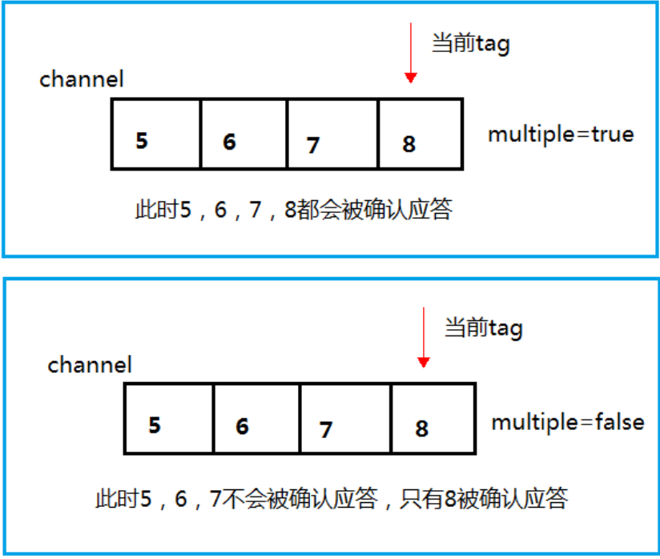
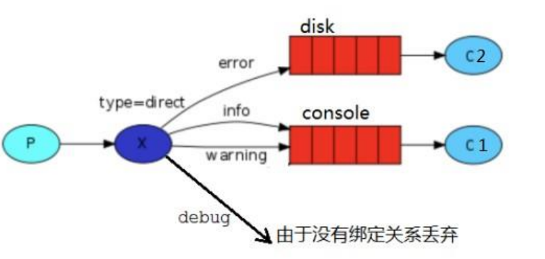

# 消息中间件RabbitMQ

## 1.消息队列

### MQ的概念

MQ(message queue)，从字面意思上看，本质是个队列，FIFO 先入先出，只不过队列中存放的内容是message 而已，还是一种跨进程的通信机制，用于上下游传递消息。在互联网架构中，MQ 是一种非常常见的上下游“逻辑解耦+物理解耦”的消息通信服务。使用了 MQ 之后，消息发送上游只需要依赖 MQ，不用依赖其他服务。

#### 为什么用MQ

- **流量消峰**

  如果订单系统最多能处理一万次订单，这个处理能力应付正常时段的下单时绰绰有余，正常时段我们下单一秒后就能返回结果。但是在高峰期，如果有两万次下单操作系统是处理不了的，只能限制订单超过一万后不允许用户下单。使用消息队列做缓冲，我们可以取消超过一万次下单的限制，把一秒内下的订单分散成一段时间来处理，这时有些用户可能在下单十几秒后才能收到下单成功的操作，但是比不能下单的体验要好。

- **应用解耦**

  耦合调用库存系统、物流系统、支付系统，任何一个子系统出了故障，都会造成下单操作异常。当转变成基于消息队列的方式后，系统间调用的问题会减少很多，比如物流系统因为发生故障，需要几分钟来修复。在这几分钟的时间里，物流系统要处理的内存被缓存在消息队列中，用户的下单操作可以正常完成。当物流系统恢复后，继续处理订单信息即可，中单用户感受不到物流系统的故障，提升系统的可用性。

  

- **异步处理**

  有些服务间调用是异步的，例如 A 调用 B，B 需要花费很长时间执行，但是 A 需要知道 B 什么时候可以执行完，以前一般有两种方式，A 过一段时间去调用 B 的查询 api 查询。或者 A 提供一个 callback api，B 执行完之后调用 api 通知 A 服务。这两种方式都不是很优雅，使用消息总线，可以很方便解决这个问题，A 调用 B 服务后，只需要监听 B 处理完成的消息，当 B 处理完成后，会发送一条消息给 MQ，MQ 会将此消息转发给 A 服务。这样 A 服务既不用循环调用 B 的查询 api，也不用提供 callback api。同样B 服务也不用做这些操作。A 服务还能及时的得到异步处理成功的消息。

  

#### MQ的分类与选择

- **Kafka**

  Kafka 主要特点是基于Pull 的模式来处理消息消费，追求高吞吐量，一开始的目的就是用于日志收集和传输，适合产生**大量数据**的互联网服务的数据收集业务。**大型公司**建议可以选用，如果有**日志采集**功能，肯定是首选 kafka.

- **RocketMQ**

  天生为**金融互联网**领域而生，对于可靠性要求很高的场景，尤其是电商里面的订单扣款，以及业务削峰，在大量交易涌入时，后端可能无法及时处理的情况。RoketMQ 在稳定性上可能更值得信赖，这些业务场景在阿里双 11 已经经历了多次考验，如果你的业务有上述并发场景，建议可以选择 RocketMQ。

- **RabbitMQ**

  结合 erlang 语言本身的并发优势，性能好**时效性微秒级**，**社区活跃度也比较高**，管理界面用起来十分方便，如果你的**数据量没有那么大**，中小型公司优先选择功能比较完备的 RabbitMQ。


### RabbitMQ

RabbitMQ 是一个消息中间件：它接受并转发消息。你可以把它当做一个快递站点，当你要发送一个包裹时，你把你的包裹放到快递站，快递员最终会把你的快递送到收件人那里，按照这种逻辑 RabbitMQ 是一个快递站，一个快递员帮你传递快件。RabbitMQ 与快递站的主要区别在于，它不处理快件而是接收，存储和转发消息数据。

#### 四大核心

- **生产者**

  产生数据发送消息的程序是生产者

- **交换机**

  交换机是 RabbitMQ 非常重要的一个部件，一方面它接收来自生产者的消息，另一方面它将消息推送到队列中。交换机必须确切知道如何处理它接收到的消息，是将这些消息推送到特定队列还是推送到多个队列，亦或者是把消息丢弃，这个得有交换机类型决定

- **队列**

  队列是 RabbitMQ 内部使用的一种数据结构，尽管消息流经 RabbitMQ 和应用程序，但它们只能存储在队列中。队列仅受主机的内存和磁盘限制的约束，本质上是一个大的消息缓冲区。许多生产者可以将消息发送到一个队列，许多消费者可以尝试从一个队列接收数据。这就是我们使用队列的方式

- **消费者**

  消费与接收具有相似的含义。消费者大多时候是一个等待接收消息的程序。请注意生产者，消费者和消息中间件很多时候并不在同一机器上。同一个应用程序既可以是生产者又是可以是消费者。

#### 工作原理

- **Broker**：接收和分发消息的应用，RabbitMQ Server 就是 Message Broker

- **Virtual host**：出于多租户和安全因素设计的，把 AMQP 的基本组件划分到一个虚拟的分组中，类似

  于网络中的 namespace 概念。当多个不同的用户使用同一个 RabbitMQ server 提供的服务时，可以划分出

  多个 vhost，每个用户在自己的 vhost 创建 exchange／queue 等

- **Connection**：publisher／consumer 和 broker 之间的 TCP 连接

- **Channel**：如果每一次访问 RabbitMQ 都建立一个 Connection，在消息量大的时候建立 TCP

Connection 的开销将是巨大的，效率也较低。Channel 是在 connection 内部建立的逻辑连接，如果应用程

序支持多线程，通常每个 thread 创建单独的 channel 进行通讯，AMQP method 包含了 channel id 帮助客

户端和 message broker 识别 channel，所以 channel 之间是完全隔离的。**Channel 作为轻量级的**

**Connection** **极大减少了操作系统建立** **TCP connection** **的开销** 

- **Exchange**：message 到达 broker 的第一站，根据分发规则，匹配查询表中的 routing key，分发

消息到 queue 中去。常用的类型有：direct (point-to-point), topic (publish-subscribe) and fanout

(multicast)

- **Queue**：消息最终被送到这里等待 consumer 取走

- **Binding**：exchange 和 queue 之间的虚拟连接，binding 中可以包含 routing key，Binding 信息被保

存到 exchange 中的查询表中，用于 message 的分发依据

#### 安装

**官网地址**

https://www.rabbitmq.com/download.html

**安装文件**

rpm -ivh erlang-21.3-1.el7.x86_64.rpm

yum install socat -y

rpm -ivh rabbitmq-server-3.8.8-1.el7.noarch.rpm

**常用命令**

1、添加开机启动 RabbitMQ 服务

 chkconfig rabbitmq-server on

2、启动服务

 /sbin/service rabbitmq-server start 

3、查看服务状态

 /sbin/service rabbitmq-server status

4、停止服务(选择执行)

/sbin/service rabbitmq-server stop

5、开启 web 管理插件

rabbitmq-plugins enable rabbitmq_management

用默认账号密码(guest)访问地址 http://+ ip +:15672/出现权限问题

6、添加一个新的用户

​	6.1.创建账号

​	rabbitmqctl add_user admin 123

​	6.2.设置用户角色

​	rabbitmqctl set_user_tags admin administrator

​	6.3.设置用户权限

​	set_permissions [-p <vhostpath>] <user> <conf> <write> <read>

​	rabbitmqctl set_permissions -p "/" admin ".*" ".*" ".*"

​	6.4.用户 user_admin 具有/vhost1 这个 virtual host 中所有资源的配置、写、读权限

当前用户和角色

​	rabbitmqctl list_users

7、再次利用 admin 用户登录

8、重置命令

关闭应用的命令为

rabbitmqctl stop_app

9、清除的命令为

rabbitmqctl reset

10、重新启动命令为

rabbitmqctl start_app


## 2.Hello World


### 依赖

```xml
<!--指定 jdk 编译版本-->
<build>
	<plugins>
		<plugin>
			<groupId>org.apache.maven.plugins</groupId>
			<artifactId>maven-compiler-plugin</artifactId>
			<configuration>
				<source>8</source>
				<target>8</target>
			</configuration>
		</plugin>
	</plugins>
</build>
<dependencies>
	<!--rabbitmq 依赖客户端-->
	<dependency>
		<groupId>com.rabbitmq</groupId>
		<artifactId>amqp-client</artifactId>
		<version>5.8.0</version>
	</dependency>
	<!--操作文件流的一个依赖-->
	<dependency>
		<groupId>commons-io</groupId>
		<artifactId>commons-io</artifactId>
		<version>2.6</version>
	</dependency>
</dependencies>
```

### 消息生产者

```java
/**
 * 生产者：发消息
 */
public class Producer {
    //队列名称
    public static final String QUEUE_NAME = "hello";
    //发消息
    public static void main(String[] args) throws IOException, TimeoutException {
        //创建一个连接工厂
        ConnectionFactory factory = new ConnectionFactory();
        //工厂IP 连接RabbitMQ 的队列
        factory.setHost("");
        //用户名 密码
        factory.setUsername("");
        factory.setPassword("");
        //创建连接
        Connection connection = factory.newConnection();
        //获取信道
        Channel channel = connection.createChannel();
        /**
         * 生成队列
         * 1.队列名称
         * 2.队列里面的消息是否持久化（磁盘） 默认情况消息存储在内存中
         * 3.该队列是否只供一个消费者进行消费 是否进行消息共享，true可以多个消费者消费 false：能一个消费者消费
         * 4.是否自动删除 最后一个消费者端开连接以后 该队一句是否删除 true自动删除 false不自动删除
         * 5.其他参数
         */
        channel.queueDeclare(QUEUE_NAME, false, false, false, null);
        //发消息
        String message = "hello world";//初次使用
        /**
         * 发送一个消费
         * 1.发送到哪个交换机
         * 2.路由的Key值是哪个 本次是队列的名称
         * 3.其他参数信息
         * 4.发送消息的消息体
         */
        channel.basicPublish("", QUEUE_NAME, null, message.getBytes());
        System.out.println("消息发送完毕");
    }
}
```

### 消息消费者

```java
/**
 * 消费者 接收消息的
 */
public class Consumer {
    //队列名称
    public static final String QUEUE_NAME = "hello";
    //接收消息
    public static void main(String[] args) throws IOException, TimeoutException {
        //创建连接工厂
        ConnectionFactory factory = new ConnectionFactory();
        factory.setHost("");
        factory.setUsername("");
        factory.setPassword("");
        Connection connection = factory.newConnection();
        Channel channel = connection.createChannel();

        //声明 接收消息
        DeliverCallback deliverCallback = (consumerTag, message) -> {
            System.out.println(new String(message.getBody()));
        };
        //取消消息时的回调
        CancelCallback cancelCallback = consumerTag -> {
            System.out.println("消息消费被中断");
        };
        /**
         * 消费者消费消息
         * 1.消费哪个队列
         * 2.消费成功之后是否要自动应答 true 代表的自动应答 false 代表手动应答
         * 3.消费者未成功消费的回调
         * 4.消费者取消消费的回调
         */
        channel.basicConsume(QUEUE_NAME, true, deliverCallback, cancelCallback);
    }
}
```


## 3.Work Queues

工作队列(又称任务队列)的主要思想是避免立即执行资源密集型任务，而不得不等待它完成。相反我们安排任务在之后执行。我们把任务封装为消息并将其发送到队列。在后台运行的工作进程将弹出任务并最终执行作业。当有多个工作线程时，这些工作线程将一起处理这些任务。

### 轮训分发消息

**抽象工具类**

```java
/**
 * 此类为连接工厂创建信道的工具类
 */
public class RabbitMqUtils {
    //得到一个连接的 channel
    public static Channel getChannel() throws Exception {
        //创建一个连接工厂
        ConnectionFactory factory = new ConnectionFactory();
        factory.setHost("1.12.63.198");
        factory.setUsername("Ming");
        factory.setPassword("Ll13422849999l...RabbitMQ");
        Connection connection = factory.newConnection();
        Channel channel = connection.createChannel();
        return channel;
    }
}
```

**启动两个工作线程**

```java
/**
 * 这是一个工作线程（相当于之前的消费者）
 */
public class Worker01 {
    //队列名称
    public static final String QUEUE_NAME = "hello";
    //接收消息
    public static void main(String[] args) throws Exception {
        Channel channel = RabbitMqUtils.getChannel();
        //声明 接收消息
        DeliverCallback deliverCallback = (consumerTag, message) -> {
            System.out.println("接收到的消息：" + new String(message.getBody()));
        };
        //取消消息时的回调
        CancelCallback cancelCallback = consumerTag -> {
            System.out.println(consumerTag + "消息者取消消费接口回调逻辑");
        };
        System.out.println("C2等待接收消息.....");
        //消息的接收
        channel.basicConsume(QUEUE_NAME, true, deliverCallback, cancelCallback);
    }
}
```


**启动一个发送线程**

```java
/**
 * 生产者 发送大量的消息
 */
public class Task01 {
    //队列名称
    public static final String QUEUE_NAME = "hello";
    //发送大量消息
    public static void main(String[] args) throws Exception {
        Channel channel = RabbitMqUtils.getChannel();
        //队列的声明
        channel.queueDeclare(QUEUE_NAME, false, false, false, null);
        //从控制台当中接收信息
        Scanner scanner = new Scanner(System.in);
        while (scanner.hasNext()) {
            String message = scanner.next();
            channel.basicPublish("", QUEUE_NAME, null, message.getBytes());
            System.out.println("发送消息完成：" + message);
        }
    }
}
```

**结果**


### 消息应答

为了保证消息在发送过程中不丢失，rabbitmq 引入消息应答机制，消息应答就是:**消费者在接收到消息并且处理该消息之后，告诉 rabbitmq 它已经处理了，rabbitmq 可以把该消息删除了。**

##### 自动应答

消息发送后立即被认为已经传送成功，这种模式需要在**高吞吐量和数据传输安全性方面做权衡**,因为这种模式如果消息在接收到之前，消费者那边出现连接或者 channel 关闭，那么消息就丢失了,当然另一方面这种模式消费者那边可以传递过载的消息，**没有对传递的消息数量进行限制**，当然这样有可能使得消费者这边由于接收太多还来不及处理的消息，导致这些消息的积压，最终使得内存耗尽，最终这些消费者线程被操作系统杀死，**所以这种模式仅适用在消费者可以高效并以某种速率能够处理这些消息的情况下使用**。


##### 消息应答的方法

- **Channel.basicAck(用于肯定确认) **

  RabbitMQ 已知道该消息并且成功的处理消息，可以将其丢弃了

- **Channel.basicNack(用于否定确认) **

- **Channel.basicReject(用于否定确认)** 

  与 Channel.basicNack 相比少一个参数不处理该消息了直接拒绝，可以将其丢弃了


##### **Multiple 的解释**

**手动应答的好处是可以批量应答并且减少网络拥堵**


**multiple 的 true 和 false 代表不同意思**

​	true 代表批量应答 channel 上未应答的消息

​		 比如说 channel 上有传送 tag 的消息 5,6,7,8 当前 tag 是8 那么此时 5-8 的这些还未应答的消息都会被确认收到消息应答

​	false 同上面相比

​		只会应答 tag=8 的消息 5,6,7 这三个消息依然不会被确认收到消息应答




##### 消息自动重新入队

如果消费者由于某些原因失去连接(其通道已关闭，连接已关闭或 TCP 连接丢失)，导致消息未发送 ACK 确认，RabbitMQ 将了解到消息未完全处理，并将对其重新排队。如果此时其他消费者可以处理，它将很快将其重新分发给另一个消费者。这样，即使某个消费者偶尔死亡，也可以确保不会丢失任何消息。


##### 消息手动应答代码

默认消息采用的是自动应答，所以我们要想实现消息消费过程中不丢失，需要把自动应答改为手动应答

**消息生产者**

```java
/**
 * 消息在手动应答时是不丢失、放回队列中重新消费
 */
public class Task02 {
    //队列名称
    public static final String TASK_QUEUE_NAME = "ack_queue";
    public static void main(String[] args) throws Exception {
        Channel channel = RabbitMqUtils.getChannel();
        channel.queueDeclare(TASK_QUEUE_NAME, false, false, false, null);
        //从控制台中输入信息
        Scanner scanner = new Scanner(System.in);
        while (scanner.hasNext()) {
            String message = scanner.next();
            //设置生产者发送消息为持久化消息（要求保存到磁盘上）
            channel.basicPublish("", TASK_QUEUE_NAME, MessageProperties.PERSISTENT_TEXT_PLAIN,
                    message.getBytes("UTF-8"));
            System.out.println("生产者发出消息：" + message);
        }
    }
}
```

**消费者01**

```java
/**
 * 消息在手动应答时是不丢失、放回队列中重新消费
 */
public class Worker02 {
    //队列名称
    public static final String TASK_QUEUE_NAME = "ack_queue";
    //接收消息
    public static void main(String[] args) throws Exception {
        Channel channel = RabbitMqUtils.getChannel();
        System.out.println("C1等待接收消息处理时间较短");
        DeliverCallback deliverCallback = (consumerTag, message) -> {
            //沉睡1S
            SleepUtils.sleep(1);
            System.out.println("接收到的消息：" + new String(message.getBody(), "UTF-8"));
            //手动应答
            /**
             * 1.消息的标记 tag
             * 2.是否批量应答 false:不批量应答信道中的消息 true：批量
             */
            channel.basicAck(message.getEnvelope().getDeliveryTag(), false);
        };
        //采用手动应答
        boolean autoAck = false;
        channel.basicConsume(TASK_QUEUE_NAME, autoAck, deliverCallback, (consumerTag -> {
            System.out.println(consumerTag + "消费者取消消费接口回调逻辑");
        }));
    }
}
```

**消费者02**

```java
/**
 * 消息在手动应答时是不丢失、放回队列中重新消费
 */
public class Worker03 {
    //队列名称
    public static final String TASK_QUEUE_NAME = "ack_queue";
    //接收消息
    public static void main(String[] args) throws Exception {
        Channel channel = RabbitMqUtils.getChannel();
        System.out.println("C1等待接收消息处理时间较短");
        DeliverCallback deliverCallback = (consumerTag, message) -> {
            //沉睡30S
            SleepUtils.sleep(30);
            System.out.println("接收到的消息：" + new String(message.getBody(), "UTF-8"));
            //手动应答
            /**
             * 1.消息的标记 tag
             * 2.是否批量应答 false:不批量应答信道中的消息 true：批量
             */
            channel.basicAck(message.getEnvelope().getDeliveryTag(), false);
        };
        //采用手动应答
        boolean autoAck = false;
        channel.basicConsume(TASK_QUEUE_NAME, autoAck, deliverCallback, (consumerTag -> {
            System.out.println(consumerTag + "消费者取消消费接口回调逻辑");
        }));
    }
}
```

**结果**


### RabbitMQ持久化

刚刚我们已经看到了如何处理任务不丢失的情况，但是如何保障当 RabbitMQ 服务停掉以后消息生产者发送过来的消息不丢失。默认情况下 RabbitMQ 退出或由于某种原因崩溃时，它忽视队列和消息，除非告知它不要这样做。确保消息不会丢失需要做两件事：**我们需要将队列和消息都标记为持久化**。

#### **队列实现持久化**

之前我们创建的队列都是非持久化的，rabbitmq 如果重启的化，该队列就会被删除掉，如果要队列实现持久化 需要在声明队列的时候把 durable 参数设置为持久化


**注：**需要把原先队列先删除，或者重新创建一个持久化的队列，不然就会出现错误

控制台中持久化和非持久化队列的UI显示区（D代表持久化）


#### 消息实现持久化 

要想让消息实现持久化需要在消息生产者修改代码，MessageProperties.PERSISTENT_TEXT_PLAIN 添加这个属性。


将消息标记为持久化并不能完全保证不会丢失消息。尽管它告诉 RabbitMQ 将消息保存到磁盘，但是这里依然存在当消息刚准备存储在磁盘的时候 但是还没有存储完，消息还在缓存的一个间隔点。此时并没有真正写入磁盘。持久性保证并不强，但是对于我们的简单任务队列而言，这已经绰绰有余了。如果需要更强有力的持久化策略，参考后边课件发布确认章节。

#### **不公平分发** 

在最开始的时候我们学习到 RabbitMQ 分发消息采用的轮训分发，但是在某种场景下这种策略并不是很好，比方说有两个消费者在处理任务，其中有个消费者 1 处理任务的速度非常快，而另外一个消费者 2处理速度却很慢，这个时候我们还是采用轮训分发的化就会到这处理速度快的这个消费者很大一部分时间处于空闲状态，而处理慢的那个消费者一直在干活，这种分配方式在这种情况下其实就不太好，但是RabbitMQ 并不知道这种情况它依然很公平的进行分发。

为了避免这种情况，我们可以设置参数 channel.basicQos(1);


意思就是如果这个任务我还没有处理完或者我还没有应答你，你先别分配给我，我目前只能处理一个任务，然后 rabbitmq 就会把该任务分配给没有那么忙的那个空闲消费者，当然如果所有的消费者都没有完成手上任务，队列还在不停的添加新任务，队列有可能就会遇到队列被撑满的情况，这个时候就只能添加新的 worker 或者改变其他存储任务的策略。

#### 预取值

本身消息的发送就是异步发送的，所以在任何时候，channel 上肯定不止只有一个消息另外来自消费者的手动确认本质上也是异步的。因此这里就存在一个未确认的消息缓冲区，因此希望开发人员能**限制此缓冲区的大小，以避免缓冲区里面无限制的未确认消息问题**。这个时候就可以通过使用 basic.qos 方法设置“预取计数”值来完成的。**该值定义通道上允许的未确认消息的最大数量**。一旦数量达到配置的数量，RabbitMQ 将停止在通道上传递更多消息，除非至少有一个未处理的消息被确认，例如，假设在通道上有未确认的消息 5、6、7，8，并且通道的预取计数设置为 4，此时RabbitMQ 将不会在该通道上再传递任何消息，除非至少有一个未应答的消息被 ack。比方说 tag=6 这个消息刚刚被确认 ACK，RabbitMQ 将会感知这个情况到并再发送一条消息。消息应答和 QoS 预取值对用户吞吐量有重大影响。通常，增加预取将提高向消费者传递消息的速度。**虽然自动应答传输消息速率是最佳的，但是，在这种情况下已传递但尚未处理****的消息的数量也会增加，从而增加了消费者的** **RAM** **消耗**(随机存取存储器)应该小心使用具有无限预处理的自动确认模式或手动确认模式，消费者消费了大量的消息如果没有确认的话，会导致消费者连接节点的内存消耗变大，所以找到合适的预取值是一个反复试验的过程，不同的负载该值取值也不同 100 到 300 范围内的值通常可提供最佳的吞吐量，并且不会给消费者带来太大的风险。预取值为 1 是最保守的。当然这将使吞吐量变得很低，特别是消费者连接延迟很严重的情况下，特别是在消费者连接等待时间较长的环境中。对于大多数应用来说，稍微高一点的值将是最佳的。


```java
        //预取值是2
        int prefetchCount = 2;
        channel.basicQos(prefetchCount);
```


## 4.发布确认

生产者将信道设置成 confirm 模式，一旦信道进入 confirm 模式，**所有在该信道上面发布的消息都将会被指派一个唯一的 ID**(从 1 开始)，一旦消息被投递到所有匹配的队列之后，broker 就会发送一个确认给生产者(包含消息的唯一 ID)，这就使得生产者知道消息已经正确到达目的队列了，如果消息和队列是可持久化的，那么确认消息会在将消息写入磁盘之后发出，broker 回传给生产者的确认消息中 delivery-tag 域包含了确认消息的序列号，此外 broker 也可以设置basic.ack 的multiple 域，表示到这个序列号之前的所有消息都已经得到了处理。

confirm 模式最大的好处在于他是异步的，一旦发布一条消息，生产者应用程序就可以在等信道返回确认的同时继续发送下一条消息，当消息最终得到确认之后，生产者应用便可以通过回调方法来处理该确认消息，如果 RabbitMQ 因为自身内部错误导致消息丢失，就会发送一条 nack 消息，生产者应用程序同样可以在回调方法中处理该 nack 消息。

### 发布确认策略

#### **开启发布确认的方法**

发布确认默认是没有开启的，如果要开启需要调用方法 confirmSelect，每当你要想使用发布确认，都需要在 channel 上调用该方法

```java
Channel channel = RabbitMqUtils.getChannel();
//开启发布确认
channel.confirmSelect();
```

### **单个确认发布**

这是一种简单的确认方式，它是一种**同步确认发布**的方式，也就是发布一个消息之后只有它被确认发布，后续的消息才能继续发布,waitForConfirmsOrDie(long)这个方法只有在消息被确认的时候才返回，如果在指定时间范围内这个消息没有被确认那么它将抛出异常。

这种确认方式有一个最大的缺点就是:**发布速度特别的慢，**因为如果没有确认发布的消息就会阻塞所有后续消息的发布，这种方式最多提供每秒不超过数百条发布消息的吞吐量。当然对于某些应用程序来说这可能已经足够了。

```java
    //单个确认
    public static void publishMessageIndividually() throws Exception {
        Channel channel = RabbitMqUtils.getChannel();
        //队列的声明
        String queueName = UUID.randomUUID().toString();
        channel.queueDeclare(queueName, true, false, false, null);
        //开启发布确认
        channel.confirmSelect();
        //开始时间
        long begin = System.currentTimeMillis();
        //批量发消息
        for (int i = 0; i < MESSAGE_COUNT; i++) {
            String message = i + "";
            channel.basicPublish("", queueName, null, message.getBytes());
            //单个消息就马上进行发布确认
            boolean flag = channel.waitForConfirms();
            if (flag) {
                System.out.println("消息发送成功");
            }
        }
        //结束时间
        long end = System.currentTimeMillis();
        System.out.println("发布" + MESSAGE_COUNT + "个单独确认消息,耗时:" + (end - begin) + "ms");
    }
```

### **批量确认发布** 

上面那种方式非常慢，与单个等待确认消息相比，先发布一批消息然后一起确认可以极大地提高吞吐量，当然这种方式的缺点就是:当发生故障导致发布出现问题时，不知道是哪个消息出现问题了，我们必须将整个批处理保存在内存中，以记录重要的信息而后重新发布消息。当然这种方案仍然是同步的，也一样阻塞消息的发布。

```java
    //批量发布确认
    public static void publishMessageBatch() throws Exception {
        Channel channel = RabbitMqUtils.getChannel();
        //队列的声明
        String queueName = UUID.randomUUID().toString();
        channel.queueDeclare(queueName, true, false, false, null);
        //开启发布确认
        channel.confirmSelect();
        //开始时间
        long begin = System.currentTimeMillis();
        //批量确认消息大小
        int batchSize = 100;
        //批量发送消息 批量发布确认
        for (int i = 0; i < MESSAGE_COUNT; i++) {
            String message = i + "";
            channel.basicPublish("", queueName, null, message.getBytes());
            //判断达到100条消息的时候 批量确认一次
            if (i % batchSize == 0) {
                //发布确认
                channel.waitForConfirms();
            }
        }
        //结束时间
        long end = System.currentTimeMillis();
        System.out.println("发布" + MESSAGE_COUNT + "个批量确认消息,耗时:" + (end - begin) + "ms");
    }
```

### **异步确认发布** 

异步确认虽然编程逻辑比上两个要复杂，但是性价比最高，无论是可靠性还是效率都没得说，他是利用回调函数来达到消息可靠性传递的，这个中间件也是通过函数回调来保证是否投递成功，下面就让我们来详细讲解异步确认是怎么实现的。


```java
    //异步发布确认
    public static void publishMessageAsync() throws Exception {
        Channel channel = RabbitMqUtils.getChannel();
        //队列的声明
        String queueName = UUID.randomUUID().toString();
        channel.queueDeclare(queueName, true, false, false, null);
        //开启发布确认
        channel.confirmSelect();
        /**
         * 线程安全有序的一个哈希表 适用于高并发的情况下
         * 1.轻松的序号与消息进行关联
         * 2.轻松批量删除条目 只要给到序号
         * 3.支持高并发（多线程）
         */
        ConcurrentSkipListMap<Long, String> outstandingConfirms =
                new ConcurrentSkipListMap<>();
        //消息确认成功 回调函数
        ConfirmCallback ackCallback = (deliveryTag, multiple) -> {
            if (multiple) {
                //2.删除已经确认的消息 剩下的就是未确认的消息
                ConcurrentNavigableMap<Long, String> confirmed =
                        outstandingConfirms.headMap(deliveryTag);
                confirmed.clear();
            } else {
                outstandingConfirms.remove(deliveryTag);
            }
            System.out.println("确认的消息：" + deliveryTag);
        };
        //消息确认失败 回调函数
        /**
         * 1.消息的标记
         * 2.是否为批量确认
         */
        ConfirmCallback nackCallback = (deliveryTag, multiple) -> {
            //3.打印一下未确认的消息都有哪些
            String message = outstandingConfirms.get(deliveryTag);
            System.out.println("未确认的消息是：" + message + "：：：：：：未确认的消息tag：" + deliveryTag);
        };
        //准备消息的监听器 监听哪些消息成功 哪些消息失败
        /**
         * 1.监听哪些消息成功了
         * 2.监听哪些消息失败了
         */
        channel.addConfirmListener(ackCallback, nackCallback); //异步通知

        //开始时间
        long begin = System.currentTimeMillis();
        //批量发送消息
        for (int i = 0; i < MESSAGE_COUNT; i++) {
            String message = "消息" + i;
            channel.basicPublish("", queueName, null, message.getBytes());
            //1.此处记录下所有要发送的消息 消息的总和
            outstandingConfirms.put(channel.getNextPublishSeqNo(), message);
        }
        //结束时间
        long end = System.currentTimeMillis();
        System.out.println("发布" + MESSAGE_COUNT + "个异步发布确认消息,耗时:" + (end - begin) + "ms");
    }
```

### **处理异步未确认消息** 

最好的解决的解决方案就是把未确认的消息放到一个基于内存的能被发布线程访问的队列，比如说用 ConcurrentLinkedQueue 这个队列在 confirm callbacks 与发布线程之间进行消息的传递。

### **3种发布确认速度对比**

- 单独发布消息

  同步等待确认，简单，但吞吐量非常有限。

- 批量发布消息

  批量同步等待确认，简单，合理的吞吐量，一旦出现问题但很难推断出是那条消息出现了问题。

- 异步处理：

  最佳性能和资源使用，在出现错误的情况下可以很好地控制，但是实现起来稍微难些

```java
        // 1.单个确认
        ConfirmMessage.publishMessageIndividually();
        //发布1000个单独确认消息,耗时:7851ms
        // 2.批量确认
        ConfirmMessage.publishMessageBatch();
        //发布1000个批量确认消息,耗时:180ms
        // 3.异步批量确认
        ConfirmMessage.publishMessageAsync();
        //发布1000个异步发布确认消息,耗时:30ms
        //发布1000个异步发布确认消息,耗时:25ms
```


## 5.交换机

> 将消息传达给多个消费者。这种模式称为 ”发布/订阅”.

### **Exchanges**

RabbitMQ 消息传递模型的核心思想是: **生产者生产的消息从不会直接发送到队列**。实际上，通常生产者甚至都不知道这些消息传递传递到了哪些队列中。

相反，**生产者只能将消息发送到交换机(exchange)**，交换机工作的内容非常简单，一方面它接收来自生产者的消息，另一方面将它们推入队列。交换机必须确切知道如何处理收到的消息。是应该把这些消息放到特定队列还是说把他们到许多队列中还是说应该丢弃它们。这就的由交换机的类型来决定。


#### **Exchanges 的类型**

总共有以下类型：

直接(direct), 主题(topic) ,标题(headers) , 扇出(fanout)

#### **无名exchange**

在本教程的前面部分我们对 exchange 一无所知，但仍然能够将消息发送到队列。之前能实现的原因是因为我们使用的是默认交换，我们通过空字符串(“”)进行标识。

```java
channel.basicPublish("", "hello", null, message.getBytes("UTF-8"));
```

第一个参数是交换机的名称。空字符串表示默认或无名称交换机：消息能路由发送到队列中其实是由 routingKey(bindingkey)绑定 key 指定的，如果它存在的话

### 临时队列

每当我们连接到 Rabbit 时，我们都需要一个全新的空队列，为此我们可以创建一个具有**随机名称的队列**，或者能让服务器为我们选择一个随机队列名称那就更好了。其次**一旦我们断开了消费者的连接，队列将被自动删除**

创建临时队列的方式如下:

​	String queueName = channel.queueDeclare().getQueue();

创建出来之后长成这样:


### 绑定(bindings)

什么是 bingding 呢，binding 其实是 exchange 和 queue 之间的桥梁，它告诉我们 exchange 和那个队列进行了绑定关系。比如说下面这张图告诉我们的就是 X 与 Q1 和 Q2 进行了绑定


### Fanout

Fanout 这种类型非常简单。正如从名称中猜到的那样，它是将接收到的所有消息**广播**到它知道的所有队列中。系统中默认有些 exchange 类型


**ReceiveLogs01**

```java
public class ReceiveLogs01 {
    //交换机的名称
    public static final String EXCHANGE_NAME = "logs";
    public static void main(String[] args) throws Exception {
        Channel channel = RabbitMqUtils.getChannel();
        //声明一个交换机
        channel.exchangeDeclare(EXCHANGE_NAME, "fanout");
        //声明一个队列 临时队列
        /**
         * 生成一个临时队列、队列的名称是随机的
         * 当消费者断开与队列的连接的时候 队列就自动删除
         */
        String queueName = channel.queueDeclare().getQueue();
        /**
         * 绑定交换机与队列
         */
        channel.queueBind(queueName, EXCHANGE_NAME, "");
        System.out.println("等待接收消息，把接收到消息打印在屏幕上.......");
        //接收消息
        DeliverCallback deliverCallback = (consumerTag, message) -> {
            System.out.println("ReceiveLogs01控制台打印接收到的消息：" + new String(message.getBody(), "UTF-8"));
        };
        //消费者取消消息时回调接口
        channel.basicConsume(queueName, true, deliverCallback, consumerTag -> {
        });
    }
}
```

**ReceiveLogs02**

与上面一样

**EmitLog**

```java
/**
 * 发消息 交换机
 */
public class EmitLog {
    //交换机的名称
    public static final String EXCHANGE_NAME = "logs";
    public static void main(String[] args) throws Exception {
        Channel channel = RabbitMqUtils.getChannel();
        channel.exchangeDeclare(EXCHANGE_NAME, "fanout");
        Scanner scanner = new Scanner(System.in);
        while (scanner.hasNext()) {
            String message = scanner.next();
            channel.basicPublish(EXCHANGE_NAME, "", null, message.getBytes("UTF-8"));
            System.out.println("生产者发出消息：" + message);
        }
    }
}
```


### Direct exchange

绑定是交换机和队列之间的桥梁关系。也可以这么理解：**队列只对它绑定的交换机的消息感兴趣**。绑定用参数：routingKey 来表示也可称该参数为 binding key，创建绑定我们用代码:channel.queueBind(queueName, EXCHANGE_NAME, "routingKey");**绑定之后的意义由其交换类型决定**

将日志消息写入磁盘的程序仅接收严重错误(errros)，而不存储哪些警告(warning)或信息(info)日志消息避免浪费磁盘空间。Fanout 这种交换类型并不能给我们带来很大的灵活性-它只能进行无意识的广播，在这里我们将使用 direct 这种类型来进行替换，这种类型的工作方式是，消息只去到它绑定的routingKey 队列中去。


在上面这张图中，我们可以看到 X 绑定了两个队列，绑定类型是 direct。队列Q1 绑定键为 orange，队列 Q2 绑定键有两个:一个绑定键为 black，另一个绑定键为 green.

在这种绑定情况下，生产者发布消息到 exchange 上，绑定键为 orange 的消息会被发布到队列Q1。绑定键为 blackgreen 和的消息会被发布到队列 Q2，其他消息类型的消息将被丢弃。

#### **多重绑定** 


当然如果 exchange 的绑定类型是direct，**但是它绑定的多个队列的** **key** **如果都相同**，在这种情况下虽然绑定类型是 direct **但是它表现的就和** **fanout** **有点类似了**，就跟广播差不多

#### 实战



**ReceiveLogsDirect01**

```java
public class ReceiveLogsDirect01 {
    public static final String EXCHANGE_NAME = "direct_logs";
    public static void main(String[] args) throws Exception {
        Channel channel = RabbitMqUtils.getChannel();
        //声明一个交换机
        channel.exchangeDeclare(EXCHANGE_NAME, BuiltinExchangeType.DIRECT);
        //声明一个队列
        channel.queueDeclare("console", false, false, false, null);
        channel.queueBind("console", EXCHANGE_NAME, "info");
        channel.queueBind("console", EXCHANGE_NAME, "warning");
        //接收消息
        DeliverCallback deliverCallback = (consumerTag, message) -> {
            System.out.println("ReceiveLogsDirect01控制台打印接收到的消息：" + new String(message.getBody(), "UTF-8"));
        };
        //消费者取消消息时回调接口
        channel.basicConsume("console", true, deliverCallback, consumerTag -> {
        });
    }
}
```

**ReceiveLogsDirect02**

```java
public class ReceiveLogsDirect02 {
    public static final String EXCHANGE_NAME = "direct_logs";
    public static void main(String[] args) throws Exception {
        Channel channel = RabbitMqUtils.getChannel();
        //声明一个交换机
        channel.exchangeDeclare(EXCHANGE_NAME, BuiltinExchangeType.DIRECT);
        //声明一个队列
        channel.queueDeclare("disk", false, false, false, null);
        channel.queueBind("disk", EXCHANGE_NAME, "error");
        //接收消息
        DeliverCallback deliverCallback = (consumerTag, message) -> {
            System.out.println("ReceiveLogsDirect02控制台打印接收到的消息：" + new String(message.getBody(), "UTF-8"));
        };
        //消费者取消消息时回调接口
        channel.basicConsume("disk", true, deliverCallback, consumerTag -> {
        });
    }
}
```

**DirectLogs**

```java
public class DirectLogs {
    //交换机的名称
    public static final String EXCHANGE_NAME = "direct_logs";
    public static void main(String[] args) throws Exception {
        Channel channel = RabbitMqUtils.getChannel();
        Scanner scanner = new Scanner(System.in);
        while (scanner.hasNext()) {
            String message = scanner.next();
            channel.basicPublish(EXCHANGE_NAME, "error", null, message.getBytes("UTF-8"));
            System.out.println("生产者发出消息：" + message);
        }
    }
}
```

### Topics

发送到类型是 topic 交换机的消息的 routing_key 不能随意写，必须满足一定的要求，它**必须是一个单词列表，以点号分隔开**。这些单词可以是任意单词，比如说："stock.usd.nyse", "nyse.vmw","quick.orange.rabbit".这种类型的。当然这个单词列表最多不能超过 255 个字节。

在这个规则列表中，其中有两个替换符是大家需要注意的

**(星号)可以代替一个单词**

**#(井号)可以替代零个或多个单词**

#### Topics匹配案例

下图绑定关系如下

​	Q1-->绑定的是

​		中间带 orange 带 3 个单词的字符串(*.orange.*)

​	Q2-->绑定的是

​		最后一个单词是 rabbit 的 3 个单词(*.*.rabbit)

​		第一个单词是 lazy 的多个单词(lazy.#)


| 数据                     | 队列接收                                   |
| ------------------------ | ------------------------------------------ |
| quick.orange.rabbit      | 被队列 Q1Q2 接收到                         |
| lazy.orange.elephant     | 被队列 Q1Q2 接收到                         |
| quick.orange.fox         | 被队列 Q1 接收到                           |
| lazy.brown.fox           | 被队列 Q2 接收到                           |
| lazy.pink.rabbit         | 虽然满足两个绑定但只被队列 Q2 接收一次     |
| quick.brown.fox          | 不匹配任何绑定不会被任何队列接收到会被丢弃 |
| quick.orange.male.rabbit | 是四个单词不匹配任何绑定会被丢弃           |
| lazy.orange.male.rabbit  | 是四个单词但匹配 Q2                        |

当队列绑定关系是下列这种情况时需要引起注意

**当一个队列绑定键是#,那么这个队列将接收所有数据，就有点像 fanout了**

**如果队列绑定键当中没有#和出现，那么该队列绑定类型就是direct了**

#### 实战


**EmitLogTopic**

```java
/**
 * 生产者
 */
public class EmitLogTopic {
    //交换机的名称
    public static final String EXCHANGE_NAME = "topic_logs";
    public static void main(String[] args) throws Exception {
        Channel channel = RabbitMqUtils.getChannel();
        /**
         * Q1-->绑定的是
         *  中间带 orange 带 3 个单词的字符串(*.orange.*)
         * Q2-->绑定的是
         *  最后一个单词是 rabbit 的 3 个单词(*.*.rabbit)
         *  第一个单词是 lazy 的多个单词(lazy.#)
         */
        Map<String, String> bindingKeyMap = new HashMap<>();
        bindingKeyMap.put("quick.orange.rabbit", "被队列 Q1Q2 接收到");
        bindingKeyMap.put("lazy.orange.elephant", "被队列 Q1Q2 接收到");
        bindingKeyMap.put("quick.orange.fox", "被队列 Q1 接收到");
        bindingKeyMap.put("lazy.brown.fox", "被队列 Q2 接收到");
        bindingKeyMap.put("lazy.pink.rabbit", "虽然满足两个绑定但只被队列 Q2 接收一次");
        bindingKeyMap.put("quick.brown.fox", "不匹配任何绑定不会被任何队列接收到会被丢弃");
        bindingKeyMap.put("quick.orange.male.rabbit", "是四个单词不匹配任何绑定会被丢弃");
        bindingKeyMap.put("lazy.orange.male.rabbit", "是四个单词但匹配 Q2");
        for (Map.Entry<String, String> entry : bindingKeyMap.entrySet()) {
            String Key = entry.getKey();
            String message = entry.getValue();
            channel.basicPublish(EXCHANGE_NAME, Key, null, message.getBytes("UTF-8"));
            System.out.println("生产者发出消息：" + message);
        }
    }
}
```

**ReceiveLogsTopic01**

```java
/**
 * 声明主题交换机 及相关队列
 * 消费者 C1
 */
public class ReceiveLogsTopic01 {
    //交换机的名称
    public static final String EXCHANGE_NAME = "topic_logs";
    public static void main(String[] args) throws Exception {
        Channel channel = RabbitMqUtils.getChannel();
        //声明交换机
        channel.exchangeDeclare(EXCHANGE_NAME, "topic");
        //声明队列
        String queueName = "Q1";
        channel.queueDeclare(queueName, false, false, false, null);
        channel.queueBind(queueName, EXCHANGE_NAME, "*.orange.*");
        System.out.println("等待接收消息....");
        //接收消息
        DeliverCallback deliverCallback = (consumerTag, message) -> {
            System.out.println(new String(message.getBody(), "UTF-8"));
            System.out.println("接收队列：" + queueName + " 绑定键：" + message.getEnvelope().getRoutingKey());
        };
        //接收消息
        channel.basicConsume(queueName, true, deliverCallback, consumerTag -> {
        });
    }
}
```

**ReceiveLogsTopic02**

```java
/**
 * 声明主题交换机 及相关队列
 * 消费者 C2
 */
public class ReceiveLogsTopic02 {
    //交换机的名称
    public static final String EXCHANGE_NAME = "topic_logs";
    public static void main(String[] args) throws Exception {
        Channel channel = RabbitMqUtils.getChannel();
        //声明交换机
        channel.exchangeDeclare(EXCHANGE_NAME, "topic");
        //声明队列
        String queueName = "Q2";
        channel.queueDeclare(queueName, false, false, false, null);
        channel.queueBind(queueName, EXCHANGE_NAME, "*.*.rabbit");
        channel.queueBind(queueName, EXCHANGE_NAME, "lazy.#");
        System.out.println("等待接收消息....");
        //接收消息
        DeliverCallback deliverCallback = (consumerTag, message) -> {
            System.out.println(new String(message.getBody(), "UTF-8"));
            System.out.println("接收队列：" + queueName + " 绑定键：" + message.getEnvelope().getRoutingKey());
        };
        //接收消息
        channel.basicConsume(queueName, true, deliverCallback, consumerTag -> {
        });
    }
}
```


## 6.死信队列

先从概念解释上搞清楚这个定义，死信，顾名思义就是无法被消费的消息，字面意思可以这样理解，一般来说，producer 将消息投递到 broker 或者直接到queue 里了，consumer 从 queue 取出消息进行消费，但某些时候由于特定的**原因导致** **queue** **中的某些消息无法被消费**，这样的消息如果没有后续的处理，就变成了死信，有死信自然就有了死信队列。

### 死信的来源

- 消息 TTL 过期
- 队列达到最大长度(队列满了，无法再添加数据到 mq 中)
- 消息被拒绝(basic.reject 或 basic.nack)并且 requeue=false.

### 实战


**Consumer01**

```java
/**
 * 死信队列 实战
 * <p>
 * 消费者 1
 */
public class Consumer01 {
    //普通交换机的名称
    public static final String NORMAL_EXCHANGE = "normal_exchange";
    //死信交换机的名称
    public static final String DEAD_EXCHANGE = "dead_exchange";
    //普通队列的名称
    public static final String NORMAL_QUEUE = "normal_queue";
    //死信队列的名称
    public static final String DEAD_QUEUE = "dead_queue";
    public static void main(String[] args) throws Exception {
        Channel channel = RabbitMqUtils.getChannel();
        //声明死信和普通交换机 类型为direct
        channel.exchangeDeclare(NORMAL_EXCHANGE, BuiltinExchangeType.DIRECT);
        channel.exchangeDeclare(DEAD_EXCHANGE, BuiltinExchangeType.DIRECT);
        //声明普通队列
        Map<String, Object> arguments = new HashMap<>();
        //过期时间 10s = 10000ms
        //arguments.put("x-message-ttl", 100000);
        //正常队列设置死信交换机
        arguments.put("x-dead-letter-exchange", DEAD_EXCHANGE);
        //设置死信RoutingKey
        arguments.put("x-dead-letter-routing-key", "lisi");
        //设置正常队列的长度的限制
        //arguments.put("x-max-length", 6);
        channel.queueDeclare(NORMAL_QUEUE, false, false, false, arguments);
        ////////////////////////////////////////////////
        //声明死信队列
        channel.queueDeclare(DEAD_QUEUE, false, false, false, null);
        //绑定普通的交换机与队列
        channel.queueBind(NORMAL_QUEUE, NORMAL_EXCHANGE, "zhangsan");
        //绑定死信的交换机与队列
        channel.queueBind(DEAD_QUEUE, DEAD_EXCHANGE, "lisi");
        System.out.println("等待接收消息.....");
        DeliverCallback deliverCallback = (consumerTag, message) -> {
            String msg = new String(message.getBody(), "UTF-8");
            if (msg.equals("info5")) {
                System.out.println("Consumer01接收的消息是：" + msg + ":此消息被C1拒绝的");
                channel.basicReject(message.getEnvelope().getDeliveryTag(), false);
            } else {
                System.out.println("Consumer01接收的消息是：" + msg);
                channel.basicAck(message.getEnvelope().getDeliveryTag(), false);
            }
        };
        //开启手动应答
        channel.basicConsume(NORMAL_QUEUE, true, deliverCallback, consumerTag -> {
        });
    }
}
```

**Consumer02**

```java
/**
 * 死信队列 实战
 * <p>
 * 消费者 1
 */
public class Consumer02 {
    //死信队列的名称
    public static final String DEAD_QUEUE = "dead_queue";
    public static void main(String[] args) throws Exception {
        Channel channel = RabbitMqUtils.getChannel();
        DeliverCallback deliverCallback = (consumerTag, message) -> {
            System.out.println("Consumer02接收的消息是：" + new String(message.getBody(), "UTF-8"));
        };
        channel.basicConsume(DEAD_QUEUE, true, deliverCallback, consumerTag -> {
        });
    }
}
```

**Producer**

```java
/**
 * 死信队列 之 生产者代码
 */
public class Producer {
    //普通交换机的名称
    public static final String NORMAL_EXCHANGE = "normal_exchange";
    public static void main(String[] args) throws Exception {
        Channel channel = RabbitMqUtils.getChannel();
        //死信消息 设置TTL时间 单位ms
//        AMQP.BasicProperties properties =
//                new AMQP.BasicProperties()
//                .builder().expiration("10000").build();
        for (int i = 1; i < 11; i++) {
            String message = "info" + i;//info2 ..... info10
            channel.basicPublish(NORMAL_EXCHANGE, "zhangsan", null, message.getBytes());
        }
    }
}
```


## 7.延迟队列

延时队列,队列内部是有序的，最重要的特性就体现在它的延时属性上，延时队列中的元素是希望在指定时间到了以后或之前取出和处理，简单来说，延时队列就是用来存放需要在指定时间被处理的元素的队列。

### 使用场景

- 订单在十分钟之内未支付则自动取消
- 新创建的店铺，如果在十天内都没有上传过商品，则自动发送消息提醒。
- 用户注册成功后，如果三天内没有登陆则进行短信提醒。
- 用户发起退款，如果三天内没有得到处理则通知相关运营人员。
- 预定会议后，需要在预定的时间点前十分钟通知各个与会人员参加会议

### **RabbitMQ** **中的** **TTL**

TTL 是 RabbitMQ 中一个消息或者队列的属性，表明一条消息或者该队列中的所有消息的最大存活时间，单位是毫秒。换句话说，如果一条消息设置了 TTL 属性或者进入了设置TTL 属性的队列，那么这条消息如果在TTL 设置的时间内没有被消费，则会成为"死信"。如果同时配置了队列的TTL 和消息的TTL，那么较小的那个值将会被使用，有两种方式设置 TTL。

#### 消息设置TTL

针对每条消息设置TTL


#### 队列设置TTL

在创建队列的时候设置队列的 “x-message-ttl” 属性


#### 两者的区别

如果设置了队列的 TTL 属性，那么一旦消息过期，就会被队列丢弃(如果配置了死信队列被丢到死信队列中)，而第二种方式，消息即使过期，也不一定会被马上丢弃，因为**消息是否过期是在即将投递到消费者之前判定的**，如果当前队列有严重的消息积压情况，则已过期的消息也许还能存活较长时间；另外，还需要注意的一点是，如果不设置 TTL，表示消息永远不会过期，如果将 TTL 设置为 0，则表示除非此时可以直接投递该消息到消费者，否则该消息将会被丢弃。

### 整合springboot

#### 依赖

```xml
<dependencies>
        <dependency>
            <groupId>org.springframework.boot</groupId>
            <artifactId>spring-boot-starter</artifactId>
        </dependency>
        <dependency>
            <groupId>org.projectlombok</groupId>
            <artifactId>lombok</artifactId>
            <optional>true</optional>
        </dependency>
        <!--RabbitMQ 依赖-->
        <dependency>
            <groupId>org.springframework.boot</groupId>
            <artifactId>spring-boot-starter-amqp</artifactId>
        </dependency>
        <dependency>
            <groupId>org.springframework.boot</groupId>
            <artifactId>spring-boot-starter-web</artifactId>
        </dependency>
        <dependency>
            <groupId>org.springframework.boot</groupId>
            <artifactId>spring-boot-starter-test</artifactId>
            <scope>test</scope>
        </dependency>
        <dependency>
            <groupId>com.alibaba</groupId>
            <artifactId>fastjson</artifactId>
            <version>1.2.47</version>
        </dependency>
        <dependency>
            <groupId>org.projectlombok</groupId>
            <artifactId>lombok</artifactId>
        </dependency>
        <!--swagger-->
        <dependency>
            <groupId>io.springfox</groupId>
            <artifactId>springfox-swagger2</artifactId>
            <version>2.9.2</version>
        </dependency>
        <dependency>
            <groupId>io.springfox</groupId>
            <artifactId>springfox-swagger-ui</artifactId>
            <version>2.9.2</version>
        </dependency>
        <!--RabbitMQ 测试依赖-->
        <dependency>
            <groupId>org.springframework.amqp</groupId>
            <artifactId>spring-rabbit-test</artifactId>
            <scope>test</scope>
        </dependency>
    </dependencies>
```

#### 配置文件

```properties
spring.rabbitmq.host=
spring.rabbitmq.port=5672
spring.rabbitmq.username=
spring.rabbitmq.password=
```

### 队列TTL及延迟队列优化

创建两个队列 QA 和 QB，两者队列 TTL 分别设置为 10S 和 40S，然后在创建一个交换机 X 和死信交换机 Y，它们的类型都是direct，创建一个死信队列 QD 并新增了一个队列 QC,绑定关系如下,该队列不设置TTL 时间


#### 配置文件代码

```java
/**
 * TTL队列 配置文件类代码
 */
@Configuration
public class TTLQueueConfig {
    //普通交换机的名称
    public static final String X_EXCHANGE = "X";
    //死信交换机的名称
    public static final String Y_DEAD_LETTER_EXCHANGE = "y";
    //普通队列的名称
    public static final String QUEUE_A = "QA";
    public static final String QUEUE_B = "QB";
    //死信队列的名称
    public static final String DEAD_LETTER_QUEUE = "QD";
    //普通队列的名称
    public static final String QUEUE_C = "QC";
    //声明QC
    @Bean("queueC")
    public Queue queueC() {
        HashMap<String, Object> arguments = new HashMap<>(3);
        //设置死信交换机
        arguments.put("x-dead-letter-exchange", Y_DEAD_LETTER_EXCHANGE);
        //设置死信RoutingKey
        arguments.put("x-dead-letter-routing-key", "XC");
        return QueueBuilder.durable(QUEUE_C).withArguments(arguments).build();
    }
    @Bean
    public Binding queueCBindingX(@Qualifier("queueC") Queue queueC,
                                  @Qualifier("xExchange") DirectExchange xExchange) {
        return BindingBuilder.bind(queueC).to(xExchange).with("XC");
    }
    //声明xExchange 别名
    @Bean("xExchange")
    public DirectExchange xExchange() {
        return new DirectExchange(X_EXCHANGE);
    }
    //声明yExchange 别名
    @Bean("yExchange")
    public DirectExchange yExchange() {
        return new DirectExchange(Y_DEAD_LETTER_EXCHANGE);
    }
    //声明普通队列 TTL 为10S
    @Bean("queueA")
    public Queue queueA() {
        HashMap<String, Object> arguments = new HashMap<>(3);
        //设置死信交换机
        arguments.put("x-dead-letter-exchange", Y_DEAD_LETTER_EXCHANGE);
        //设置死信RoutingKey
        arguments.put("x-dead-letter-routing-key", "YD");
        //设置TTL 单位是ms
        arguments.put("x-message-ttl", 10000);
        return QueueBuilder.durable(QUEUE_A).withArguments(arguments).build();
    }
    //声明普通队列 TTL 为40S
    @Bean("queueB")
    public Queue queueB() {
        HashMap<String, Object> arguments = new HashMap<>(3);
        //设置死信交换机
        arguments.put("x-dead-letter-exchange", Y_DEAD_LETTER_EXCHANGE);
        //设置死信RoutingKey
        arguments.put("x-dead-letter-routing-key", "YD");
        //设置TTL 单位是ms
        arguments.put("x-message-ttl", 40000);
        return QueueBuilder.durable(QUEUE_B).withArguments(arguments).build();
    }
    //死信队列
    @Bean("queueD")
    public Queue queueD() {
        return QueueBuilder.durable(DEAD_LETTER_QUEUE).build();
    }
    //绑定
    @Bean
    public Binding queueABindingX(@Qualifier("queueA") Queue queueA,
                                  @Qualifier("xExchange") DirectExchange xExchange) {
        return BindingBuilder.bind(queueA).to(xExchange).with("XA");
    }
    @Bean
    public Binding queueBBindingX(@Qualifier("queueB") Queue queueB,
                                  @Qualifier("xExchange") DirectExchange xExchange) {
        return BindingBuilder.bind(queueB).to(xExchange).with("XB");
    }
    @Bean
    public Binding deadLetterBindingQAD(@Qualifier("queueD") Queue queueD,
                                        @Qualifier("yExchange") DirectExchange yExchange) {
        return BindingBuilder.bind(queueD).to(yExchange).with("YD");
    }
}
```

#### 消费生产者代码

```java
    //开始发消息 消息 ttl
    @GetMapping("/sendExpirationMsg/{message}/{ttlTime}")
    public void sendMsg(@PathVariable String message, @PathVariable String ttlTime) {
        rabbitTemplate.convertAndSend("X", "XC", message, msg -> {
            //发送消息的时候 延迟时长
            msg.getMessageProperties().setExpiration(ttlTime);
            return msg;
        });
        rabbitTemplate.convertAndSend("X", "XB", "消息来自ttl为40s的队列：" + message);
        log.info("当前时间：{}，发送一条时长{}毫秒TTL信息给队列QC：{}", new Date().toString(), ttlTime, message);
    }
```

#### 消费者代码

```java
/**
 * 队列TTL 消费者
 */
@Slf4j
@Component
public class DeadLetterQueueConsumer {
    //接收消息
    @RabbitListener(queues = "QD")
    public void receiveD(Message message, Channel channel) throws Exception {
        String msg = new String(message.getBody());
        log.info("当前时间：{}，收到死信队列的消息：{}", new Date().toString(), msg);
    }
}
```


看起来似乎没什么问题，但是在最开始的时候，就介绍过如果使用在消息属性上设置 TTL 的方式，消息可能并不会按时“死亡“，因为 **RabbitMQ** **只会检查第一个消息是否过期**，如果过期则丢到死信队列，**如果第一个消息的延时时长很长，而第二个消息的延时时长很短，第二个消息并不会优先得到执行**。

### Rabbitmq插件实现延迟队列

下载**rabbitmq_delayed_message_exchange** 插件，然后解压放置到 RabbitMQ 的插件目录。

进入 RabbitMQ 的安装目录下的 plgins 目录，执行下面命令让该插件生效，然后重启 RabbitMQ

/usr/lib/rabbitmq/lib/rabbitmq_server-3.8.8/plugins

rabbitmq-plugins enable rabbitmq_delayed_message_exchange


#### 代码架构

新增一个队列delayed.queue,一个自定义交换机 delayed.exchange


#### **配置文件类代码**

在我们自定义的交换机中，这是一种新的交换类型，该类型消息支持延迟投递机制 消息传递后并不会立即投递到目标队列中，而是存储在 mnesia(一个分布式数据系统)表中，当达到投递时间时，才投递到目标队列中。

```java
@Configuration
public class DelayedQueueConfig {
    //队列
    public static final String DELAYED_EXCHANGE_NAME = "delayed.exchange";
    //交换机
    public static final String DELAYED_QUEUE_NAME = "delayed.queue";
    //routingKey
    public static final String DELAYED_ROUTING_KEY = "delayed.routingkey";
    @Bean
    public Queue delayedQueue() {
        return new Queue(DELAYED_QUEUE_NAME);
    }
    //声明交换机
    @Bean
    public CustomExchange delayedExchange() {
        Map<String, Object> arguments = new HashMap<>();
        arguments.put("x-delayed-type", "direct");
        return new CustomExchange(DELAYED_EXCHANGE_NAME, "x-delayed-message",
                true, false, arguments);
    }
    //绑定
    @Bean
    public Binding delayedQueueBindingDelayedExchange(@Qualifier("delayedQueue") Queue delayedQueue,
                                                      @Qualifier("delayedExchange") CustomExchange delayedExchange) {
        return BindingBuilder.bind(delayedQueue).to(delayedExchange).with(DELAYED_ROUTING_KEY).noargs();
    }
}
```

#### 消息生产者代码

```java
    //开始发消息 基于插件的 消息 及 延迟的时间
    @GetMapping("/sendDelayMsg/{message}/{delayTime}")
    public void sendMsg(@PathVariable String message, @PathVariable Integer delayTime) {
        log.info("当前时间：{}，发送一条时长{}毫秒信息给延迟队列delayed.queue：{}", new Date().toString(), delayTime, message);
        rabbitTemplate.convertAndSend(DelayedQueueConfig.DELAYED_EXCHANGE_NAME,
                DelayedQueueConfig.DELAYED_ROUTING_KEY, message, msg -> {
            //发送消息的时候 延迟时长 单位ms
            msg.getMessageProperties().setDelay(delayTime);
            return msg;
        });
    }
```

#### 消费消费者代码

```java
/**
 * 消费者 基于插件的延迟消息
 */
@Slf4j
@Component
public class DelayQueueConsumer {
    //监听消息
    @RabbitListener(queues = DelayedQueueConfig.DELAYED_QUEUE_NAME)
    public void receiveDelayQueue(Message message) {
        String msg = new String(message.getBody());
        log.info("当前时间：{}，收到延迟队列的消息：{}", new Date().toString(), msg);
    }
}
```


### 总结

延时队列在需要延时处理的场景下非常有用，使用 RabbitMQ 来实现延时队列可以很好的利用RabbitMQ 的特性，如：消息可靠发送、消息可靠投递、死信队列来保障消息至少被消费一次以及未被正确处理的消息不会被丢弃。另外，通过 RabbitMQ 集群的特性，可以很好的解决单点故障问题，不会因为单个节点挂掉导致延时队列不可用或者消息丢失。当然，延时队列还有很多其它选择，比如利用 Java 的 DelayQueue，利用 Redis 的 zset，利用 Quartz或者利用 kafka 的时间轮，这些方式各有特点,看需要适用的场景


## 8.发布确认高级

在生产环境中由于一些不明原因，导致 rabbitmq 重启，在 RabbitMQ 重启期间生产者消息投递失败，导致消息丢失，需要手动处理和恢复。于是，我们开始思考，如何才能进行 RabbitMQ 的消息可靠投递呢？ 特别是在这样比较极端的情况，RabbitMQ 集群不可用的时候，无法投递的消息该如何处理呢:

```java
应 用 [xxx] 在 [08-1516:36:04] 发 生 [ 错 误 日 志 异 常 ] ， alertId=[xxx] 。 由[org.springframework.amqp.rabbit.listener.BlockingQueueConsumer:start:620] 触 发 。
应用 xxx 可能原因如下
服 务 名 为 ：异 常 为 ： org.springframework.amqp.rabbit.listener.BlockingQueueConsumer:start:620,产 生 原 因 如 下:1.org.springframework.amqp.rabbit.listener.QueuesNotAvailableException:Cannot prepare queue for listener. Either the queue doesn't exist or the broker will notallow us to use it.||Consumer received fatal=false exception on startup:
```

### 实现发布确认 回退消息 备份交换机


#### 配置文件

在配置文件当中需要添加

**spring.rabbitmq.publisher-confirm-type=correlated**

⚫ NONE

禁用发布确认模式，是默认值

⚫ CORRELATED

发布消息成功到交换器后会触发回调方法

⚫ SIMPLE

经测试有两种效果，其一效果和 CORRELATED 值一样会触发回调方法，其二在发布消息成功后使用 rabbitTemplate 调用 waitForConfirms 或 waitForConfirmsOrDie 方法等待 broker 节点返回发送结果，根据返回结果来判定下一步的逻辑，要注意的点是waitForConfirmsOrDie 方法如果返回 false 则会关闭 channel，则接下来无法发送消息到 broker

#### 回退消息

**Mandatory 参数** 

**在仅开启了生产者确认机制的情况下，交换机接收到消息后，会直接给消息生产者发送确认消息**，**如果发现该消息不可路由，那么消息会被直接丢弃，此时生产者是不知道消息被丢弃这个事件的**。那么如何让无法被路由的消息帮我想办法处理一下？最起码通知我一声，我好自己处理啊。通过设置 mandatory 参数可以在当消息传递过程中不可达目的地时将消息返回给生产者。

#### 备份交换机

备份交换机可以理解为 RabbitMQ 中交换机的“备胎”，当我们为某一个交换机声明一个对应的备份交换机时，就是为它创建一个备胎，当交换机接收到一条不可路由消息时，将会把这条消息转发到备份交换机中，由备份交换机来进行转发和处理，通常备份交换机的类型为 Fanout ，这样就能把所有消息都投递到与其绑定的队列中，然后我们在备份交换机下绑定一个队列，这样所有那些原交换机无法被路由的消息，就会都进入这个队列了。当然，我们还可以建立一个报警队列，用独立的消费者来进行监测和报警。

#### 配置类

```java
/**
 * 配置类 发布确认 （高级）
 */
@Configuration
public class ConfirmConfig {
    //交换机
    public static final String CONFIRM_EXCHANGE_NAME = "confirm_exchange";
    //队列
    public static final String CONFIRM_QUEUE_NAME = "confirm_queue";
    //RoutingKey
    public static final String CONFIRM_ROUTING_KEY = "key1";
    //备份交换机
    public static final String BACKUP_EXCHANGE_NAME = "backup_exchange";
    //备份队列
    public static final String BACKUP_QUEUE_NAME = "backup_queue";
    //报警队列
    public static final String WARNING_QUEUE_NAME = "warning_queue";
    //声明交换机
    @Bean("confirmExchange")
    public DirectExchange confirmExchange() {
        return ExchangeBuilder.directExchange(CONFIRM_EXCHANGE_NAME).durable(true)
                .withArgument("alternate-exchange", BACKUP_EXCHANGE_NAME).build();
    }
    @Bean("confirmQueue")
    public Queue confirmQueue() {
        return QueueBuilder.durable(CONFIRM_QUEUE_NAME).build();
    }
    //绑定
    @Bean
    public Binding queueBindingExchange(@Qualifier("confirmQueue") Queue confirmQueue,
                                        @Qualifier("confirmExchange") DirectExchange confirmExchange) {
        return BindingBuilder.bind(confirmQueue).to(confirmExchange).with(CONFIRM_ROUTING_KEY);
    }
    //备份交换机
    @Bean("backupExchange")
    public FanoutExchange backupExchange() {
        return new FanoutExchange(BACKUP_EXCHANGE_NAME);
    }

    @Bean("backupQueue")
    public Queue backupQueue() {
        return QueueBuilder.durable(BACKUP_QUEUE_NAME).build();
    }
    @Bean("warningQueue")
    public Queue warningQueue() {
        return QueueBuilder.durable(WARNING_QUEUE_NAME).build();
    }
    @Bean
    public Binding backupQueueBindingBackupExchange(@Qualifier("backupQueue") Queue backupQueue,
                                                    @Qualifier("backupExchange") FanoutExchange backupExchange) {
        return BindingBuilder.bind(backupQueue).to(backupExchange);
    }
    @Bean
    public Binding warningQueueBindingWarningExchange(@Qualifier("warningQueue") Queue warningQueue,
                                                      @Qualifier("backupExchange") FanoutExchange backupExchange) {
        return BindingBuilder.bind(warningQueue).to(backupExchange);
    }
}
```

#### 报警消费者

```java
/**
 * 报警消息者
 */
@Component
@Slf4j
public class WarningConsumer {
    //接收报警消息
    @RabbitListener(queues = ConfirmConfig.WARNING_QUEUE_NAME)
    public void receiveWarningMsg(Message message) {
        String msg = new String(message.getBody());
        log.error("报警发现不可路由消息：{}", msg);
    }
}
```

#### 回调接口

```java
@Slf4j
@Component
public class MyCallBack implements RabbitTemplate.ConfirmCallback, RabbitTemplate.ReturnsCallback {
    @Resource
    private RabbitTemplate rabbitTemplate;
    @PostConstruct
    public void init() {
        //注入
        rabbitTemplate.setConfirmCallback(this);
        rabbitTemplate.setReturnsCallback(this);
    }
    /**
     * 交换机确认回调方法
     * 1.发消息 交换机接收到了 回调
     * 1.1 correlationData 保存回调消息的ID及相关信息
     * 1.2 交换机收到消息 ack=true
     * 1.3 cause null
     * 2.发消息 交换机接收失败了 回调
     * 2.1 correlationData 保存回调消息的ID及相关信息
     * 2.2 交换机收到消息 ack=false
     * 2.3 cause 失败的原因
     */
    @Override
    public void confirm(CorrelationData correlationData, boolean ack, String cause) {
        String id = correlationData != null ? correlationData.getId() : "";
        if (ack) {
            log.info("交换机已经收到Id为：{}的消息", id);
        } else {
            log.info("交换机还未收到Id为：{}的消息，由于原因：{}", id, cause);
        }
    }
    /**
     * 可以在消息传递过程中不可达目的地时将消息返回给生产者
     * 只有不可达目的地的时候 才进行回退
     * @param returnedMessage
     */
    @Override
    public void returnedMessage(ReturnedMessage returnedMessage) {
        log.error("消息{}，被交换机{}退回。退回原因：{}，路由Key:{}",
                returnedMessage.getMessage().getBody(),
                returnedMessage.getExchange(),
                returnedMessage.getReplyText(),
                returnedMessage.getRoutingKey());
    }
}
```

#### 消息生产者代码

```java
/**
 * //开始发消息 测试确认
 */
@Slf4j
@RestController
@RequestMapping("/confirm")
public class ProducerController {
    @Resource
    private RabbitTemplate rabbitTemplate;
    //发消息
    @GetMapping("/sendMessage/{message}")
    public void sendMessage(@PathVariable String message) {
        CorrelationData correlationData1 = new CorrelationData("1");
        rabbitTemplate.convertAndSend(ConfirmConfig.CONFIRM_EXCHANGE_NAME,
                ConfirmConfig.CONFIRM_ROUTING_KEY, message, correlationData1);
        log.info("发送消息内容：{}", message + "key1");

        CorrelationData correlationData2 = new CorrelationData("2");
        rabbitTemplate.convertAndSend(ConfirmConfig.CONFIRM_EXCHANGE_NAME,
                ConfirmConfig.CONFIRM_ROUTING_KEY + "2", message, correlationData2);
        log.info("发送消息内容：{}", message + "key2");
    }
}
```

#### 结果


mandatory 参数与备份交换机可以一起使用的时候，如果两者同时开启，经过上面得知**备份交换机优先级高**。


## 9.RabbitMQ其他知识点

### **幂等性**

用户对于同一操作发起的一次请求或者多次请求的结果是一致的，不会因为多次点击而产生了副作用。举个最简单的例子，那就是支付，用户购买商品后支付，支付扣款成功，但是返回结果的时候网络异常，此时钱已经扣了，用户再次点击按钮，此时会进行第二次扣款，返回结果成功，用户查询余额发现多扣钱了，流水记录也变成了两条。在以前的单应用系统中，我们只需要把数据操作放入事务中即可，发生错误立即回滚，但是再响应客户端的时候也有可能出现网络中断或者异常等等

#### **消息重复消费** 

消费者在消费 MQ 中的消息时，MQ 已把消息发送给消费者，消费者在给MQ 返回 ack 时网络中断，故 MQ 未收到确认信息，该条消息会重新发给其他的消费者，或者在网络重连后再次发送给该消费者，但实际上该消费者已成功消费了该条消息，造成消费者消费了重复的消息。

#### 解决思路

- **消费端的幂等性保障**

  在海量订单生成的业务高峰期，生产端有可能就会重复发生了消息，这时候消费端就要实现幂等性，这就意味着我们的消息永远不会被消费多次，即使我们收到了一样的消息。业界主流的幂等性有两种操作:a.唯一 ID+指纹码机制,利用数据库主键去重, b.利用 redis 的原子性去实现

- **唯一ID+指纹码机制** 

  指纹码:我们的一些规则或者时间戳加别的服务给到的唯一信息码,它并不一定是我们系统生成的，基本都是由我们的业务规则拼接而来，但是一定要保证唯一性，然后就利用查询语句进行判断这个 id 是否存在数据库中,优势就是实现简单就一个拼接，然后查询判断是否重复；劣势就是在高并发时，如果是单个数据库就会有写入性能瓶颈当然也可以采用分库分表提升性能，但也不是我们最推荐的方式。

- **Redis 原子性** **（推荐）**

  利用 redis 执行 setnx 命令，天然具有幂等性。从而实现不重复消费

### **优先级队列**

在我们系统中有一个**订单催付**的场景，我们的客户在天猫下的订单,淘宝会及时将订单推送给我们，如果在用户设定的时间内未付款那么就会给用户推送一条短信提醒，很简单的一个功能对吧，但是，tmall商家对我们来说，肯定是要分大客户和小客户的对吧，比如像苹果，小米这样大商家一年起码能给我们创造很大的利润，所以理应当然，他们的订单必须得到优先处理，而曾经我们的后端系统是使用 redis 来存放的定时轮询，大家都知道 redis 只能用 List 做一个简简单单的消息队列，并不能实现一个优先级的场景，所以订单量大了后采用 RabbitMQ 进行改造和优化,如果发现是大客户的订单给一个相对比较高的优先级，否则就是默认优先级。

#### 添加


**注意事项**

要让队列实现优先级需要做的事情有如下事情:队列需要设置为优先级队列，消息需要设置消息的优先级，消费者需要等待消息已经发送到队列中才去消费因为，这样才有机会对消息进行排序

### 惰性队列

RabbitMQ 从 3.6.0 版本开始引入了惰性队列的概念。惰性队列会尽可能的将消息存入磁盘中，而在消费者消费到相应的消息时才会被加载到内存中，它的一个重要的设计目标是能够支持更长的队列，即支持更多的消息存储。当消费者由于各种各样的原因(比如消费者下线、宕机亦或者是由于维护而关闭等)而致使长时间内不能消费消息造成堆积时，惰性队列就很有必要了。

默认情况下，当生产者将消息发送到 RabbitMQ 的时候，队列中的消息会尽可能的存储在内存之中，这样可以更加快速的将消息发送给消费者。即使是持久化的消息，在被写入磁盘的同时也会在内存中驻留一份备份。当 RabbitMQ 需要释放内存的时候，会将内存中的消息换页至磁盘中，这个操作会耗费较长的时间，也会阻塞队列的操作，进而无法接收新的消息。虽然 RabbitMQ 的开发者们一直在升级相关的算法，但是效果始终不太理想，尤其是在消息量特别大的时候。

#### **两种模式**

队列具备两种模式：default 和 lazy。默认的为default 模式，在3.6.0 之前的版本无需做任何变更。lazy模式即为惰性队列的模式，可以通过调用 channel.queueDeclare 方法的时候在参数中设置，也可以通过Policy 的方式设置，如果一个队列同时使用这两种方式设置的话，那么 Policy 的方式具备更高的优先级。如果要通过声明的方式改变已有队列的模式的话，那么只能先删除队列，然后再重新声明一个新的。

在队列声明的时候可以通过“x-queue-mode”参数来设置队列的模式，取值为“default”和“lazy”。下面示例中演示了一个惰性队列的声明细节：

Map<String, Object> args = new HashMap<String, Object>();

args.put("x-queue-mode", "lazy");

channel.queueDeclare("myqueue", false, false, false, args);

#### **内存开销对比** 


## 10.Rabbit MQ集群

