# Redis6

**概述**

- Redis是一个**开源**的**key-value**存储系统。
- 和Memcached类似，它支持存储和value类型相对更多，包括**string**(字符串)、**list**(链表)、**set**(集合)、**zset**(sorted set --有序集合)和**hash**(哈希类型)。
- 这些数据类型都支持 push/pop、add/remove及取交集并集和差集及更丰富的操作，而且这些操作都是**原子性**的。
- 在此基础上，Redis支持各种不同方式的**排序**
- 于memcached一样，为保证效率，数据都是**缓存在内存**中。
- 区别的是Redis会周期性的把更新的**数据写入磁盘**或者把修改操作写入追加的记录文件。
- 并且在此基础上实现了**master-slave(主从)**同步。

## 应用场景

- **配合关系型数据库做高速缓存**
  - 高频次，热门访问的数据，降低数据库IO
  - 分布式架构，做session共享
- **多样的数据结构存储持久化数据**

**相关技术**

```java
Redis 使用的是单线程 + 多路 IO 复用技术：
多路复用是指使用一个线程来检查多个文件描述符（Socket）的就绪状态，比如调用 select 和 poll 函数，传入多个文件描述符，如果有一个文件描述符就绪，则返回，否则阻塞直到超时。得到就绪状态后进行真正的操作可以在同一个线程里执行，也可以启动线程执行（比如使用线程池）。
** 串行 vs 多线程 + 锁（memcached） vs 单线程 + 多路 IO 复用 (Redis)**（与 Memcache 三点不同：支持多数据类型，支持持久化，单线程 + 多路 IO 复用） 。
```


## Redis 数据类型

### Redis键(Key)

**命令**

| 命令           | 作用                                                         |
| -------------- | ------------------------------------------------------------ |
| keys *         | 查看当前库所有key (匹配：keys *1)                            |
| exists key     | 判断某个key是否存在                                          |
| type key       | 查看你的key是什么类型                                        |
| del key        | 删除指定的key数据                                            |
| **unlink key** | **根据value选择非阻塞删除** 仅将keys从keyspace元数据中删除，真正删除会在后续异步操作 |
| expire key 10  | 10秒钟：为给定的key设置过期时间                              |
| ttl key        | 查看还有多少秒过期，-1表示永不过期，02表示已过期             |
| select         | 命令切换数据库                                               |
| dbsize         | 查看当前数据库的key的数量                                    |
| flushdb        | 清空当前库                                                   |
| flushall       | 通杀全部库                                                   |


### Redis 字符串（String）

**概述**

- String是Redis最基本的类型，可以理解成与Memcached一模一样的类型，一个key对应一个value
- String类型**是二进制安全的**。意味着Redis的string可以包含任何数据。比如jpg图片或者序列化的对象
- String类型是Redis最基本的数据类型，一个Redis中字符串value最多可以是**512M**

#### 常用命令

| 命令                               | 作用                                                         |
| ---------------------------------- | ------------------------------------------------------------ |
| set <key> <value>                  | 添加键值对                                                   |
| get <key>                          | 查询对应键值                                                 |
| append <key> <value>               | 将给定的<value>追加到原值的末尾                              |
| strlen <key>                       | 获取值的长度                                                 |
| setnx <key> <value>                | 只有在key不存在时 设置key的值                                |
| incr <key>                         | 将key中储存的数字值增1，只能对数字值操作，如果为空，新增值为1 |
| getrange <key><起始位置><结束位置> | 获取值的范围，类似java中的substring，**前包，后包**          |
| setrange <key><起始位置><value>    | 用<value> 覆写<key>所储存的字符串值，从<起始位置>开始(**索引从0开始**) |
| setex <key><过期时间><value>       | 设置键值的同时，设置过期时间，单位秒                         |
| getset<key><value>                 | 以新换旧，设置了新值同时获得旧值                             |

#### 原子性命令

所谓**原子**操作是指不会被线程调度机制打断的操作；这种操作一旦开始，就一直运行到结束，中间不会有任何context switch（切换到另一个线程）

1. 在单线程中，能够在单条指令中完成的操作都可以认为是“原子操作”，因为中断只能发生于指令之间。
2. 在多线程中，不能被其他进程（线程）打断的操作就叫原子操作。Redis单命令的原子性主要得益于Redis的单线程。

| 命令                                   | 作用                                                       |
| -------------------------------------- | ---------------------------------------------------------- |
| mset <key1><value1> <key2><value2>...  | 同时设置一个或多个key-value对                              |
| mget <key1><key2><key3>....            | 同时获取一个或多个value                                    |
| msetnx <key1><value1><key2><value2>... | 同时设置一个或多个key-value时，当且仅当所有给定key都不存在 |

同时设置一个或多个key-value对，当且仅当所有给定key都不存在。

**原子性，有一个失败则都失败**

#### Sring数据结构

```java
String的数据结构为简单动态字符串(Simple Dynamic String,缩写SDS)。是可以修改的字符串，内部结构实现上类似于Java的ArrayList，采用预分配冗余空间的方式来减少内存的频繁分配。
```

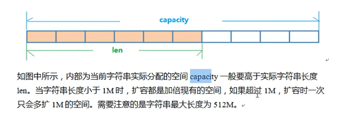


### Redis 列表(List)

**概述**

单键多值
Redis列表是简单的字符串列表，按照插入顺序排序。可以添加一个元素到列表的头部（左边）或者尾部（右边）。
它的底层实际是个**双向链表**，对两端的操作性能很高，通过索引下标的操作中间的节点性能会较差。


#### 常用命令

| 命令                                         | 作用                                                |
| -------------------------------------------- | --------------------------------------------------- |
| lpush/rpush <key><value1><value2><value3>... | 从左边/右边插入一个或多个值                         |
| lpop/rpop <key>                              | 从左边/右边吐出一个值。**值在键在，值光键亡**。     |
| rpoplpush <key1><key2>                       | 从<key1>列表右边吐出一个值，插到<key2>列表左边      |
| lrange <key><start><stop>                    | 按照索引下标获取元素(从左到右)                      |
| lrange mylist 0 -1                           | 0左边第一个，**-1右边第一个，（0-1 表示获取所有）** |
| lindex <key><index>                          | 按照索引下标获取元素（从左到右）                    |
| llen <key>                                   | 获取列表长度                                        |
| linsert <key> before <value><newvalue>       | 在<value>的前面插入<newvalue>插入值                 |
| lrem <key><n><value>                         | 从左边删除n个value（从左到右）                      |
| lset <key><index><value>                     | 将列表key下标为index的值替换成value                 |

#### List数据结构

```java
List的数据结构为快速链表quickList
首先在列表元素较少的情况下会使用一块连续的内存存储，这个结构是ziplist，也即是压缩列表。
它将所有的元素紧挨着一起存储，分配的是一块连续的内存。
当数据量比较多的时候才会改成quicklist
因为普通的链表需要的附加指针空间太大，会比较浪费空间。比如列表里存的只是int类型的数据，结构上还需要两个额外的指针prev和next。    
```

Redis将链表和ziplist结合起来组成了quicklist。也就是将多个ziplist使用双向指针串起来使用。既满足了快速的插入删除功能，又不会出现太大的空间冗余。


### Redis 集合（Set）

**概述**

Redis set对外提供的功能与list类似是一个列表的功能，特殊之处在于set是可以**自动排重**的，当你需要存储一个列表数据，又不希望出现重复数据时，set是一个很好的选择，并且set提供了判断某个成员是否在一个set集合内的重要接口，这个也是list所不能提供的。
Redis的Set是string类型的**无序集合**。**底层其实是一个value为null的hash表**，所以添加，删除，查找的**复杂度都是O(1)**。
一个算法，随着数据的增加，执行时间的长短，如果O(1)，数据增加，查找数据的时间不变。

#### 常用命令

| 命令                              | 作用                                                         |
| --------------------------------- | ------------------------------------------------------------ |
| sadd <key><value1><value2>...     | 将一个或多个member元素加入到集合key中，已经存在的member元素将被忽略 |
| smembers <key>                    | 取出该集合的所有值                                           |
| sismember <key><value>            | 判断集合<key>是否为含有该<value>值，有1，没有0               |
| scard <key>                       | 返回该集合的元素个数                                         |
| srem <key><value1><value2>...     | 删除集合中的某个元素                                         |
| spop <key>                        | **随机从该集合中吐出一个值**                                 |
| srandmember <key><n>              | 随机从该集合中取出n个值。不会从集合中删除                    |
| smove <source><destination> value | 把集合中一个值从一个集合移动到另一个集合                     |
| sinter <key1> <key2>              | 返回两个集合的**交集**元素                                   |
| sunion <key1><key2>               | 返回两个集合的**并集**元素                                   |
| sdiff <key1><key2>                | 返回两个集合的**差集**元素(key1中的，不包含key2中的)         |

#### 数据结构

Set数据结构是dict字典，字典是用哈希表实现的。
Java中HashSet的内部实现使用的是HashMap，只不过所有的value都指向同一个对象。Redis的set结构也是一样，它的内部也使用hash结构，所有的value都指向同一个内部值，


### Redis 哈希（Hash）

Redis hash是一个键值对集合
Redis hash是一个string类型的**field**和**value**的映射表，hash特别适合用于存储对象。
类似Java里面的Map<String,Object>

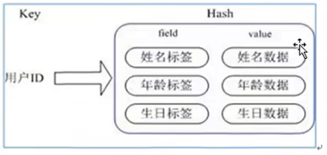

通过**key(用户ID)+field(属性标签)**就可以操作对应属性数据了，既不需要重复储存数据，也不会带来序列化和并发修改控制的问题。

#### 常用命令

| 命令                                            | 作用                                                        |
| ----------------------------------------------- | ----------------------------------------------------------- |
| hset <key><field><value>                        | 给<key>集合中的M<field>键赋值<value>                        |
| hget <key1><field>                              | 从<key1>集合<field>取出value                                |
| hmset <key1><field1><value1><field2><value2>... | 批量设置hash的值                                            |
| hexists<key1><field>                            | 查看哈希表key中，给定域field是否存在。                      |
| hkeys <key>                                     | 列出该hash集合的所有field                                   |
| hvals <key>                                     | 列出该hash集合的所有的value                                 |
| hincrby <key><field><increment>                 | 为哈希表key中的域field的值加上增量 1 -1                     |
| hsetnx <key><field><value>                      | 将哈希表key中的域field的值设置为value,当且仅当域field不存在 |

#### 数据结构

Hash类型对应的数据结构是两种：ziplist(压缩列表)，hashtable(哈希表)。当field-value长度较短且个数较少时，使用ziplist,否则使用hashtable。


### Redis 有序集合（Zset）

**概述**

Redis有序集合zset与普通集合set非常相似，是一个**没有重复元素**的字符串集合。
不同之处是有序集合的每个成员都关联了一个**评分（score）**，这个评分（score）被用来按照从最低分到最高分的方式排序集合中的成员。**集合的成员是唯一的，但是评分可以是重复了。**
因为元素是有序的，所有也可以很快的根据评分（score）或者次序（position）来获取一个范围的元素。
访问有序集合的中间元素也是非常快的，因此能够使用有序集合作为一个没有重复成员的智能列表。

#### 常用命令

| 命令                                                         | 作用                                                         |
| ------------------------------------------------------------ | ------------------------------------------------------------ |
| zadd <key><score1><value1><score2><value2>                   | 将一个或多个member元素及其score值加入到有序集key当中         |
| zrange <key><start><stop> [WITHSCORES]                       | 返回有序key中，下标在<start><stop>之间的元素。带WITHSCORES，可以让分数一起和值返回到结果集。 |
| zrangebyscore key minmax [withscores] [limit offset count]   | 返回有序集key中，所有score值介于min和max之间（包括等于min或max）的成员。有序集成员按score值递增（从小到大）次序排列。 |
| zrevrangebyscore key maxmin  [wutgscires] [limit offset count] | 同上，改为从大到小排列。                                     |
| zincrby <key><increment><value>                              | 为元素的score加上增量                                        |
| zrem <key><value>                                            | 删除该集合下，指定值的元素。                                 |
| zcount <key><min><max>                                       | 统计该集合，分数区间内的元素个数                             |
| zrank <key><value>                                           | 返回该值在集合中的排名，从0开始                              |

#### 数据结构

SortedSet（zset）是Redis提供的一个非常特别的数据结构，一方面它等价于Java的数据结构Map<String,Double>，可以给每一个元素value赋予一个权重score，另一方面它又类似于TreeSet，内部的元素会按照权重score进行排序，可以得到每个元素的名次，还可以通过score的范围来获取元素的列表。

zset底层使用了两个数据结构

- hash，hash的作用就是关联元素value和权重score，保障元素value的唯一性，可以通过元素value找到相应的score值
- 跳跃表，跳跃表的目的在于给元素value排序，根据score的范围获取元素列表。


## Redis 配置文件

我的目录：vim /etc/redis.conf

### Units 单位

配置大小单位，开头定义了一些基本的度量单位，只支持bytes，不支持bit
大小写敏感

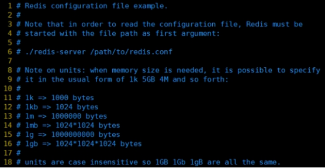

### INCLUDES包含

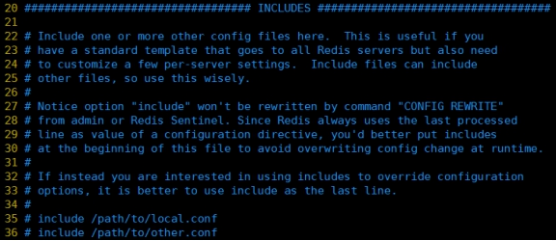

类似jsp中的include，多实例的情况可以把公用的配置文件提取出来

### 网络相关配置

#### bind

默认情况bind=127.0.0.1只能接受本机的访问请求

不写的情况下，无限制接受任何ip地址的访问

生产环境肯定要写你应用服务器的地址；服务器是需要远程访问的，所以需要将其注释掉

**如果开启了protected-mode，那么在没有设定bind ip且没有设密码的情况下，Redis只允许接受本机的响应**

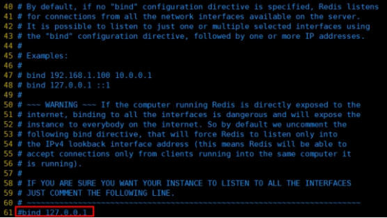

保存配置，停止服务，重启启动查看进程，不再是本机访问了。

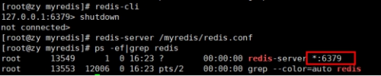

#### protected-mode

将本机访问保护模式设置no

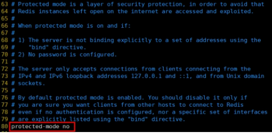

#### Port

端口号，默认 6379

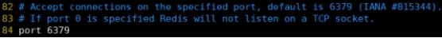

#### tcp-backlog

设置tcp的backlog，backlog其实是一个连接队列，backlog队列总和=未完成三次握手队列 + 已经完成三次握手队列。

在高并发环境下你需要一个高backlog值来避免慢客户端连接问题。

注意Linux内核会将这个值减小到/proc/sys/net/core/somaxconn的值（128），所以需要确认增大/proc/sys/net/core/somaxconn和/proc/sys/net/ipv4/tcp_max_syn_backlog（128）两个值来达到想要的效果

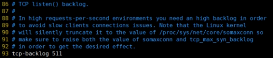

#### timeout

一个空闲的客户端维持多少秒会关闭，0表示关闭该功能。即永不关闭。

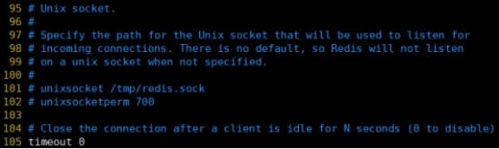

#### tcp-keepalive

对访问客户端的一种心跳检测，每个n秒检测一次。

单位为秒，如果设置为0，则不会进行Keepalive检测，建议设置成60 

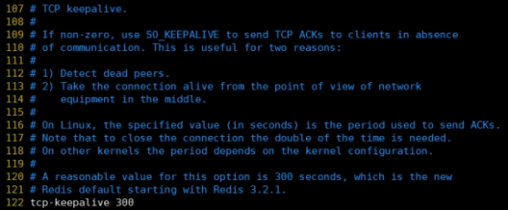

### GENERAL 通用

#### daemonize

是否为后台进程，设置为yes

守护进程，后台启动

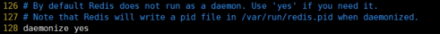

#### pidfile

存放pid文件的位置，每个实例会产生一个不同的pid文件

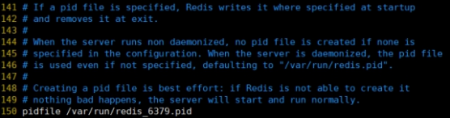

#### loglevel

指定日志记录级别，Redis总共支持四个级别：debug、verbose、notice、warning，默认为***\*notice\****

四个级别根据使用阶段来选择，生产环境选择notice 或者warning

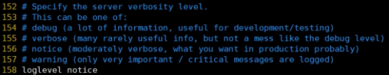

#### logfile

日志文件名称

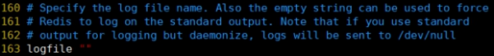

#### databases 16

设定库的数量 默认16，默认数据库为0，可以使用SELECT <dbid>命令在连接上指定数据库id

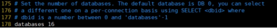

### SECURITY 安全

#### 设置密码

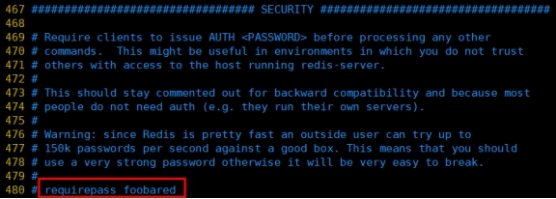

访问密码的查看、设置和取消

在命令中设置密码，只是临时的。重启redis服务器，密码就还原了。

永久设置，需要再配置文件中进行设置。

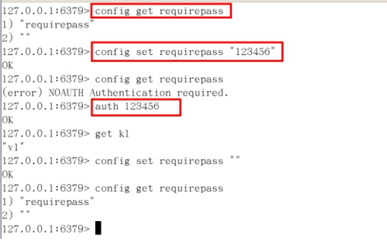

### LIMITS限制

#### maxclients

- 设置redis同时可以与多少个客户端进行连接。

- 默认情况下为10000个客户端。

- 如果达到了此限制，redis则会拒绝新的连接请求，并且向这些连接请求方发出“max number of clients reached”以作回应。

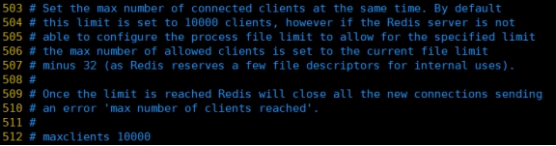

#### maxmemory

- 建议***\*必须设置\****，否则，将内存占满，造成服务器宕机

- 设置redis可以使用的内存量。一旦到达内存使用上限，redis将会试图移除内部数据，移除规则可以通过maxmemory-policy来指定。

- 如果redis无法根据移除规则来移除内存中的数据，或者设置了“不允许移除”，那么redis则会针对那些需要申请内存的指令返回错误信息，比如SET、LPUSH等。

- 但是对于无内存申请的指令，仍然会正常响应，比如GET等。如果你的redis是主redis（说明你的redis有从redis），那么在设置内存使用上限时，需要在系统中留出一些内存空间给同步队列缓存，只有在你设置的是“不移除”的情况下，才不用考虑这个因素。

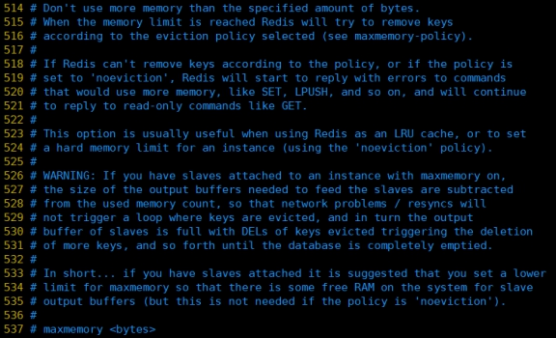

#### maxmemory-policy

- volatile-lru：使用LRU算法移除key，只对设置了过期时间的键；（最近最少使用）

- allkeys-lru：在所有集合key中，使用LRU算法移除key

- volatile-random：在过期集合中移除随机的key，只对设置了过期时间的键

- allkeys-random：在所有集合key中，移除随机的key

- volatile-ttl：移除那些TTL值最小的key，即那些最近要过期的key

- noeviction：不进行移除。针对写操作，只是返回错误信息

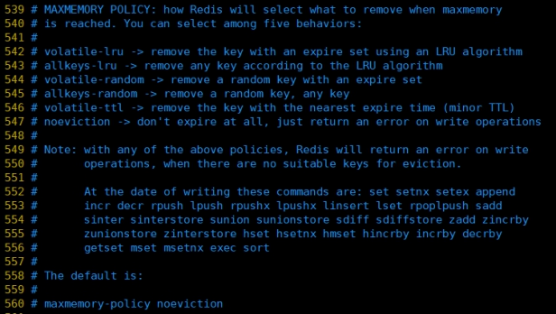

#### maxmemory-samples

- 设置样本数量，LRU算法和最小TTL算法都并非是精确的算法，而是估算值，所以你可以设置样本的大小，redis默认会检查这么多个key并选择其中LRU的那个。

- 一般设置3到7的数字，数值越小样本越不准确，但性能消耗越小。

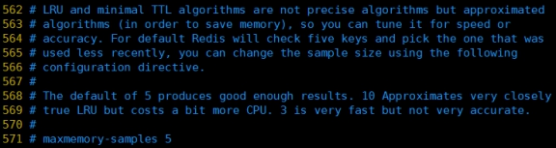


## Redis的发布和订阅

客户端订阅频道：

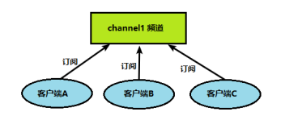

当给这个频道发布消息后，消息就会发送给订阅的客户端

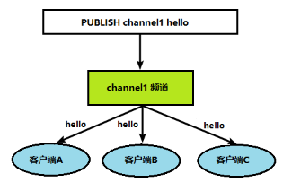

客户端-1订阅channel1

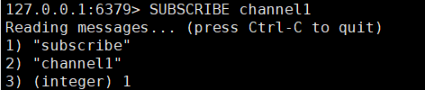

客户端-2给channel1发布消息hello


返回的1是订阅者数量

客户端-1可以看到发送的消息

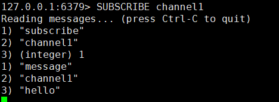

注：发布的消息没有持久化，如果在订阅的客户端收不到hello，只能收到订阅后发布的消息


## Redis 新数据类型

### Bitmaps

#### **命令**

| 命令                                     | 作用                                                         |
| ---------------------------------------- | ------------------------------------------------------------ |
| setbit <key><offset><value>              | 设置Bitmaps中某个偏移量的值(0或1) *offset:偏移量从0开始      |
| getbit <key><offset>                     | 获取Bitmaps中某个偏移量的值 获取键的第offset位的值(从0开始算) |
| bitcount <key>[start end]                | 统计字符串从start字节到end字节比特值为1的数量。-1 表示最后一个位，而 -2 表示倒数第二个位 |
| bitop and(or/not/xor) <destkey> [key...] | bitop是一个复合操作，可以做多个Bitmaps的and(交集)、or(并集)、not(非)、xor(异或)操作并将结果保存咋 destkey中 |

#### 实例

每个独立用户是否访问过网站存放在Bitmaps中， 将访问的用户记做1， 没有访问的用户记做0， 用偏移量作为用户的id。

**设置键的第offset个位的值（从0算起） ， 假设现在有20个用户，userid=1， 6， 11， 15， 19的用户对网站进行了访问， 那么当前Bitmaps初始化结果如图**

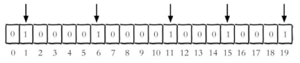

unique:users:20201106代表2020-11-06这天的独立访问用户的Bitmaps

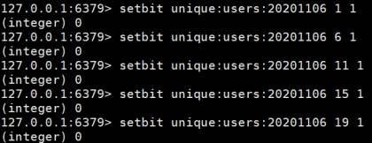

```java
//注：
很多应用的用户id以一个指定数字（例如10000） 开头， 直接将用户id和Bitmaps的偏移量对应势必会造成一定的浪费， 通常的做法是每次做setbit操作时将用户id减去这个指定数字。
在第一次初始化Bitmaps时， 假如偏移量非常大， 那么整个初始化过程执行会比较慢， 可能会造成Redis的阻塞。
```

**获取id=8的用户是否在2020-11-06这天访问过， 返回0说明没有访问过：**

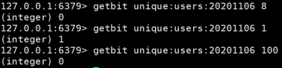

注：因为100根本不存在，所以也是返回0

**计算2022-11-06这天的独立访问用户数量**

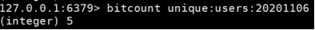

**start和end代表起始和结束字节数， 下面操作计算用户id在第1个字节到第3个字节之间的独立访问用户数， 对应的用户id是11， 15， 19。**

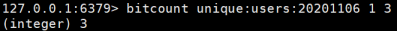

 注意：redis的setbit设置或清除的是bit位置，而bitcount计算的是byte位置。

**2020-11-04 日访问网站的userid=1,2,5,9。**
setbit unique:users:20201104 1 1
setbit unique:users:20201104 2 1
setbit unique:users:20201104 5 1
setbit unique:users:20201104 9 1

**2020-11-03 日访问网站的userid=0,1,4,9。**
setbit unique:users:20201103 0 1
setbit unique:users:20201103 1 1
setbit unique:users:20201103 4 1
setbit unique:users:20201103 9 1

**计算出两天都访问过网站的用户数量**

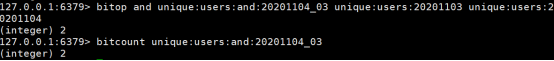

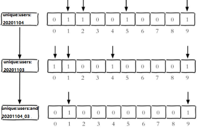

**计算出任意一天都访问过网站的用户数量（例如月活跃就是类似这种） ， 可以使用or求并集**

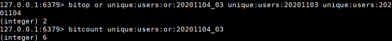

#### Bitmaps与set对比

假设网站有1亿用户， 每天独立访问的用户有5千万， 如果每天用集合类型和Bitmaps分别存储活跃用户可以得到表

| set和Bitmaps存储一天活跃用户对比 |                    |                  |                        |
| -------------------------------- | ------------------ | ---------------- | ---------------------- |
| 数据类型                         | 每个用户id占用空间 | 需要存储的用户量 | 全部内存量             |
| 集合类型                         | 64位               | 50000000         | 64位*50000000 = 400MB  |
| Bitmaps                          | 1位                | 100000000        | 1位*100000000 = 12.5MB |

很明显， 这种情况下使用Bitmaps能节省很多的内存空间， 尤其是随着时间推移节省的内存还是非常可观的

| set和Bitmaps存储独立用户空间对比 |        |        |       |
| -------------------------------- | ------ | ------ | ----- |
| 数据类型                         | 一天   | 一个月 | 一年  |
| 集合类型                         | 400MB  | 12GB   | 144GB |
| Bitmaps                          | 12.5MB | 375MB  | 4.5GB |

但Bitmaps并不是万金油， 假如该网站每天的独立访问用户很少， 例如只有10万（大量的僵尸用户） ， 那么两者的对比如下表所示， 很显然， 这时候使用Bitmaps就不太合适了， 因为基本上大部分位都是0。

| set和Bitmaps存储一天活跃用户对比（独立用户比较少） |                    |                  |                        |
| -------------------------------------------------- | ------------------ | ---------------- | ---------------------- |
| 数据类型                                           | 每个userid占用空间 | 需要存储的用户量 | 全部内存量             |
| 集合类型                                           | 64位               | 100000           | 64位*100000 = 800KB    |
| Bitmaps                                            | 1位                | 100000000        | 1位*100000000 = 12.5MB |


### HyperLogLog

求集合中不重复元素个数的问题称为基数问题。

解决基数问题有很多种方案：

- 数据存储在MySQL表中，使用distinct count计算不重复个数

- 使用Redis提供的hash、set、bitmaps等数据结构来处理

以上方案结果精确，但随着数据不断增加，导致占用空间越来越大，对于非常大的数据集是不切实际的。

使用Redis HyperLogLog 是用来做基数统计的算法，降低一定的精度来平衡存储空间，HyperLogLog的优点是，在输入元素的数量或者体积非常非常大时，计算基数所需的空间总是固定的、并且是很小的。

在 Redis 里面，每个 HyperLogLog 键只需要花费 12 KB 内存，就可以计算接近 2^64 个不同元素的基数。这和计算基数时，元素越多耗费内存就越多的集合形成鲜明对比。

但是，因为 HyperLogLog 只会根据输入元素来计算基数，而不会储存输入元素本身，所以 HyperLogLog 不能像集合那样，返回输入的各个元素。

```java
//什么是基数?
比如数据集 {1, 3, 5, 7, 5, 7, 8}， 那么这个数据集的基数集为 {1, 3, 5 ,7, 8}, 基数(不重复元素)为5。 基数估计就是在误差可接受的范围内，快速计算基数。
```

#### 命令

| 命令                                      | 作用                                         |
| ----------------------------------------- | -------------------------------------------- |
| pfadd <key><element>[element...]          | 添加指定元素到HyperLogLog                    |
| pfcount<key>[key...]                      | 计算HLL的近似基数，可以计算多个HLL           |
| pfmerge<destkey><sourcekey>[courcekey...] | 将一个或多个HLL合并后的结果存储在另一个HLL中 |


### Geospatial

**概述**

```java
Redis 3.2 中增加了对GEO类型的支持。GEO，Geographic，地理信息的缩写。该类型，就是元素的2维坐标，在地图上就是经纬度。redis基于该类型，提供了经纬度设置，查询，范围查询，距离查询，经纬度Hash等常见操作。
```

#### 命令

| 命令                                                         | 作用                                       |
| ------------------------------------------------------------ | ------------------------------------------ |
| geoadd<key><longitude><latitude><member> [longitude latitude member...] | 添加地理位置(经度，维度，名称)             |
| geopos  <key><member> [member...]                            | 获得指定地区的坐标值                       |
| geodist<key><member1><member2>  [m\|km\|ft\|mi]              | 获取两个位置之间的直线距离                 |
| georadius<key>< longitude><latitude>radius m\|km\|ft\|mi     | 以给定的经纬度为中心，找出某一半径内的元素 |


## Redis Jedis测试

### Jedis所需要的jar包

```xml
<dependency>
	<groupId>redis.clients</groupId>
	<artifactId>jedis</artifactId>
	<version>3.2.0</version>
</dependency>
```

### 连接Redis注意事项

禁用Linux的防火墙：Linux(CentOS7)里执行命令

systemctl stop/disable firewalld.service

redis.conf中注释掉bind 127.0.0.1 ,然后 protected-mode no

**程序**

```java
main{
    Jedis jedis = new Jedis("192.168.137.3",6379);
	String pong = jedis.ping();
	System.out.println("连接成功："+pong);
	jedis.close();
}
```

**操作相关数据类型**

```java
//Jesids-API:	Key
jedis.set("k1", "v1");
Set<String> keys = jedis.keys("*");
System.out.println(keys.size());
System.out.println(jedis.exists("k1"));
System.out.println(jedis.ttl("k1"));                
System.out.println(jedis.get("k1"));

//Jedis-API:    String
jedis.mset("str1","v1","str2","v2","str3","v3");
System.out.println(jedis.mget("str1","str2","str3"));

//Jedis-API:    List
List<String> list = jedis.lrange("mylist",0,-1);
for (String element : list) {
	System.out.println(element);
}

//Jedis-API:    set
jedis.sadd("orders", "order02");
Set<String> smembers = jedis.smembers("orders");
for (String order : smembers) {
	System.out.println(order);
}
jedis.srem("orders", "order02");

//Jedis-API:    hash
jedis.hset("hash1","userName","lisi");
System.out.println(jedis.hget("hash1","userName"));
Map<String,String> map = new HashMap<String,String>();
map.put("telphone","13810169999");
jedis.hmset("hash2",map);
List<String> result = jedis.hmget("hash2", "telphone","email");
```

### Redis与Spring Boot整合

1、 在pom.xml文件中引入redis相关依赖

```xml
<!-- redis -->
<dependency>
<groupId>org.springframework.boot</groupId>
<artifactId>spring-boot-starter-data-redis</artifactId>
</dependency>

<!-- spring2.X集成redis所需common-pool2-->
<dependency>
<groupId>org.apache.commons</groupId>
<artifactId>commons-pool2</artifactId>
<version>2.6.0</version>
</dependency>
```

2、 application.properties配置redis配置

```properties
#Redis服务器地址
spring.redis.host=192.168.140.136
#Redis服务器连接端口
spring.redis.port=6379
#Redis数据库索引（默认为0）
spring.redis.database= 0
#连接超时时间（毫秒）
spring.redis.timeout=1800000
#连接池最大连接数（使用负值表示没有限制）
spring.redis.lettuce.pool.max-active=20
#最大阻塞等待时间(负数表示没限制)
spring.redis.lettuce.pool.max-wait=-1
#连接池中的最大空闲连接
spring.redis.lettuce.pool.max-idle=5
#连接池中的最小空闲连接
spring.redis.lettuce.pool.min-idle=0
```

3、 添加redis配置类

```java
@EnableCaching
@Configuration
public class RedisConfig extends CachingConfigurerSupport {

    @Bean
    public RedisTemplate<String, Object> redisTemplate(RedisConnectionFactory factory) {
        RedisTemplate<String, Object> template = new RedisTemplate<>();
        RedisSerializer<String> redisSerializer = new StringRedisSerializer();
        Jackson2JsonRedisSerializer jackson2JsonRedisSerializer = new Jackson2JsonRedisSerializer(Object.class);
        ObjectMapper om = new ObjectMapper();
        om.setVisibility(PropertyAccessor.ALL, JsonAutoDetect.Visibility.ANY);
        om.enableDefaultTyping(ObjectMapper.DefaultTyping.NON_FINAL);
        jackson2JsonRedisSerializer.setObjectMapper(om);
        template.setConnectionFactory(factory);
//key序列化方式
        template.setKeySerializer(redisSerializer);
//value序列化
        template.setValueSerializer(jackson2JsonRedisSerializer);
//value hashmap序列化
        template.setHashValueSerializer(jackson2JsonRedisSerializer);
        return template;
    }

    @Bean
    public CacheManager cacheManager(RedisConnectionFactory factory) {
        RedisSerializer<String> redisSerializer = new StringRedisSerializer();
        Jackson2JsonRedisSerializer jackson2JsonRedisSerializer = new Jackson2JsonRedisSerializer(Object.class);
//解决查询缓存转换异常的问题
        ObjectMapper om = new ObjectMapper();
        om.setVisibility(PropertyAccessor.ALL, JsonAutoDetect.Visibility.ANY);
        om.enableDefaultTyping(ObjectMapper.DefaultTyping.NON_FINAL);
        jackson2JsonRedisSerializer.setObjectMapper(om);
// 配置序列化（解决乱码的问题）,过期时间600秒
        RedisCacheConfiguration config = RedisCacheConfiguration.defaultCacheConfig()
                .entryTtl(Duration.ofSeconds(600))
                .serializeKeysWith(RedisSerializationContext.SerializationPair.fromSerializer(redisSerializer))
                .serializeValuesWith(RedisSerializationContext.SerializationPair.fromSerializer(jackson2JsonRedisSerializer))
                .disableCachingNullValues();
        RedisCacheManager cacheManager = RedisCacheManager.builder(factory)
                .cacheDefaults(config)
                .build();
        return cacheManager;
    }
}
```

4.测试一下

RedisTestController中添加测试方法

```java
@RestController
@RequestMapping("/redisTest")
public class RedisTestController {
    @Autowired
    private RedisTemplate redisTemplate;

    @GetMapping
    public String testRedis() {
        //设置值到redis
        redisTemplate.opsForValue().set("name","lucy");
        //从redis获取值
        String name = (String)redisTemplate.opsForValue().get("name");
        return name;
    }
}
```


## Redis-事务-锁机制-秒杀

### Redis的事务定义

```java
Redis事务是一个单独的隔离操作：事务中的所有命令都会序列化、按顺序地执行。事务在执行的过程中，不会被其他客户端发送来的命令请求所打断。
Redis事务的主要作用就是串联多个命令防止别的命令插队。
```

### Multi、Exec、discard

```java
从输入Multi命令开始，输入的命令都会依次进入命令队列中，但不会执行，直到输入Exec后，Redis会将之前的命令队列中的命令依次执行。
组队的过程中可以通过discard来放弃组队。
```

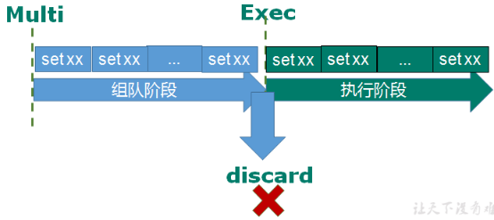

### 事务的错误处理

组队中某个命令出现了报告错误，执行时整个的所有队列都会被取消。

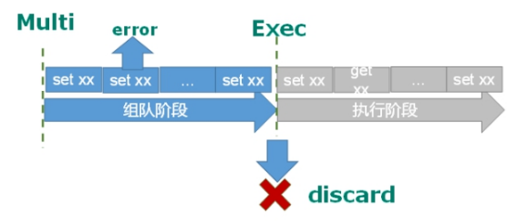

如果执行阶段某个命令报出了错误，则只有报错的命令不会被执行，而其他的命令都会执行，不会回滚。

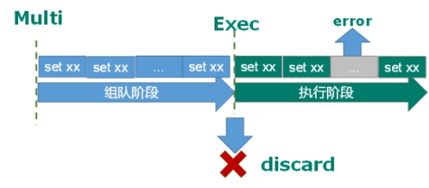

### 悲观锁

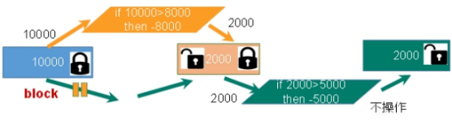

```java
悲观锁(Pessimistic Lock), 顾名思义，就是很悲观，每次去拿数据的时候都认为别人会修改，所以每次在拿数据的时候都会上锁，这样别人想拿这个数据就会block直到它拿到锁。传统的关系型数据库里边就用到了很多这种锁机制，比如行锁，表锁等，读锁，写锁等，都是在做操作之前先上锁。
```

### 乐观锁

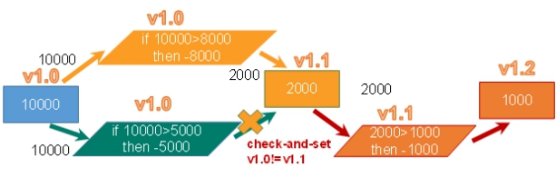

```java
乐观锁(Optimistic Lock), 顾名思义，就是很乐观，每次去拿数据的时候都认为别人不会修改，所以不会上锁，但是在更新的时候会判断一下在此期间别人有没有去更新这个数据，可以使用版本号等机制。乐观锁适用于多读的应用类型，这样可以提高吞吐量。Redis就是利用这种check-and-set机制实现事务的。
```

### WATCH key [key...]

在执行multi之前，先执行watch key1 [key2],可以监视一个(或多个) key ，如果在事务**执行之前这个(或这些) key 被其他命令所改动，那么事务将被打断。**

**unwatch**

取消 WATCH 命令对所有 key 的监视。
如果在执行 WATCH 命令之后，EXEC 命令或DISCARD 命令先被执行了的话，那么就不需要再执行UNWATCH 了。

### Redis事务三特性

- **单独的隔离操作** 
  - 事务中的所有命令都会序列化、按顺序地执行。事务在执行的过程中，不会被其他客户端发送来的命令请求所打断。 

- **没有隔离级别的概念** 
  - 队列中的命令没有提交之前都不会实际被执行，因为事务提交前任何指令都不会被实际执行

- **不保证原子性** 
  - 事务中如果有一条命令执行失败，其后的命令仍然会被执行，没有回滚

### 超卖问题

**利用乐观锁淘汰用户，解决超卖问题**

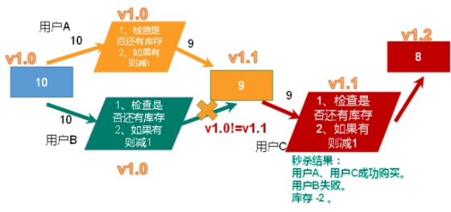

但当并发量增加，已经秒光，还有库存：原因就是**乐观锁导致很多请求都失败**。先点的没秒到，后点的可能秒到了。

增加事务操作来解决.

### **连接超时,通过连接池解决**

```lua
链接池参数
1. MaxTotal：控制一个pool可分配多少个jedis实例，通过pool.getResource()来获取；如果赋值为-1，则表示不限制；如果pool已经分配了MaxTotal个jedis实例，则此时pool的状态为exhausted。
2. maxIdle：控制一个pool最多有多少个状态为idle(空闲)的jedis实例；
3. MaxWaitMillis：表示当borrow一个jedis实例时，最大的等待毫秒数，如果超过等待时间，则直接抛JedisConnectionException；
4. testOnBorrow：获得一个jedis实例的时候是否检查连接可用性（ping()）；如果为true，则得到的jedis实例均是可用的；
```

### 解决库存遗留问题

使用LUA脚本语言

**LUA脚本在Redis中的优势**

- 将复杂的或者多步的redis操作,写为一个脚本,一次提交给redis执行,减少反复连接redis的次数.提升性能。
- LUA脚本是类似redis事务，有一定的原子性，不会被其他命令插队，可以完成一些redis事务性的操作，但是redis的lua脚本功能，只有在Redis2.6以上的版本才可以使用。
- 利用lua脚本淘汰用户，解决超卖问题

redis2.6版本以后，通过lua脚本解决**争抢问题**，实际上**redis利用其单线程的特性，用任务队列的方式解决多任务并发问题。**

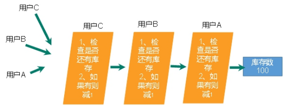


## RDB

> 在指定的**时间间隔**内将内存中的数据集**快照**写入磁盘，也就是行话讲的Snapshot快照，它恢复时是将快照文件直接读到内存里。

### 备份如何执行

Redis会单独创建（fork）一个子进程来进行持久化，会**先**将数据**写入**到 一个**临时文件**中，待持久化过程都结束了，再用这个**临时文件替换上次持久化**好的文件。 整个过程中，主进程是不进行任何IO操作的，这就确保了极高的性能 如果需要进行大规模数据的恢复，且对于数据恢复的完整性不是非常敏感，那RDB方式要比AOF方式更加的高效。**RDB的缺点是最后一次持久化后的数据可能丢失**。

### Fork

- Fork的作用是复制一个与当前进程**一样的进程**。新进程的所有数据（变量、环境变量、程序计数器等） 数值都和原进程一致，但是是一个全新的进程，并**作为原进程的子进程**
- 在Linux程序中，fork()会产生一个和父进程完全相同的子进程，但子进程在此后多会exec系统调用，出于效率考虑，Linux中引入了**写时复制技术**
- **一般情况父进程和子进程会共用同一段物理内存**，只有进程空间的各段的内容要发生变化时，才会将父进程的内容复制一份给子进程。

### RDB持久化流程

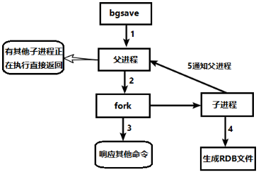

### dump.rdb文件

在redis.conf中配置文件名称，默认为dump.rdb

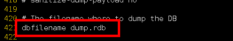

#### 配置位置

rdb文件的保存路径，也可以修改。默认为Redis启动时命令行所在的目录下

dir "/myredis/"

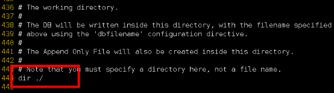

#### 如何触发RDB快照；保持策略

##### 配置文件中默认的快照配置

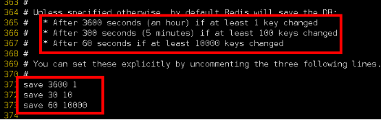

##### 命令save VS bgsave

save ：save时只管保存，其它不管，全部阻塞。手动保存。不建议。
bgsave：Redis会在后台异步进行快照操作， 快照同时还可以响应客户端请求。
可以通过lastsave 命令获取最后一次成功执行快照的时间

##### flushall命令

执行flushall命令，也会产生dump.rdb文件，但里面是空的，无意义

##### SNAPSHOTTING快照

##### Save

格式：save 秒钟 写操作次数

RDB是整个内存的压缩过的Snapshot，RDB的数据结构，可以配置复合的快照触发条件，

**默认是1分钟内改了1万次，或5分钟内改了10次，或15分钟内改了1次**

禁用
不设置save指令，或者给save传入空字符串

##### stop-writes-on-bgsave-error

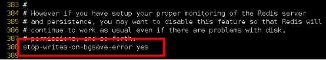

当Redis无法写入磁盘的话，直接关掉Redis的写操作。推荐yes.

##### rdbcompression压缩文件

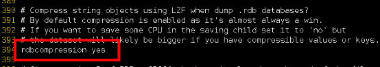

对于存储到磁盘中的快照，可以设置是否进行压缩存储。如果是的话，redis会采用LZF算法进行压缩。

如果不想消耗CPU来进行压缩的话，可以设置为关闭此功能。推荐yes.

##### rdb的备份

先通过config get dir  查询rdb文件的目录 
将*.rdb的文件拷贝到别的地方

rdb的恢复

- 关闭Redis
- 先把备份的文件拷贝到工作目录下 cp dump2.rdb dump.rdb
- 启动Redis，备份数据会直接加载

### 优势

- 适合大数据的数据恢复
- 对数据完整性和一致性要求不高更适合使用
- 节省磁盘空间
- 恢复速度快

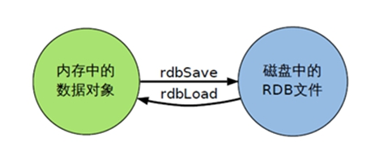

### 劣势

- Fork的时候，内存中的数据被克隆了一份，大致2倍的膨胀性需要考虑
- 虽然Redis在fork时使用了**写时拷贝技术**，但是如果数据庞大时还是比较消耗性能
- 在备份周期在一定间隔时间做一次备份，所以如果Redis意外down掉的话，就会丢失最后一次快照后的所有修改。

### 停止运行

动态停止RDB：redis-cli config set save ""#save后给空值，表示禁用保存策略

### 总结

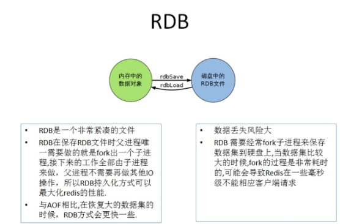


## AOF

> 以**日志**的形式来记录每个写操作（增量保存），将Redis执行过的所有写指令记录下来(**读操作不记录**)， **只许追加文件但不可以改写文件**，redis启动之初会读取该文件重新构建数据，换言之，redis 重启的话就根据日志文件的内容将写指令从前到后执行一次以完成数据的恢复工作

### AOF持久化流程

- 客户端的请求写命令会被append追加到AOF缓冲区内；
- AOF缓冲区根据AOF持久化策略[always,everysec,no]将操作sync同步到磁盘的AOF文件中；
- AOF文件大小超过重写策略或手动重写时，会对AOF文件rewrite重写，压缩AOF文件容量；
- Redis服务重启时，会重新load加载AOF文件中的写操作达到数据恢复的目的；

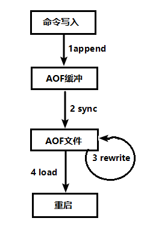

### AOF默认不开启

可以在redis.conf中配置文件名称，默认为 appendonly.aof

AOF文件的保存路径，同RDB的路径一致。

### AOF和RDB同时开启，redis听谁的？

AOF和RDB同时开启，系统默认取AOF的数据（数据不会存在丢失）

### AOF启动修复恢复

- AOF的备份机制和性能虽然和RDB不同，但是备份和恢复操作同RDB一样，都是拷贝备份文件，需要恢复时间时再拷贝到Redis工作目录下，启动系统即加载。
- 正常恢复
  - 修改默认的appendonly no，改为yes
  - 将有数据的aof文件复制一份保存到对应目录（查看目录：config get dir）
  - 恢复：重启redis然后重新加载
- 异常修复
  - 修改默认的appendonly no，改为yes
  - 如遇到**AOF文件损坏**，通过/usr/local/bin**redis-check-aof--fix appendonly.aof**进行恢复
  - 备份被写坏的AOF文件
  - 恢复：重启redis，然后重新加载

### AOF同步频率设置

- **appendfsync always**
  始终同步，每次Redis的写入都会立刻记入日志；性能较差但数据完整性比较好
- **appendfsync everysec**
  每秒同步，每秒记入日志一次，如果宕机，本秒的数据可能丢失。
- **appendfsync no**
  redis不主动进行同步，把同步时机交给操作系统。

### Rewrite压缩

> AOF采用文件追加方式，文件会越来越大为避免出现此种情况，新增了重写机制, 当AOF文件的大小超过所设定的阈值时，Redis就会启动AOF文件的内容压缩， 只保留可以恢复数据的最小指令集.可以使用命令bgrewriteaof

#### 重写原理

```java
AOF文件持续增长而过大时，会fork出一条新进程来将文件重写(也是先写临时文件最后再rename)，redis4.0版本后的重写，是指上就是把rdb 的快照，以二级制的形式附在新的aof头部，作为已有的历史数据，替换掉原来的流水账操作。
no-appendfsync-on-rewrite：
如果 no-appendfsync-on-rewrite=yes ,不写入aof文件只写入缓存，用户请求不会阻塞，但是在这段时间如果宕机会丢失这段时间的缓存数据。（降低数据安全性，提高性能）
如果 no-appendfsync-on-rewrite=no,  还是会把数据往磁盘里刷，但是遇到重写操作，可能会发生阻塞。（数据安全，但是性能降低）
触发机制，何时重写
Redis会记录上次重写时的AOF大小，默认配置是当AOF文件大小是上次rewrite后大小的一倍且文件大于64M时触发
重写虽然可以节约大量磁盘空间，减少恢复时间。但是每次重写还是有一定的负担的，因此设定Redis要满足一定条件才会进行重写。 
auto-aof-rewrite-percentage：设置重写的基准值，文件达到100%时开始重写（文件是原来重写后文件的2倍时触发）
auto-aof-rewrite-min-size：设置重写的基准值，最小文件64MB。达到这个值开始重写。
例如：文件达到70MB开始重写，降到50MB，下次什么时候开始重写？100MB
系统载入时或者上次重写完毕时，Redis会记录此时AOF大小，设为base_size,
如果Redis的AOF当前大小>= base_size +base_size*100% (默认)且当前大小>=64mb(默认)的情况下，Redis会对AOF进行重写。
```

#### 重写流程

- bgrewriteaof触发重写，判断是否当前有bgsave或bgrewriteaof在运行，如果有，则等待该命令结束后再继续执行。
- 主进程fork出子进程执行重写操作，保证主进程不会阻塞。
- 子进程遍历redis内存中数据到临时文件，客户端的写请求同时写入aof_buf缓冲区和aof_rewrite_buf重写缓冲区保证原AOF文件完整以及新AOF文件生成期间的新的数据修改动作不会丢失。
- 1).子进程写完新的AOF文件后，向主进程发信号，父进程更新统计信息。
  2).主进程把aof_rewrite_buf中的数据写入到新的AOF文件。
- 使用新的AOF文件覆盖旧的AOF文件，完成AOF重写。


### 优势

- 比起RDB占用更多的磁盘空间
- 恢复备份速度要慢
- 每次读写都同步的话，有一定的性能压力
- 存在个别BUG，造成恢复不能。

### 总结


## AOF和RDB比较

官方推荐两个都启用。

如果对数据不敏感，可以选单独用RDB。

不建议单独用 AOF，因为可能会出现Bug。

如果只是做纯内存缓存，可以都不用。

### 官方建议

- RDB持久化方式能够在指定的时间间隔能对你的数据进行快照存储

- AOF持久化方式记录每次对服务器写的操作,当服务器重启的时候会重新执行这些命令来恢复原始的数据,AOF命令以redis协议追加保存每次写的操作到文件末尾. 

- Redis还能对AOF文件进行后台重写,使得AOF文件的体积不至于过大

- 只做缓存：如果你只希望你的数据在服务器运行的时候存在,你也可以不使用任何持久化方式.

- 同时开启两种持久化方式
  在这种情况下,当redis重启的时候会优先载入AOF文件来恢复原始的数据, 因为在通常情况下AOF文件保存的数据集要比RDB文件保存的数据集要完整.

- RDB的数据不实时，同时使用两者时服务器重启也只会找AOF文件。那要不要只使用AOF呢？
  建议不要，因为RDB更适合用于备份数据库(AOF在不断变化不好备份)， 快速重启，而且不会有AOF可能潜在的bug，留着作为一个万一的手段。

- 性能建议

  ```java
  如果使用AOF，好处是在最恶劣情况下也只会丢失不超过两秒数据，启动脚本较简单只load自己的AOF文件就可以了。
  代价,一是带来了持续的IO，二是AOF rewrite的最后将rewrite过程中产生的新数据写到新文件造成的阻塞几乎是不可避免的。
  只要硬盘许可，应该尽量减少AOF rewrite的频率，AOF重写的基础大小默认值64M太小了，可以设到5G以上。
  默认超过原大小100%大小时重写可以改到适当的数值。
  ```


## Redis-主从复制

> 主机数据更新后根据配置和策略， 自动同步到备机的**master/slaver机制，Master以写为主，Slave以读为主**

**做什么：**

- 读写分离
- 容灾快速恢复


### 实现

```java
拷贝多个redis.conf文件include(写绝对路径)
开启daemonize yes
Pid文件名字pidfile
指定端口port
Log文件名字
dump.rdb名字dbfilename
Appendonly 关掉或者换名字
```

**新建redis6379.conf**
编辑以下内容


**新建redis6380.conf**
编辑以下内容


**新建redis6381.conf**
编辑以下内容


**启动三台redis服务器**


**查看系统进程**


**查看三台主机运行情况**

info replication 打印主从复制的相关信息


#### **配从(库)不配主(库)**

slaveof  <ip><port>
成为某个实例的从服务器

- 在6380和6381上执行：slaveof 127.0.0.1 6379
  
- 在主机上写，在从机上可以读取数据
  在从机上写数据报错
  
- 主机挂掉，重启就行，一切如初
- 从机重启需重设：slaveof 127.0.0.1 6379
  可以将配置增加到文件中。永久生效。
  

### 一主二仆

- 主机可写可读，从机只可读。
- 主机shutdown后，从机不会上位
- 主机回来后，主机新增记录，从机还能顺利复制
- 从机down后，连回来还能完成复制，跟上大部队


### 薪火相传

上一个Slave可以是下一个slave的Master，Slave同样可以接收其他slaves的连接和同步请求，那么该slave作为了链条中下一个的master，可以有效减轻master的写压力，去中心化降低风险。

命令：slaveof <ip> <port>
中途变更转向：会清除之前的数据，重新建立拷贝最新的
风险是一旦某个slave宕机，后面的slave都没法备份
主机挂了，从机还是从机，无法写数据。


### 反客为主

当一个master宕机后，后面的slave可以立刻升为master，其后面的slave不用做任何修改。
用slaveof no noe 将从机变为主机。


### 复制原理

- Slave启动成功连接到master后会发送一个sync命令
- Master接到命令启动后台的存盘进程，同时收集所有接收到的用于修改数据集命令， 在后台进程执行完毕之后，master将传送整个数据文件到slave,以完成一次完全同步
- 全量复制：而slave服务在接收到数据库文件数据后，将其存盘并加载到内存中。
- 增量复制：Master继续将新的所有收集到的修改命令依次传给slave,完成同步
- 但是只要是重新连接master,一次完全同步（全量复制)将被自动执行


### 哨兵模式

> **反客为主的自动版**，能够后台监控主机是否故障，如果故障了根据投票数自动将从库转换为主库


#### 实现

**调整为一主二仆模式，6379带着6380、6381**


**自定义的/myredis目录下新建sentinel.conf文件，名字决不能错**

**配置哨兵，填写内容**

vi /myredis/sentinel
sentinel monitor mymaster 127.0.0.1 6379 1
其中mymaster为监控对象起的服务器名称， 1 为至少有多少个哨兵同意迁移的数量。

**启动哨兵**

/usr/local/bin
redis做压测可以用自带的redis-benchmark工具
执行redis-sentinel  /myredis/sentinel.conf 


**当主机挂掉，从机选举中产生新的主机**
(大概10秒左右可以看到哨兵窗口日志，切换了新的主机)
从机根据优先级别：slave-priority 
原主机重启后会变为从机。


**复制延时**

由于所有的写操作都是先在Master上操作，然后同步更新到Slave上，所以从Master同步到Slave机器有一定的延迟，当系统很繁忙的时候，延迟问题会更加严重，Slave机器数量的增加也会使这个问题更加严重。

#### 故障恢复


优先级在redis.conf中默认：slave-priority 100，值越小优先级越高

偏移量是指获得原主机数据最全的

每个redis实例启动后都会随机生成一个40位的runid

#### 主从复制

```java
private static JedisSentinelPool jedisSentinelPool=null;

public static  Jedis getJedisFromSentinel(){
	if(jedisSentinelPool==null){
		Set<String> sentinelSet=new HashSet<>();
        sentinelSet.add("192.168.11.103:26379");

        JedisPoolConfig jedisPoolConfig =new JedisPoolConfig();
        jedisPoolConfig.setMaxTotal(10); //最大可用连接数
		jedisPoolConfig.setMaxIdle(5); //最大闲置连接数
		jedisPoolConfig.setMinIdle(5); //最小闲置连接数
		jedisPoolConfig.setBlockWhenExhausted(true); //连接耗尽是否等待
		jedisPoolConfig.setMaxWaitMillis(2000); //等待时间
		jedisPoolConfig.setTestOnBorrow(true); //取连接的时候进行一下测试 ping pong

		jedisSentinelPool=new JedisSentinelPool("mymaster",sentinelSet,jedisPoolConfig);
		return jedisSentinelPool.getResource();
	}else{
		return jedisSentinelPool.getResource();
	}
}
```

​	

## Redis集群

> Redis 集群实现了对Redis的水平扩容，即启动N个redis节点，将整个数据库分布存储在这N个节点中，每个节点存储总数据的1/N。
>
> Redis 集群通过分区（partition）来提供一定程度的可用性（availability）： 即使集群中有一部分节点失效或者无法进行通讯， 集群也可以继续处理命令请求。

```java
主从模式，薪火相传模式，主机宕机，导致ip地址发生变化，应用程序中配置需要修改对应的主机地址、端口等信息。
使用无中心化集群配置来解决。    
```

### 实现

**配置基本信息**

```java
开启daemonize yes
Pid文件名字
指定端口
Log文件名字
Dump.rdb名字
Appendonly 关掉或者换名字
```

**redis cluster配置修改**

cluster-enabled yes  打开集群模式
cluster-config-file nodes-6379.conf 设定节点配置文件名
cluster-node-timeout 15000  设定节点失联时间，超过该时间（毫秒），集群自动进行主从切换。

```properties
include /home/bigdata/redis.conf
port 6379
pidfile "/var/run/redis_6379.pid"
dbfilename "dump6379.rdb"
dir "/home/bigdata/redis_cluster"
logfile "/home/bigdata/redis_cluster/redis_err_6379.log"
cluster-enabled yes
cluster-config-file nodes-6379.conf
cluster-node-timeout 15000
```

**修改好redis6379.conf文件，拷贝多个redis.conf文件**

redis.conf文件


**使用查找替换修改另外5个文件**
例如：:%s/6379/6380 

**启动6个redis服务**


**将六个节点合成一个集群**
组合之前，请确保所有redis实例启动后，nodes-xxxx.conf文件都生成正常。


**合体**
cd  /opt/redis-6.2.1/src

```powershell
redis-cli --cluster create --cluster-replicas 1 172.16.10.150:6379 172.16.10.150:6380 172.16.10.150:6381 172.16.10.150:6389 172.16.10.150:6390 172.16.10.150:6391
```

此处不要用127.0.0.1， 请用真实IP地址
--replicas 1 采用最简单的方式配置集群，一台主机，一台从机，正好三组。


**普通方式登录**
可能直接进入读主机，存储数据时，会出现MOVED重定向操作。所以，应该以集群方式登录


**-c采用集群策略连接，设置数据会自动切换到相应的写主机**


**通过cluster nodes命令查看集群信息**


**redis cluster如何分配这六个节点**

一个集群至少要有三个主节点。
选项 --cluster-replicas 1 表示我们希望为集群中的每个主节点创建一个从节点。
分配原则尽量保证每个主数据库运行在不同的IP地址，每个从库和主库不在一个IP地址上。

**什么是slots**

```java
一个 Redis 集群包含 16384 个插槽（hash slot）， 数据库中的每个键都属于这 16384 个插槽的其中一个， 
集群使用公式 CRC16(key) % 16384 来计算键 key 属于哪个槽， 其中 CRC16(key) 语句用于计算键 key 的 CRC16 校验和 。
集群中的每个节点负责处理一部分插槽。 举个例子， 如果一个集群可以有主节点， 其中：
节点 A 负责处理 0 号至 5460 号插槽。
节点 B 负责处理 5461 号至 10922 号插槽。
节点 C 负责处理 10923 号至 16383 号插槽。
```

**在集群中录入值**

```java
在redis-cli每次录入、查询键值，redis都会计算出该key应该送往的插槽，如果不是该客户端对应服务器的插槽，redis会报错，并告知应前往的redis实例地址和端口。
redis-cli客户端提供了 –c 参数实现自动重定向。
如 redis-cli  -c –p 6379 登入后，再录入、查询键值对可以自动重定向。
不在一个slot下的键值，是不能使用mget,mset等多键操作。
```


可以通过{}来定义组的概念，从而使key中{}内相同内容的键值对放到一个slot中去。


**查询集群中的值**
CLUSTER GETKEYSINSLOT <slot><count> 返回 count 个 slot 槽中的键。


**故障恢复**
如果主节点下线？从节点能否自动升为主节点？注意：**15秒超时**

主节点恢复后，主从关系会如何？主节点回来变成从机。


如果所有某一段插槽的主从节点都宕掉，redis服务是否还能继续?
如果某一段插槽的主从都挂掉，而cluster-require-full-coverage 为yes ，那么 ，整个集群都挂掉
如果某一段插槽的主从都挂掉，而cluster-require-full-coverage 为no ，那么，该插槽数据全都不能使用，也无法存储。
redis.conf中的参数  cluster-require-full-coverage

### 集群的Jedis开发

即使连接的不是主机，集群会自动切换主机存储。主机写，从机读。
无中心化主从集群。无论从哪台主机写的数据，其他主机上都能读到数据。

```java
public class JedisClusterTest {
  public static void main(String[] args) { 
     Set<HostAndPort>set =new HashSet<HostAndPort>();
     set.add(new HostAndPort("192.168.31.211",6379));
     JedisCluster jedisCluster=new JedisCluster(set);
     jedisCluster.set("k1", "v1");
     System.out.println(jedisCluster.get("k1"));
  }
}
```

### Redis集群提供了以下好处

实现扩容
分摊压力
无中心配置相对简单

### Redis集群的不足

多键操作是不被支持的 
多键的Redis事务是不被支持的。lua脚本不被支持
由于集群方案出现较晚，很多公司已经采用了其他的集群方案，而代理或者客户端分片的方案想要迁移至redis cluster，需要整体迁移而不是逐步过渡，复杂度较大。


## 应用问题及解决

### 缓存穿透

**问题**

key对应的数据在数据源并不存在，每次针对此key的请求从缓存获取不到，请求都会压到数据源，从而可能压垮数据源。比如用一个不存在的用户id获取用户信息，不论缓存还是数据库都没有，若黑客利用此漏洞进行攻击可能压垮数据库	


#### 解决方案

```java
一个一定不存在缓存及查询不到的数据，由于缓存是不命中时被动写的，并且出于容错考虑，如果从存储层查不到数据则不写入缓存，这将导致这个不存在的数据每次请求都要到存储层去查询，失去了缓存的意义。
```

- **对空值缓存：**
  如果一个查询返回的数据为空（不管是数据是否不存在），我们仍然把这个空结果（null）进行缓存，设置空结果的过期时间会很短，最长不超过五分钟
- **设置可访问的名单（白名单）：**
  使用bitmaps类型定义一个可以访问的名单，名单id作为bitmaps的偏移量，每次访问和bitmap里面的id进行比较，如果访问id不在bitmaps里面，进行拦截，不允许访问。
- **采用布隆过滤器**：
  (布隆过滤器（Bloom Filter）是1970年由布隆提出的。它实际上是一个很长的二进制向量(位图)和一系列随机映射函数（哈希函数）。
  布隆过滤器可以用于检索一个元素是否在一个集合中。它的优点是空间效率和查询时间都远远超过一般的算法，缺点是有一定的误识别率和删除困难。)
  将所有可能存在的数据哈希到一个足够大的bitmaps中，一个一定不存在的数据会被 这个bitmaps拦截掉，从而避免了对底层存储系统的查询压力。
- **进行实时监控：**
  当发现Redis的命中率开始急速降低，需要排查访问对象和访问的数据，和运维人员配合，可以设置黑名单限制服务

### 缓存击穿

**问题**

key对应的数据存在，但在redis中过期，此时若有大量并发请求过来，这些请求发现缓存过期一般都会从后端DB加载数据并回设到缓存，这个时候大并发的请求可能会瞬间把后端DB压垮。


#### 解决方案

```java
key可能会在某些时间点被超高并发地访问，是一种非常“热点”的数据。这个时候，需要考虑一个问题：缓存被“击穿”的问题。
```

- **预先设置热门数据：**在redis高峰访问之前，把一些热门数据提前存入到redis里面，加大这些热门数据key的时长

- **实时调整：**现场监控哪些数据热门，实时调整key的过期时长

- **使用锁：**

  1、就是在缓存失效的时候（判断拿出来的值为空），不是立即去load db。

  2、先使用缓存工具的某些带成功操作返回值的操作（比如Redis的SETNX）去set一个mutex key

  3、 当操作返回成功时，再进行load db的操作，并回设缓存,最后删除mutex key；

  4、 当操作返回失败，证明有线程在load db，当前线程睡眠一段时间再重试整个get缓存的方法。


### 缓存雪崩

**问题**

key对应的数据存在，但在redis中过期，此时若有大量并发请求过来，这些请求发现缓存过期一般都会从后端DB加载数据并回设到缓存，这个时候大并发的请求可能会瞬间把后端DB压垮。
缓存雪崩与缓存击穿的区别在于这里针对很多key缓存，前者则是某一个key

正常访问


缓存失效瞬间


#### 解决方案

缓存失效时的雪崩效应对底层系统的冲击非常可怕！

- **构建多级缓存架构：**nginx缓存 + redis缓存 +其他缓存（ehcache等）
- **使用锁或队列**：用加锁或者队列的方式保证来保证不会有大量的线程对数据库一次性进行读写，从而避免失效时大量的并发请求落到底层存储系统上。不适用高并发情况
- **设置过期标志更新缓存：**记录缓存数据是否过期（设置提前量），如果过期会触发通知另外的线程在后台去更新实际key的缓存。
- **将缓存失效时间分散开：**比如我们可以在原有的失效时间基础上增加一个随机值，比如1-5分钟随机，这样每一个缓存的过期时间的重复率就会降低，就很难引发集体失效的事件。

### 分布式锁

**问题**

随着业务发展的需要，原单体单机部署的系统被演化成分布式集群系统后，由于分布式系统多线程、多进程并且分布在不同机器上，这将使原单机部署情况下的并发控制锁策略失效，单纯的Java API并不能提供分布式锁的能力。为了解决这个问题就需要一种跨JVM的互斥机制来控制共享资源的访问，这就是分布式锁要解决的问题！

分布式锁主流的实现方案：

- 基于数据库实现分布式锁
- 基于缓存（Redis等）
- 基于Zookeeper

每一种分布式锁解决方案都有各自的优缺点：

- 性能：redis最高
- 可靠性：zookeeper最高

#### 解决方案

- 

redis:命令

\# set sku:1:info “OK” NX PX 10000
EX second ：设置键的过期时间为 second 秒。 SET key value EX second 效果等同于 SETEX key second value 。
PX millisecond ：设置键的过期时间为 millisecond 毫秒。 SET key value PX millisecond 效果等同于 PSETEX key millisecond value 。
NX ：只在键不存在时，才对键进行设置操作。 SET key value NX 效果等同于 SETNX key value 。
XX ：只在键已经存在时，才对键进行设置操作。


- 多个客户端同时获取到锁（setnx）
- 获取成功，执行业务逻辑{从db获取数据，放入缓存}，执行完成释放锁（del）
- 其他客户端等待重试

问题：setnx刚好获取到锁，业务逻辑出现异常，导致锁无法释放

解决：设置过期时间，自动释放锁。

#### 优化之设置锁的过期时间

设置过期时间有两种方式

- 首先想到通过expire设置过期时间（缺乏原子性：如果在setnx和expire之间出现异常，锁也无法释放）
- 在set时指定过期时间（推荐）


设置过期时间：


问题：可能会释放其他服务器的锁。

场景：如果业务逻辑的执行时间是7s。执行流程如下

- index1业务逻辑没执行完，3秒后锁被自动释放。
- index2获取到锁，执行业务逻辑，3秒后锁被自动释放。
- index3获取到锁，执行业务逻辑
- index1业务逻辑执行完成，开始调用del释放锁，这时释放的是index3的锁，导致index3的业务只执行1s就被别人释放。

最终等于没锁的情况。

解决：setnx获取锁时，设置一个指定的唯一值（例如：uuid）；释放前获取这个值，判断是否自己的锁

#### 优化之UUID防误删


问题：删除操作缺乏原子性。

场景：

- index1执行删除时，查询到的lock值确实和uuid相等

uuid=v1

set(lock,uuid)；

 

- index1执行删除前，lock刚好过期时间已到，被redis自动释放

在redis中没有了lock，没有了锁。

 

- index2获取了lock

index2线程获取到了cpu的资源，开始执行方法

uuid=v2

set(lock,uuid)；

- index1执行删除，此时会把index2的lock删除

index1 因为已经在方法中了，所以不需要重新上锁。index1有执行的权限。index1已经比较完成了，这个时候，开始执行

 

删除的index2的锁！

#### 优化之LUA脚本保证删除的原子性

```java
@GetMapping("testLockLua")
public void testLockLua() {
    //1 声明一个uuid ,将做为一个value 放入我们的key所对应的值中
    String uuid = UUID.randomUUID().toString();
    //2 定义一个锁：lua 脚本可以使用同一把锁，来实现删除！
    String skuId = "25"; // 访问skuId 为25号的商品 100008348542
    String locKey = "lock:" + skuId; // 锁住的是每个商品的数据

    // 3 获取锁
    Boolean lock = redisTemplate.opsForValue().setIfAbsent(locKey, uuid, 3, TimeUnit.SECONDS);

    // 第一种： lock 与过期时间中间不写任何的代码。
    // redisTemplate.expire("lock",10, TimeUnit.SECONDS);//设置过期时间
    // 如果true
    if (lock) {
        // 执行的业务逻辑开始
        // 获取缓存中的num 数据
        Object value = redisTemplate.opsForValue().get("num");
        // 如果是空直接返回
        if (StringUtils.isEmpty(value)) {
            return;
        }
        // 不是空 如果说在这出现了异常！ 那么delete 就删除失败！ 也就是说锁永远存在！
        int num = Integer.parseInt(value + "");
        // 使num 每次+1 放入缓存
        redisTemplate.opsForValue().set("num", String.valueOf(++num));
        /*使用lua脚本来锁*/
        // 定义lua 脚本
        String script = "if redis.call('get', KEYS[1]) == ARGV[1] then return redis.call('del', KEYS[1]) else return 0 end";
        // 使用redis执行lua执行
        DefaultRedisScript<Long> redisScript = new DefaultRedisScript<>();
        redisScript.setScriptText(script);
        // 设置一下返回值类型 为Long
        // 因为删除判断的时候，返回的0,给其封装为数据类型。如果不封装那么默认返回String 类型，
        // 那么返回字符串与0 会有发生错误。
        redisScript.setResultType(Long.class);
        // 第一个要是script 脚本 ，第二个需要判断的key，第三个就是key所对应的值。
        redisTemplate.execute(redisScript, Arrays.asList(locKey), uuid);
    } else {
        // 其他线程等待
        try {
            // 睡眠
            Thread.sleep(1000);
            // 睡醒了之后，调用方法。
            testLockLua();
        } catch (InterruptedException e) {
            e.printStackTrace();
        }
    }
}
```

**LUA脚本详解：**


**项目中使用：**

定义key，key应该是为每个sku定义的，也就是每个sku有一把锁。

String locKey =**"lock:"**+skuId; *//* *锁住的是每个商品的数据*

Boolean lock = **redisTemplate**.opsForValue().setIfAbsent(locKey, uuid,3,TimeUnit.***SECONDS\***);


#### 总结：

- 加锁

  ```java
  // 1. 从redis中获取锁,set k1 v1 px 20000 nx
  String uuid = UUID.randomUUID().toString();
  Boolean lock = this.redisTemplate.opsForValue()
        .setIfAbsent("lock", uuid, 2, TimeUnit.SECONDS);
  ```

- 使用lua释放锁

  ```java
  // 2. 释放锁 del
  String script = "if redis.call('get', KEYS[1]) == ARGV[1] then return redis.call('del', KEYS[1]) else return 0 end";
  // 设置lua脚本返回的数据类型
  DefaultRedisScript<Long> redisScript = new DefaultRedisScript<>();
  // 设置lua脚本返回类型为Long
  redisScript.setResultType(Long.class);
  redisScript.setScriptText(script);
  redisTemplate.execute(redisScript, Arrays.asList("lock"),uuid);
  ```

- 重试

  ```java
  Thread.sleep(500);
  testLock();
  ```

  为了确保分布式锁可用，我们至少要确保锁的实现同时**满足以下四个条件**：

  \- 互斥性。在任意时刻，只有一个客户端能持有锁。

  \- 不会发生死锁。即使有一个客户端在持有锁的期间崩溃而没有主动解锁，也能保证后续其他客户端能加锁。

  \- 解铃还须系铃人。加锁和解锁必须是同一个客户端，客户端自己不能把别人加的锁给解了。

  \- 加锁和解锁必须具有原子性


## Redis6.0新功能

### ACL

Redis ACL是Access Control List（访问控制列表）的缩写，该功能允许根据可以执行的命令和可以访问的键来限制某些连接。

在Redis 5版本之前，Redis 安全规则只有密码控制 还有通过rename 来调整高危命令比如 flushdb ， KEYS* ， shutdown 等。Redis 6 则提供ACL的功能对用户进行更细粒度的权限控制 ：

（1）接入权限:用户名和密码 

（2）可以执行的命令 

（3）可以操作的 KEY

参考官网：https://redis.io/topics/acl

**命令**

1、使用acl list命令展现用户权限列表

（1）数据说明

 

2、使用acl cat命令

（1）查看添加权限指令类别

 

（2）加参数类型名可以查看类型下具体命令

 

3、使用acl whoami命令查看当前用户

 

4、使用aclsetuser命令创建和编辑用户ACL

（1）ACL规则

下面是有效ACL规则的列表。某些规则只是用于激活或删除标志，或对用户ACL执行给定更改的单个单词。其他规则是字符前缀，它们与命令或类别名称、键模式等连接在一起。

| ACL规则              |              |                                                              |
| -------------------- | ------------ | ------------------------------------------------------------ |
| 类型                 | 参数         | 说明                                                         |
| 启动和禁用用户       | on           | 激活某用户账号                                               |
|                      | off          | 禁用某用户账号。注意，已验证的连接仍然可以工作。如果默认用户被标记为off，则新连接将在未进行身份验证的情况下启动，并要求用户使用AUTH选项发送AUTH或HELLO，以便以某种方式进行身份验证。 |
| 权限的添加删除       | +<command>   | 将指令添加到用户可以调用的指令列表中                         |
|                      | -<command>   | 从用户可执行指令列表移除指令                                 |
|                      | +@<category> | 添加该类别中用户要调用的所有指令，有效类别为@admin、@set、@sortedset…等，通过调用ACL CAT命令查看完整列表。特殊类别@all表示所有命令，包括当前存在于服务器中的命令，以及将来将通过模块加载的命令。 |
|                      | -@<actegory> | 从用户可调用指令中移除类别                                   |
|                      | allcommands  | +@all的别名                                                  |
|                      | nocommand    | -@all的别名                                                  |
| 可操作键的添加或删除 | ~<pattern>   | 添加可作为用户可操作的键的模式。例如~*允许所有的键           |

（2）通过命令创建新用户默认权限

acl setuser user1

 

在上面的示例中，我根本没有指定任何规则。如果用户不存在，这将使用just created的默认属性来创建用户。如果用户已经存在，则上面的命令将不执行任何操作。

（3）设置有用户名、密码、ACL权限、并启用的用户

acl setuser user2 on >password ~cached:* +get

 

(4)切换用户，验证权限

 

### IO多线程

Redis6终于支撑多线程了，告别单线程了吗？

IO多线程其实指**客户端交互部分**的**网络IO**交互处理模块**多线程**，而非**执行命令多线程**。Redis6执行命令依然是单线程。

#### 原理框架

Redis 6 加入多线程,但跟 Memcached 这种从 IO处理到数据访问多线程的实现模式有些差异。Redis 的多线程部分只是用来处理网络数据的读写和协议解析，执行命令仍然是单线程。之所以这么设计是不想因为多线程而变得复杂，需要去控制 key、lua、事务，LPUSH/LPOP 等等的并发问题。整体的设计大体如下:


另外，多线程IO默认也是不开启的，需要再配置文件中配置

io-threads-do-reads  yes 
io-threads 4

### 工具支持 Cluster

之前老版Redis想要搭集群需要单独安装ruby环境，Redis 5 将 redis-trib.rb 的功能集成到 redis-cli 。另外官方 redis-benchmark 工具开始支持 cluster 模式了，通过多线程的方式对多个分片进行压测。


### Redis新功能持续关注

Redis6新功能还有：

1、RESP3新的 Redis 通信协议：优化服务端与客户端之间通信

2、Client side caching客户端缓存：基于 RESP3 协议实现的客户端缓存功能。为了进一步提升缓存的性能，将客户端经常访问的数据cache到客户端。减少TCP网络交互。

3、Proxy集群代理模式：Proxy 功能，让 Cluster 拥有像单实例一样的接入方式，降低大家使用cluster的门槛。不过需要注意的是代理不改变 Cluster 的功能限制，不支持的命令还是不会支持，比如跨 slot 的多Key操作。

4、Modules API
Redis 6中模块API开发进展非常大，因为Redis Labs为了开发复杂的功能，从一开始就用上Redis模块。Redis可以变成一个框架，利用Modules来构建不同系统，而不需要从头开始写然后还要BSD许可。Redis一开始就是一个向编写各种系统开放的平台。

