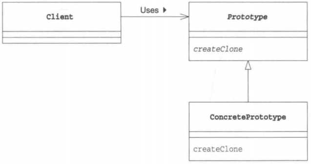

# 设计模式

## 七大原则

```java
//1、单一职责原则
//2、接口隔离原则
//3、依赖倒转原则
//4、里氏替换原则
//5、开闭原则ocp
//6、迪米特法则
//7、合成复用原则
```

### 目的

```java
//1、代码重用性(相同功能的代码，不用多次编写)
//2、可读性(编程规范性，便于其他程序员的阅读和理解)
//3、可扩展性(也称可维护性，增加新的功能时要方便)
//4、可靠性(当增加新的功能后，对原来的功能没有影响)
//5、使程序出现高内聚，低耦合的特性
```

### 单一职责原则

```java
//对类来说的，即一个类应该只负责一项职责。如类A负责两个不同职责：职责1，职责2.当职责1需求变更而改变A时，可能造成职责2执行错误，所以需要将类A的粒度分解为A1，A2
```

**单一职责原理注意事项和细节**

```java
//1、降低类的复杂度，一个类只负责一项职责
//2、提高类的可读性，可维护性
//3、降低变更引起的风险
//4、通常情况下，我们应当遵守单一职责原则，只有逻辑做够简单，才可以在代码级违反单一职责原理；只有类方法数量足够少，可以在方法级别保持单一职责原则
```

### 接口隔离原则

```java
//客户端不应该依赖它不需要的接口，即一个类对另一个类的依赖应该建立在最小的接口上。
```


```java
main{
    A aa = new A(); aa.depend1(new B());//A 类通过接口去依赖B类
	aa.depend2(new B()); aa.depend3(new B());

    C cc = new C(); cc.depend1(new D());
    cc.depend4(new D()); cc.depend5(new D());
}
interface Interface1 { void opt1(); }

interface Interface2 { void opt2(); void opt3(); }

interface Interface3 { void opt4(); void opt5(); }

class B implements Interface1 ,Interface2{ /*实现接口方法*/ }

class D implements Interface1,Interface3 { /*实现接口方法*/}

class A { //A 类通过接口Interface1,Interface2 依赖(使用) B类，但是只会用到1,2,3方法
    public void depend1(Interface1 interface1) { interface1.opt1(); }
    public void depend2(Interface2 interface1) { interface1.opt2(); }
    public void depend3(Interface2 interface1) { interface1.opt3(); }
}
class C { //C 类通过接口Interface1,Interface3 依赖(使用) D类，但是只会用到1,2,3方法
    public void depend1(Interface1 interface1) { interface1.opt1(); }
    public void depend4(Interface3 interface1) { interface1.opt4(); }
    public void depend5(Interface3 interface1) { interface1.opt5(); }
}
```

### 依赖倒转(倒置)原则

```java
//1、高层模块不应该依赖底层模块，二层都应该依赖抽象
//2、抽象不应该依赖细节，细节应该依赖抽象
//3、依赖倒转(倒置)的中心思想是面向接口编程
//4、设计理念：相当于细节的多变性，抽象的东西要稳定的多。以抽象搭建的架构比以细节为基础的架构要稳定的多。抽象指的是接口或抽象类，细节就是具体的实现类
//5、使用接口或抽象类的目的是制定好规范，而不涉及任何具体的操作，把展现细节的任务交给实现类去完成
```

**依赖倒转的注意事项和细节**

```java
//1、底层模块尽量都要有抽象类或接口，或者两者都有，程序稳定性更好
//2、变量的声明类型尽量是抽象类或接口，在变量引用和时间对象间，就存在一个缓冲层，利于程序扩展和优化
//3、基础时遵循里氏替换原则
```

**依赖传递的三种方式**

```java
//1、接口传递
//2、构造方法传递
//3、setter方式传递
```

```java
main{
    changhongTV changhongTV = new changhongTV();
    //接口传递实现依赖
	OpenAndClose openAndClose = new OpenAndClose();
	openAndClose.open(changhongTV);
    //构造器方法传递
	OpenAndClose openAndClose = new OpenAndClose(changhongTV);
	openAndClose.open();
    //setter方法传递
    OpenAndClose openAndClose = new OpenAndClose();
    openAndClose.setTv(changhongTV);
    openAndClose.open();
}

//接口
interface IOpenAndClose {public void open(ITV tv);}
interface ITV { public void play();}
class changhongTV implements ITV{
    @Override
    public void play() { System.out.println("打开长虹电视机"); }
}

//通过构造方法依赖传递
interface IOpenAndClose { public void open(); }
interface ITV { public void play(); }
class OpenAndClose implements IOpenAndClose {
    public ITV tv;
    public OpenAndClose(ITV tv) { this.tv = tv; }
    public void open() { this.tv.play(); }
}
class changhongTV implements ITV{
    @Override
    public void play() { System.out.println("打开长虹电视机"); }
}

//通过setter方法传递
interface IOpenAndClose {
    public void open(); 
    public void setTv(ITV tv);
}
interface ITV { public void play(); }
class OpenAndClose implements IOpenAndClose {
    private ITV tv;
    public void setTv(ITV tv) { this.tv = tv; }
    public void open() { this.tv.play(); }
}
class changhongTV implements ITV{
    @Override
    public void play() { System.out.println("打开长虹电视机"); }
}
```

### 里氏转换原则

```java
//1、所有引用基类的地方必须能透明地使用其子类的对象。
//2、使用继承时，遵循里氏替换原则，在子类中尽量不要重写父类的方法。
//3、继承实际上让两个类增强耦合性，可以通过聚合，组合，依赖，来解决问题。
```

```java
main(String[] args) {
        A a = new A();
        System.out.println("11-3=" + a.fun1(11, 3));//11-3=8
        System.out.println("1-8=" + a.fun1(1, 8));//1-8=-7
        B b = new B();
        //因为B类不再继承A类 因此调用者，不会再fun1是求减法
        //调用完成的功能就会很明确
        System.out.println("11+3=" + b.fun1(11, 3)); //这里的本意是求出11+3
        System.out.println("1-8=" + b.fun1(1, 8));  // 这里 1+8
        System.out.println("11+3+9=" + b.fun2(11, 3));11+3+9=23
        //使用组合仍然可以使用到A类相关方法
        System.out.println("11-3="+b.fun3(11,3));//这里的本意是求出11-3
    }
}
//创建一个更加基础的基类
class Base{//把更加基础的方法和成员写到Base类
}
//A类
class A extends Base {
    // 返回两个数的差
    public int fun1(int num1, int num2) {
        return num1 - num2;
    }
}
//B类继承A类
// 新增一个新功能：完成两个数的相加，然后和9求和
class B extends Base {
    private A a = new A();
    //这里重写了A类的方法，可能是无意识
    public int fun1(int a, int b) {
        return a + b;
    }
    public int fun2(int a, int b) {
        return fun1(a, b) + 9;
    }
    //我们仍然想使用A的方法
    public int fun3(int a,int b){
        return this.a.fun1(a,b);
    }
}
```

### 开闭原则

```java
1、开闭原则是编程中最基础、最重要的设计原则。
2、通过扩展软件实体的行为来实现变化，而不是通过修改已有代码来实现变化。
3、编程中遵循其他原则，以及使用设计模式的目的就是遵循开闭原则。
```

```java
main{
    GraphicEditor graphicEditor = new GraphicEditor();
    graphicEditor.drawShape(new Rectangle());
    graphicEditor.drawShape(new Circle());
    graphicEditor.drawShape(new Triangle());
    graphicEditor.drawShape(new Other());
}

//用于绘图的类
class GraphicEditor {
    //接收Shape对象，根据type，来绘制不同的图形
    public void drawShape(Shape s) {
        s.draw();
    }
}
//Shape类，基类
abstract class Shape {
    int m_type;
    public abstract void draw();//抽象方法
}
class Rectangle extends Shape {
    Rectangle() {
        super.m_type = 1;
    }
    @Override
    public void draw() {
        System.out.println("绘制矩形");
    }
}
class Circle extends Shape {
    public Circle() {
        super.m_type = 2;
    }
    @Override
    public void draw() {
        System.out.println("绘制圆形");
    }
}
class Triangle extends Shape {
    public Triangle() {
        super.m_type = 3;
    }
    @Override
    public void draw() {
        System.out.println("绘制三角形 ");
    }
}
class Other extends Shape {
    public Other() {
        super.m_type = 4;
    }
    @Override
    public void draw() {
        System.out.println("绘制其他图形");
    }
}
```

### 迪米特法则

```java
1、一个对象应该对其他对象保持最少的了解
2、类与类关系越密切，耦合度越大
3、迪米特法则又叫最少知道原则，即一个类对自己依赖的类知道的越少越好，即对外处理提供public方法，不对外泄露任何信息
4、更简单的定义：只与直接的朋友通信
5、直接的朋友：每个对象都会与其他对象有耦合关系，只要两个对象之间有耦合关系，这两个对象之间就是朋友关系，耦合的方式很多：依赖、关联、组合、聚合等。其中：出现在 成员变量，方法参数，方法返回值中的类为直接的朋友，而出现在局部变量中的类不是直接的朋友，要避免出现在局部变量中。    
```

**迪米特法则注意事项和细节**

```java
1、迪米特法则的核心是降低类之间的耦合
2、注意：每个类都减少了不必要的依赖，迪米特法则只是要求降低类之间的耦合关系，并不是要求完全没有依赖关系    
```

```java
main{
    System.out.println("使用迪米特原则的改进");
    SchoolManager schoolManager = new SchoolManager();
    schoolManager.printAllEmployee(new CollegeManager());
}
//学校总部员工类
class Employee {
    private String id;
    public void setId(String id) {
        this.id = id;
    }
    public String getId() {
        return id;
    }
}
//学院的员工
class CollegeEmployee {
    private String id;
    public void setId(String id) {
        this.id = id;
    }
    public String getId() {
        return id;
    }
}
//管理学院员工的管理类
class CollegeManager {
    //返回学院的所有员工
    public List<CollegeEmployee> getAllEmployee() {
        List<CollegeEmployee> list = new ArrayList<CollegeEmployee>();
        for (int i = 0; i < 10; i++) { //增加了10个员工
            CollegeEmployee emp = new CollegeEmployee();
            emp.setId("学院员工id= " + i);
            list.add(emp);
        }
        return list;
    }
    //输出学院员工的信息
    public void printEmployee(){
        List<CollegeEmployee> list1 = getAllEmployee();
        System.out.println("------------学院员工------------");
        for (CollegeEmployee e : list1) {
            System.out.println(e.getId());
        }
    }
}
//管理学校员工的管理类
// SchoolManager的直接朋友 Employee CollegeManager
// CollegeEmployee 不是直接朋友，而是陌生类，违背了迪米特原则
class SchoolManager {
    //返回学校总部的员工
    public List<Employee> getAllEmployee() {
        List<Employee> list = new ArrayList<Employee>();
        for (int i = 0; i < 5; i++) {
            Employee emp = new Employee();
            emp.setId("学校总部员工id= " + i);
            list.add(emp);
        }
        return list;
    }
    //该方法完成输出学校总部和学院员工信息(id)
    void printAllEmployee(CollegeManager sub) {
        //将输出学院的员工的方法，封装到CollegeManager
        //获取学院员工
        sub.printEmployee();
        //获取到学校员工
        List<Employee> list2 = this.getAllEmployee();
        System.out.println("------------学校总部员工------------");
        for (Employee e : list2) {
            System.out.println(e.getId());
        }
    }
}
```

### 合成复用原则

```java
//原则是尽量使用合成/聚合的方式，而不是使用继承  
```

**设计原则核心思想**

```java
1、找出应用中可能需要变化之处，把它们独立出来，不要和那些不需要变化的代码混在一起
2、针对接口编程，而不是针对实现编程
3、为了交互对象之间的松耦合设计而努力    
```

## UML

```java
//UML(统一建模语言)，是一种用于软件系统分析和设计的语言工具。
//UML本身是一套符号的规定，就像数学符号和化学符号一样，符号用来描述软件模型中的各个元素之间的关系，如：类、接口、实现、泛化、依赖、组合、聚合等。
```


### UML类图

```java
1、用与描述系统中的类(对象)本身的组成和类(对象)之间的各种静态关系
2、类之间的关系：依赖、泛化(继承)、实现、关联、聚合与组合    
```

### 依赖关系

```java
只要在类中用到了对方，它们之间就存在依赖关系，可以是：
 1、类的成员属性
 2、方法的返回类型
 3、方法接受的参数类型
 4、方法中使用到的    
```


### 泛化关系

```java
泛化关系实际上就是继承关系，即如果A类继承了B类，那么A和B就是泛化关系。
```

### 实现关系

```java
实现关系实际上就是A类实现B类接口，它是依赖关系的特例
```

### 关联关系

```java
关联关系是类与类之间的联系，是依赖关系的特例。
关联具有导航性：即双向关系或单向关系
关联具有多重性：如“1”(表示有且仅有一个)，“0...”(表示0个或者多个)，“0，1”(表示0个或1个)，“n...m”(表示n到m个都可以)，“m...*”(表示至少m个)    
```

```java
//单向一对一关系
public class Person{private IDCard card;}
public class IDCard{}
//双向一对一关系
public class Person{private IDCard card;}
public class IDCard{private Person person;}
```

### 聚合关系

```java
聚合关系表示的是整体和部分的关系，整体与部分可以分开。聚合关系是关联关系的特例。所以它具有关联的导航性和多重性。
```


### 组合关系

```java
组合关系：也是整体与部分的关系，但是整体与部分不可以分开。
public class Person{ 
    private IDCard card; 
    private Head head = new Head(); 
}
上述代码： Head和Person就是组合，IDCard和Person就是聚合。
```


## 设计模式

> 1、设计模式的本质是提高 软件的维护性，通用性和扩展性，并降低软件的复杂度
> 2、设计模式不局限与语言。
> 3、设计模式分为三种类型，共23种：
> 	一、创建型模式：单例模式、抽象工厂模式、原型模式、建造者模式、工厂模式。
> 	二、结构型模式：适配器模式、桥接模式、装饰模式、组合模式、外观模式、享元模式、代理模式
> 三、行为型模式：模板方法模板、命令模式、访问者模式、迭代器模式、观察者模式、中介者模式、备忘录模式、解释器模式（Interpreter模式）、状态模式、策略模式、职责链模式（责任链模式）

### Iterator模式

> **迭代器模式**是一种行为设计模式， 让你能在不暴露集合底层表现形式 （列表、 栈和树等） 的情况下遍历集合中所有的元素。

```java
在for预计中的i++的作用是让i的值每次循环后自增1，来访问数组的下一个元素。
将这里的循环变量i的作用抽象化、通用化后形成的模式，在设计模式中成为Iterator模式---迭代器模式
```

#### 应用场景

- 当集合背后为复杂的数据结构，且你希望对客户端隐藏其复杂性时 （出于使用便利性或安全性的考虑），可以使用迭代器模式。
- 使用该模式可以减少程序中重复的遍历代码。
- 如果希望代码能够遍历不同的甚至是无法预知的数据结构，可以使用迭代器模式。

#### 登场角色

- **Iterator(迭代器)**：该角色定义按顺序逐个遍历元素的**接口(API)**。它定义了 hasNext 和 next 两个方法。其中，hasNext 方法用于判断是否存在下一个元素，next 方法则用于获取该元素。
- **Concretelterator(具体的迭代器)**：该角色负责**实现 Iterator 角色**所定义的**接口(API)**。该角色中包含了遍历集合所必需的信息。
- **Aggregate(集合)**：该角色负责定义创建 Iterator 角色的**接口(API)**。这个接口(API)是一个方法，会创建出”按顺序访问保存在我内部元素的人“。
- **ConcreteAggregate(具体的集合)**：该角色负责**实现Aggregate角色**所定义的**接口(API)**。它会出击出具体的  Iterator 角色，即 ConcreteIterator 角色


#### 优缺点

**优点：** 

-  *单一职责原则*。 通过将体积庞大的遍历算法代码抽取为独立的类， 你可对客户端代码和集合进行整理。
-  *开闭原则*。 你可实现新型的集合和迭代器并将其传递给现有代码， 无需修改现有代码。
-  你可以并行遍历同一集合， 因为每个迭代器对象都包含其自身的遍历状态。
-  相似的， 你可以暂停遍历并在需要时继续。

**缺点：**

- 如果你的程序只与简单的集合进行交互， 应用该模式可能会矫枉过正。
- 对于某些特殊集合， 使用迭代器可能比直接遍历的效率低。

#### 要点

- **不管实现如何变化，都可以使用Iterator**
  引入Iterator后可以将遍历与实现分离开来，使用Iterator的hasNext方法和next方法。

  当具体的迭代器，放弃数组，使用集合，不管如何变化，只要具体的迭代器的iterator方法能正确地返回Iterator的实例，while循环可以不做任何修改，代码都可以正常运行。

- **容易弄错”下一个“与”最后一个“**
  在next方法上容易出错，该方法是 "返回当前的元素，并指向下一个元素"。
  hasNext方法可以理解成 "确认接下来是否可以调用next方法"。

- **多个Iterator**

  "将遍历功能置于Aggregate角色之外" 是Iterator模式的一个特征。根据该特征，可以针对一个ConcreteAggregate角色编写多个ConcreteIterator角色。

  **迭代器的种类可以多种多样** 遍历的方法是可以多种多样的：**(可以根据需求编写各种各样的Iterator类)**	

  ​		1.从最后开始向前遍历

  ​		2.从前向后或后向前遍历(既有next方法也有previous方法)

  ​		3.指定下标进行"跳跃式"遍历

- **不需要deleteIterator**

  在Java中，没有被使用的对象实例将会自动被删除(垃圾回收，GC)。因此，在iterator中不需要与其对应的deleteIterator方法。


### Adapter模式

> **适配器模式**是一种结构型设计模式， 它能使接口不兼容的对象能够相互合作。

```java
在程序世界中，经常会存在现有的程序无法直接使用，需要做适当的变换之后才能使用的情况。这种用于填补 "现有的程序" 和 "所需的程序" 之间差异的设计模式就是 Adapter模式
```

Adapter模式有以下两种：

- **类适配器模式（使用继承的适配器）**

  

- **对象适配器模式（使用委托的适配器）**

  

#### 应用场景

- 当你希望使用某个类，但是其接口与其他代码不兼容时，可以使用适配器类。
- 如果你需要复用这样一些类：他们处于同一个继承体系，并且他们又有了额外的一些共同的方法，但是这些共同的方法不是所有在这一继承体系中的子类所具有的共性。

#### 登场角色

- **Target(对象)**     
  该角色负责定义所需的方法。由 某接口(使用继承时) 和 某类(使用委托时)扮演此角色。

- **Client(请求者)**

  该角色负责使用Target角色所定义的方法进行具体处理。

- **Adaptee(被适配)**
  Adaptee是一个持有既定方法的角色。如果Adaptee角色中的方法与Target角色的方法相同，就不需要下面的Adapter角色。

- **Adapter(适配)**
  Adapter模式的主要人物。使用Adaptee角色的方法来满足Target角色的需求。
  在类适配器模式中，Adapter角色通过继承来使用Adapter角色。
  在对象适配器模式中，Adapter角色通过委托来使用Adaptee角色。

#### 优缺点

**优点：**

-  *单一职责原则。*你可以将接口或数据转换代码从程序主要业务逻辑中分离
-  *开闭原则*。 只要客户端代码通过客户端接口与适配器进行交互， 你就能在不修改现有客户端代码的情况下在程序中添加新类型的适配器。

**缺点：**

- 代码整体复杂度增加， 因为你需要新增一系列接口和类。 有时直接更改服务类使其与其他代码兼容会更简单。

#### 要点

- **什么时候使用Adapter模式**

  - **如果没有现成的代码**

    让现有的类适配新的接口(API )时，使用Adapter模式可以在完全不改变代码的前提下使现有代码适配于新的接口(API)。而且，Adapter模式中，并非一定需要现场的代码。只要知道现有类的功能，就可以编写出新的类。

  - **版本升级与兼容性**

    使用Adapter模式使新旧版本兼容，帮助我们轻松地同时维护新版本和旧版本。如：如果只想维护新版本，这时就可以让新版本扮演Adaptee角色，旧版本半夜Target角色，接着编写一个扮演一个Adapter角色的类，让它使用新版本的类来实现旧版本的类中的方法。
    **(下图非UML图)**

    

​				

### Template Method模式

> **模板方法模式**是一种行为设计模式， 它在超类中定义了一个算法的框架， 允许子类在不修改结构的情况下重写算法的特定步骤。

```java
在父类中定义处理流程的框架，在子类中实现具体处理的模式就称为Template Method模式。
```

#### 应用场景

- 当你希望客户端扩展某个特定算法步骤，而不是整个算法或其结构时，可使用模板方法模式。
- 当多个类的算法除一些细微不同之外几乎完全一样时，你可使用该模式。但其后果就是，只要算法发生变化，你就可能需要修改所有类

#### 登场角色

- **AbstractClass(抽象类)**：AbstractClass角色不仅负责实现模板方法，还负责声明在模板方法中所使用到的抽象方法。
- **ConcreteClass(具体类)**：该角色负责具体实现AbstractClass角色中定义的抽象方法。这里实现的方法将会在AbstractClass角色的模板方法中被调用。


#### 优缺点

**优点：**

- 可仅允许客户端重写一个大型算法中的特定部分，使得算法其他部分修改对其所造成的影响减小。
- 可将重复代码提取到一个超类中。

**缺点：**

- 部分客户端可能会受到算法框架的限制。
- 通过子类抑制默认步骤实现可能会导致违反里氏替换原则。
- 模板方法中的步骤越多，其维护工作就可能会越困难。

#### 要点

- **可以使逻辑处理通用化**
  父类的模板方法中编写了算法，每个子类无需再编写算法。在模板方法中发现BUG时，只需要修改模板方法即可解决问题。

- **父类与子类之间的协作和一致性**

  在该模式下，父类和子类时紧密联系、共同工作的。

  子类实例都保存在AbstractClass父类的类型变量中，好处就是：即使没有用instanceof等指定子类的种类，程序也能正常工作。

  

### Factory Method模式

> **工厂方法模式**是一种创建型设计模式，其在父类中提供一个创建对象的方法，允许子类决定实例化对象的类型。

```java
Factory Method模式中，父类决定实例的生成方式，但并不决定所要生成的具体的类，具体的处理全部交给子类负责。这样就可以将生成实例的框架（framework）和实际负责生成实例的类解耦
```

#### 应用场景

- 当你在编写代码的过程中，如果无法预知对象确切类别及其依赖关系时，可使用工厂方法。
- 如果你希望用户能扩展软件库或框架的内部组件，可使用工厂方法。
- 如果你希望复用现有对象来节省系统资源，而不是每次都重新场景对象，可使用工厂方法。


#### 登场角色

- **Product(产品)**
  Product角色属于框架这一方，是一个抽象类，在该模式中生成的那些实例所持有的接口(API)，但具体的处理则有子类ConcreteProduct角色决定。
- **Creator(创建者)**
  Creator角色属于框架这一方，负责生成Product角色的抽象类，但具体的处理则由子类ConcreteCreator角色决定。
  Creator角色对于实际负责生成实例的ConcreteCreator角色一无所知，唯一知道的就是，只要调用Product角色和生成实例的方法，就可以生成Productde的实例。**不用new关键字来生成实例，而是调用生成实例的专用方法来生成实例，这样就可以防止父类与其他具体的类耦合。**
- **ConcreteProduct(具体的产品)**
  ConcreteProduct角色属于具体加工这一方，它决定了具体的产品。
- **ConcreteCreator(具体的创建者)**
  ConcreteCreator角色属于具体加工这一方，它负责生成具体的产品。

#### 优缺点

**优点：**

- 可以避免创建者和具体产品之间的紧密耦合
- 单一职责原则。可以将产品场景代码放在程序的单一位置，从而使得代码更容易维护。
- 开闭原则。无需更改现有客户端代码，就可以在程序中引入新的产品类型。

**缺点：**

- 应用工厂方法模式需要引入许多新的子类，代码可能会因此变得更复杂。最好的情况是将该模式引入创建者类的现有层次结构中。

#### 要点

- **框架与具体加工**
  该模式下学习了“框架”与“具体加工”这两个方面的内容。可以让我们用相同的框架场景出其他的“产品”和“工厂”。如：创建 电视机类 和 电视机工厂的类 时，只需要引入(improt)framework包就可以编写 电视机包。即使用已有框架生成全新的类时，完全不需要对framework进行修改。

- **生成实例——方法的三种实现方式**
  实例中：Factory类的createProduct方法是抽象方法，也就是说需要在子类中实现该方法。
  createProduct 方法的实现方式一般有以下3种。

  - **指定其为抽象方法**
    指定为抽象方法后，子类就必须实现该方法，不实现该方法，编译器报编译错误
  - **为其实现默认处理**
    实现默认处理后，如果子类没有实现该方法，将进行默认处理。不过，这时是使用new关键字创建出实例的，因此不能将Product类定义为抽象类。
  - **在其中抛出异常**
    createProduct 方法的默认处理为抛出异常，这样一来，如果未在子类中实现该方法，程序就会在运行时出错，不过，需要另外编写FactoryMethodRuntimeException异常类。

- **使用模式与开发人员之间的沟通**

  建议在程序注释中和开发文档中记录所使用的设计模式的名称和意图。


### Singleton模式

> **单例模式**是一种创建型设计模式，让你能够保证一个类只有一个实例，并提供一个访问该实例的全局节点

```java
想确保任何情况下都绝对只有1个实例，想在程序上表现出“只存在一个实例”。确保只生产一个实例的模式被称作Singleton模式。
```

#### 应用场景

- 如果程序中的某个类对于所有客户端只有一个可用的实例，可以使用单例模式
- 如果需要更加严格地控制全局变量，可以使用单例模式。

#### 登场角色

- **Singleton**
  在Singleton模式中，只有Singleton这一个角色。Singleton角色中有一个返回唯一实例的static方法。该方法总是会返回同一个实例。


#### 优缺点

**优点：**

- 可以保证一个类只有一个实例
- 获得了一个指向该实例的全局访问节点
- 仅在首次请求单例对象时对其进行初始化。

**缺点：**

- 违反了单一职责原则。该模式同时解决了两个问题
- 单例模式可能掩盖不良设计，比如程序各组件之间相互了解过多等。
- 该模式在多线程环境下需要进行特殊处理，避免多个线程多次创建单例对象
- 单例的客户端代码单元测试可能会比较困难，因为许多测试框架以基于继承的方式创建模拟对象。所以：要么不编写测试代码，或者不使用单例模式。

#### 要点

- **为什么要这样限制**
  当存在多个实例时，实例之间互相影响，可能会产生意想不到的Bug。

- **何时生成这个唯一的实例**

  程序运行后，在第一次调用 getInstance 方法时， Singleton类会被初始化。也就是在这个时候，static字段singleton被初始化。


### Prototype模式

> **原型模式**是一种创建型设计模式，使你能够复制已有对象，而又无需使代码依赖他们所属的类

```java
在以下情况下，我们就不能根据类来生成实例，而是要根据现有的实例来生成新的实例:
//1、对象种类繁多，无法将它们整合到一个类中时
//2、难以根据类生成实例时
//3、想解耦框架与生成的实例时
```

#### 应用场景

- 需要复制一些对象，同时又希望代码独立于这些对象所属的具体类，可以使用原型模式。
- 如果子类的区别仅在于其对象的初始化方式，那么你可以使用该模式来减少子类的数量。别人创建这些子类的目的可能是为了创建特定类型的对象。

#### 登场角色

- **Prototype(原型)**
  Product角色负责定义用于复制现有实例来生成新实例。
- **ConcretePrototype(具体的原型)**
  ConcretePrototype角色负责实现复制现有实例并生成新实例的方法。
- **Client(使用者)**
  Client角色负责使用复制实例的方法生成新的实例。



#### 优缺点

**优点：**

- 可以克隆对象，无需与它们所属的具体类相耦合。
- 可以克隆预生成原型，避免反复运行初始化代码。
- 可以更方便地生成发杂对象
- 可以用继承以外的方式来处理发杂对象的不同配置

**缺点：**

- 克隆包含循环引用的复杂对象可能会非常麻烦

#### 要点

- **为什么不能根据类来生成实例**

  - **对象种类繁多，无法将它们整合到一个类中时**
    比如：将每一种样式都编写为一个类，类的数量将会非常庞大，源程序的管理也会变得非常困难
  - **难以根据类生成实例时**
    根据类来生成实例相比，根据实例来生成实例要简单得多
  - **想解耦框架与生成的实例时**
    将复制实例的部分封装在framework包中，而且并没有使用类名，而用字符串为生成的实例命名。与 new Something()生成实例方式相比，这种方式具有更好的通用性，而且将框架从类名的束缚中解脱出来。

- **类名是束缚吗**

  面向对象编程的目标之一：“作为组件复用”
  在代码中出现要使用的类的名字并非总是坏事。不过，一旦在代码中出现要使用的类的名字，就无法与该类分离开来，也就无法实现复用。

  以Java来说，重要的是当手边只有class文件(.class)时,该类能否被复用。**即使没有Java文件(.java)也能复用该类才是关键。**


### Builder模式

> **生成器模式**是一种创建型设计模式，使你能够分步骤创建复杂对象。该模式允许你使用相同的创建代码生成不同类型和形式的对象

```java
组装具有复杂结构的实例的Builder模式
```

#### 应用场景

- 使用生成器模式可避免“重叠构造函数 (telescoping constructor)”的出现
- 希望使用代码创建不同形式的产品(例如石头或木头房屋)时，可使用生成器模式
- 使用生成器构造组合树或其他复杂对象

#### 登场角色

- **Builder(建造者)**
  Builder角色负责定义用于生成实例的接口(API)。Builder角色中准备了用于生成实例的方法。
- **ConcreteBuilder(具体的建造者)**
  ConcreteBuilder角色是负责实现Builder角色的接口的类(API)。
- **Director(监工)**
  Director角色负责使用Builder角色的接口(API)来生成实例。它并不依赖于ConcreteBuilder角色。为了确保不论ConcreteBuilder角色是如何被定义的，Director角色都能正常工作，它**只调用在Builder角色中被定义的方法**。
- **Client(使用者)**
  该角色使用了Builder模式，但Builder模式并不包含Client角色。

**类图**

****

**时序图**


#### 优缺点

**优点**

- 可以分布创建对象，暂缓创建步骤或递归运行创建步骤
- 生成不同形式的产品时，可以复用相同的制造代码。
- 单一职责原则。可以将复杂构造代码从产品的业务逻辑中分离出来。

**缺点**

- 由于该模式需要新增多个类，因此代码整体复杂程度会有所增加。

#### 要点

- **谁知道什么**
  Main类并不知道Builder类，它只是调用了Direct类的construct方法。Director类知道Builder类，它调用Builder类的方法了来编写文档，但是它并不知道“真正”使用的是哪个类。不知道使用的是那个Builder类的子类。不过它没必要知道，因为Director类只使用了Builder类的方法，而Builder类的子类都已经实现了那些方法。正是因为“**只有不知道子类才能替换**”。无论传递哪个Builder的子类，Director都可以正常工作，原因正是Director类不知道Builder类的具体的子类。正是因为不知道才能替换，正是因为可以替换，组件才具有高价值。作为设计人员，我们必须时刻关注这种“**可替换性**”。
- **设计时能够决定的事情和不能决定的事情**
  在Builder类中，需要声明实现功能所必须的所有方法，Director类使用的方法都是Builder类提供的。因此，在Builder类中应当定义哪些方法是非常重要的。虽然无法预测将来可能发生的变化。但我们还是有必要让设计出的类能够尽可能灵活地应对近期可能发生的变化。
- **代码的阅读方法和修改方法**
  需要理解各个类的角色才可以动手增加和修改代码。比如：要修改Builder类，那么就会对Director类中调用Builder类方法的地方和Builder类的子类产生影响。如果不小心修改了Director类，在内部调用了某个Builder类的子类的特有方法，则会导致其失去作为可复用性的独立性，而且当将子类替换为其他Builder子类时，程序可能无法工作。


### Abstract Factory模式

> **抽象工厂模式**是一种创建型设计模式，它能创建一系列相关的对象，而无需指定其具体类。

```java
在 Abstract Factory模式，有“抽象工厂”，还有“抽象零件”和“抽象产品”。抽象工厂的工作是将“抽象零件”组装成“抽象产品”。但我们并不关心零件的具体实现，而是只关心接口（API）。我们仅使用该接口（API）将零件组装成为产品。
```

#### 应用场景

- 如果代码需要与多个不同系列的相关产品交互，但是由于无法提前获取相关信息，或者出于对未来扩展性的考虑，你不希望代码基于产品的具体类进行构建，在这种情况下，你可以使用抽象工厂。
- 抽象工厂为你提供了一个接口，可用于创建每个系列产品的对象。只要代码通过该接口创建对象，那么你就不会生成与应用程序已生成的产品类型不一致的产品。

#### 登场角色

- **AbstractProduct(抽象产品)**
  AbstractProduct角色负责定义AbstractFactory角色所生成的抽象零件和产品的接口。

- **AbstractFactory(抽象工厂)**
  AbstractFactory角色负责定义用于生成抽象产品的接口。

- **Client(委托者)**
  Client角色仅会调用AbstractFactory角色和AbstractProduct角色的接口来进行工作，对于具体的零件、产品和工厂一无所知。

- **ConcreteProduct(具体产品)**
  ConcreteProduct角色负责实现AbstractProduct角色的接口。

- **ConcreteFactory(具体工厂)**
  ConcreteFactory角色负责实现AbstractFactory角色的接口。

  

#### 优缺点

**优点：**

- 可以确保同一工厂生成的产品相互匹配。
- 可以避免客户端和具体产品代码的耦合。
- 单一职责原则。可以将产品生成代码抽取到同一位置，使得代码易于维护。
- 开闭原则。向应用程序中引入新产品变体时，无需修改客户端代码。

**缺点：**

- 由于采取该模式需要向应用中引入众多接口和类，代码可能会比之前更加复杂。

#### 要点

- **易于增加具体的工厂**
  在AbstractFactory模式中增加具体的工厂是非常容易的。指需要编写哪些类和需要实现哪些方法都非常清楚。
- **难以增加新的零件**
  在已经编写完成的具体工厂越多，修改的工作量就会越大。


### Bridge模式

> **桥接模式**是一种结构型设计模式，可将一个大类或一系列紧密相关的类拆分为抽象和实现两个独立的层次结构，从而能在开发时分别使用。

```java
Bridge模式的作用也就是将两样东西连接起来：类的功能层次结构和类的实现层次结构。
```

#### 应用场景

- 如果想要拆分或重组一个具有多重功能的庞杂类(例如能与多个数据库服务器进行交互的类)，可以使用桥接模式。
- 如果希望在几个独立维度上扩展一个类，可使用该模式。
- 如果需要在运行时切换不同实现方法，可使用桥接模式

#### 登场角色

- **Abstraction(抽象化)**
  该角色位于“类的功能层次结构”的最上层。它使用Implementor角色的方法定义了基本的功能。该角色保存了Implementor角色的实例。
- **RefinedAbstraction(改善后的抽象化)**
  在Abstraction角色的基础上增加了新功能的角色。
- **Implementor(实现者)**
  该角色位于“类的实现层次结构”的最上层。它定义了用于实现Abstraction角色的接口的方法。
- **ConcreteImplementor(具体实现者)**
  该角色负责实现在Implementor角色中定义的接口。


#### 优缺点

**优点：**

- 可以创建与平台无关的类和程序
- 客户端代码仅与高层抽象部分进行互动，不会接触到平台的详细信息。
- 开闭原则。可以新增抽象部分和实现部分，且它们之间不会影响。
- 单一职责原则。抽象部分专注于处理高层逻辑，实现部分处理平台细节。

**缺点：**

- 对高内聚的类使用该模式可能会让代码更加复杂。

#### 要点

- **分开后更容易扩展**
  当想要增加功能时，只需要在“类的功能层次结构”一侧增加类即可，不必对“类的实现层次结构”做任何修改。而且，**增加后的功能可以被“所有的实现”使用。**
- **继承是强关联，委托是弱关联**
  想要很轻松地改变类之间的关系，使用继承不合适，因此每次改变类之间关系时都需要修改程序，这时，使用委托来代替继承关系。


### Strategy模式

> **策略模式**是一种行为设计模式，它能让你定义一系列算法，并将每种算法分别放入独立的类中，以使算法的对象能够相互替换

```java
Strategy模式可以整体地替换算法的实现部分。能让我们轻松地以不同的算法去解决同一个问题。
```

#### 应用场景

- 想使用对象中各种不同的算法变体，并希望在运行时切换算法时，可使用策略模式。
- 当有许多仅在执行某些行为时略有不同的相似类时，可使用策略模式。
- 如果算法在上下文的逻辑中不是特别重要，使该模式能将类的业务逻辑与其算法实现细节隔离开来。
- 当类中使用了复杂条件运算符以在同一算法的不同变体中切换时，可使用该模式。

#### 登场角色

- **Strategy(策略)**
  Strategy角色负责决定实现策略所必需的接口。
- **ConcreteStrategy(具体的策略)**
  ConcreteStrategy角色负责实现Strategy角色的接口，即负责实现具体的策略。
- **Context(上下文)**
  负责使用Strategy角色。Context角色保存了ConcreteStrategy角色的实例。并使用ConcreteStrategy角色去实现需求(总之，还是要调用Strategy角色的接口)。


#### 优缺点

**优点：**

- 可以在运行时切换对象内的算法
- 可以将算法的实现和使用算法的代码隔离开来。
- 可以使用组合来代替继承
- 开闭原则。无需对上下文进行修改就能够引入新的策略

**缺点：**

- 如果你的算法极少发生改变，那么没有任何理由引入新的类和接口。使用该模式只会让程序过于复杂。
- 客户端必须知晓策略间的不同——它需要选择合适的策略
- 许多现代编程语言支持函数类型功能，允许你在一组匿名函数中实现不同版本的算法，这样，使用这些函数的方式就和使用策略对象时完全相同，无需借助额外的类和接口来保存代码简洁。

#### 要点

- **为什么需要特意编写Strategy角色**
  通常在编程时算法会被写在具体方法中。Strategy模式却特意将算法与其他部分分离开来，只是定义了与算法相关的接口，然后在程序中以委托的方式来使用算法。使用了Strategy模式，好久不必修改Strategy角色的接口了，仅仅修改ConcreteStrategy角色即可。而且，**使用委托这种弱关联关系可以很方便地整体替换算法。**
- **程序运行中也可以切换策略**
  使用Strategy模式，在程序运行中也可以切换ConcreteStrategy角色。


### Composite模式

> **组合模式**是一种结构型设计模式，你可以使用它将对象组合成树状结构，并且能像使用独立对象一样使用它们。

```java
Composite模式能够使容器与内容具有一致性，创造出递归结构的模式。
```

#### 应用场景

- 如果需要实现树状对象结构，可以使用组合模式
- 如果希望客户端代码以相同方式处理简单和复杂元素，可以使用该模式。

#### 登场角色

- **Leaf(树叶)**
  表示“内容”的角色。在该角色中不能放入其他对象。
- **Composite(复合物)**
  表示容器的角色。可以在其中放入Leaf角色和Composite角色。
- **Component**
  使Leaf角色和Composite角色具有一致性的角色。Composite角色是Leaf角色和Composite角色的父类。
- **Client**
  使用Composite模式的角色


#### 优缺点

**优点：**

- 可以利用多态和递归机制更方便地使用复杂树结构。
- 开闭原则。

**缺点：**

- 对于功能差异较大的类，提供公共接口或许会有困难。在特定情况下，需要过度一般化组件接口，使其变得令人难以理解。

#### 要点

- **多个和单个的一致性**
  使用Composite模式可以使容器和内容具有一致性，也可以称其为多个和单个的一致性，即将多个对象结合在一起，当作一个对象进行处理。
- **Add方法应该放在哪里**
  - **方法1：定义在Entry类中，报错**
    将add方法定义在Entry类中，让其报错，在实例程序中的就是这种做法。能使用add方法的只有示例程序中Directory类，它会重写add方法，根据需求实现其处理。
    File类会继承Entry类的add方法，虽然也可以调用它的add方法，不过会抛出异常。
  - **方法2：定义在Entry类中，但什么都不做**
    也可以将add方法定义在Entry类中，但什么处理都不做。
  - **方法3：声明在Entry类中，但不实现**
    可以在Entry类中声明add抽象方法，如果子类需要add方法就根据需求实现该方法，不需要则可以简单地报错。该方法的优点就是所有子类都必须实现add方法，不需要add方法时的处理也可以交给子类自己去做决定。不过，有些类可能完全不需要，而且有时不仅 add(有时还有remove和getrChild)方法。
  - **方法4：只定义在Directory类中**
    因为只有Directory类可以使用add方法，所以可以不在Entry类中定义add方法，而是只将其定义在Directory类中。不过，使用这种方法时，如果要向Entry类型的变量（实际保存的是Directory类的实例）中add时，需要先将它们一个一个地类型转换(cast)为Directory类型
- **到处都存在递归结构**
  通常来说，树结构和数据结构都适用Composite模式。


### Decorator模式 

> **装饰模式**是一种结构型设计模式，允许你通过将对象放入包含行为的特殊封装对象中来为原对象绑定新的行为。

```java
程序中的对象与蛋糕十分相似，像不断地装饰蛋糕一样地不断地对其增加功能，使它变成使用目的更加明确的对象。像这样不断地为对象添加装饰的设计模式被称为Decorator模式。
```

#### 应用场景

- 希望在无需修改代码的情况下即可使用对象，且希望运行时为对象新增额外的行为，可以使用装饰模式。
- 如果用继承来扩展对象行为的方案难以实现或者根本不可行，可以使用该模式。

#### 登场角色

- **Component**
  增加功能时的核心角色。比如装饰前的蛋糕就是Component角色，Component角色只是定义了蛋糕的接口。
- **ConcreteComponent**
  该角色是实现了Component角色所定义的接口的具体蛋糕。
- **Decorator(装饰物)**
  该角色具有与Component角色相同的接口。在它内部保存了被装饰对象——Component角色。Decorator角色知道自己要装饰的对象。
- **ConcreteDecorator(具体的装饰物)**
  该角色是具体的Decorator角色。


#### 优缺点

**优点：**

- 无需创建新子类即可扩展对象的行为。
- 可以在运行时添加或删除对象的功能
- 可以用多个装饰封装对象来组合几种行为。
- 单一职责原则。可以实现许多不同行为的一个大类拆分为多个较小的类。

**缺点：**

- 在封装器栈中删除特定封装器比较困难
- 实现行为不受装饰栈顺序影响的装饰比较困难
- 各层的初始化配置代码看上去可能会很糟糕。

#### 要点

- **接口的透明性**
  表示装饰边框的Border类是表示被装饰物的Display类的子类，这就体现了它们之间的一致性。也就是说，Border类（以及它的子类）与表示被装饰物的Display类具有相同的接口。这样，即使被装饰物被边框装饰起来了，接口也不会被隐藏起来。其他类依然可以调用相应方法。这就是接口的“透明性”。
- **在不改变被装饰物的前提下增加功能**
  在Decorator模式中，装饰边框与被装饰物具有相同的接口。虽然接口时相同的，但是越装饰，功能则越多。比如我们使用多个装饰物连续装饰，此时，我们完全不需要对被装饰的类做任何修改。我们就实现了**不修改被装饰的类即可增加功能。**
  Decorator模式使用了**委托**。对“装饰边框”提出的要求(调用装饰边框的方法)会被转交(委托)给“被装饰物”去处理。
- **可以动态地增加功能**
  Decorator模式中用到了委托，它使类之间形成了弱关联关系。因此，不用改变框架代码，就可以生成一个与其他对象具有不同关系的新对象。
- **只需要一些装饰物即可添加许多功能**
  使用Decorator模式可以为程序添加许多功能。只要准备一些装饰边框(ConcreteDecorator角色)，即使这些装饰边框都只是具有非常简单的功能。也可以将它们自由组合成为新的对象。Decorator模式就是可以应对这种多功能对象的需求的一种模式。
- **java.io包与Decorator模式**
  除了java.io包以外，我们还在javax.swing.border包中使用了Decorator模式。javax.swing.border包为我们提供了可以为界面中的控件添加装饰边框的类。
- **导致增加许多很小的类**
  Decorator模式的一个缺点是会导致程序中增加许多功能类似的很小的类。


### Visitor模式

> **访问者模式**是一种行为设计模式，它能将算法与其所作用的对象隔离开来。

```java
在Visitor模式中，数据结构与处理被分离开来。我们编写一个表示“访问者”的类来访问数据结构中的元素，并把对各元素的处理交给访问者类。这样，当需要增加新的处理时，我们只需要编写新的访问者，然后让数据结构可以接受访问者的访问即可。
```

#### 应用场景

- 如果需要对一个复杂对象结构(例如对象树)中的所有元素执行某些操作，可使用访问者模式。
- 可使用访问者模式来清理辅助行为的业务逻辑
- 当某个行为仅在类层次结构中的一些类中有意义，而在其他类中没有意义时，可使用该模式。

#### 登场角色

- **Visitor(访问者)**
  Visitor角色负责对数据结构中每个具体的元素(ConcreteElement角色)声明一个用于访问XXXXX的visit(XXXX)方法。。visit(XXXXX)是用于处理XXXXX的方法，负责实现该方法的是ConcreteVisitor角色。
- **ConcreteVisitor(具体的访问者)**
  ConcreteVisitor角色负责实现Visitor角色所定义的接口。它要实现所有的vistir(XXXXX)方法，即实现如何处理每个ConcreteElement角色。
- **Element(元素)**
  Element角色表示Visitor角色的访问对象。它声明了接受访问者的accept方法。accept方法接收到的参数是Visitor角色。
- **ConcreteElement**
  ConcreteElement角色负责实现Element角色所定义的接口。
- **ObjectStructure(对象结构)**
  ObjectStructure角色负责处理Element角色的集合。ConcreteVisitor角色为每个Element角色都准备了处理方法。


#### 优缺点

**优点：**

- 开闭原则。可以引入在不同类对象上执行的新行为，且无需对这些类做出修改
- 单一职责原则。可将同一行为的不同版本移到同一个类中
- 访问者对象可以在与各种对象交互时收集一些有用的信息。当你想要遍历一些复杂的对象结构(例如对象树)，并在结构中的每个对象上应用访问者时，这些信息可能会有所帮助。

**缺点：**

- 每次在元素层次结构中添加或移除一个类时，你都要更新所有的访问者
- 在访问者同某个元素进行交互时，它们可能没有访问元素私有成员变量和方法的必要权限。

#### 要点

- **双重分发**
  Visitor模式中方法的调用关系：
  accept（接受）方法的调用方式： element.accept(visitor);
  visit（访问）方法的调用方式：visitor.visit(element);
  对比发现这两个方法时相反的关系。element接受visitor，而visitor又访问element。
  在Visitor模式中，ConcreteElement和ConcreteVisitor这两个角色共同决定了实际进行的处理。这种消息分发的方式一般被称为**双重分发**
- **为什么要弄得这么复杂**
  Visitor模式的目的时**将处理从数据结构中分离出来**。数据结构很重要，它能将元素集合和关联在一起。但是，保存数据结构与以数据结构为基础进行处理是两种不同的东西。Visitor模式提高了ConcreteElement角色的类**作为组件的独立性**。
- **开闭原则——对扩展开放，对修改关闭**
- **易于增加ConcreteVisitor角色**
  使用Visitor模式角色可以很容易地增加Concrete Visitor角色。因为具体的处理被交给ConcreteVisitor角色负责，因此完全不用修改ConcreteVisitor角色
- **难以增加ConcreteElement角色**
  虽然使用Visitor模式可以很容易地增加ConcreteVisitor角色，不过却很难应对ConcreteElement角色的增加。这时，我们需要在Visitor类中声明一个visit(Device)方法，并非所有的Visitor类的子类中都实现这个方法。
- **Visitor工作所需的条件**
  在Vusutir模式中，对数据结构中的元素进行处理的认为被分离出来，交给Visitor类负责。这样，就实现了数据结构与处理的分离这个主题。但是要达到这个目的是有条件的，那就是Element角色必须向Visitor角色公开足够多的信息。访问者只有从数据结构中获取足够多的信息后才能工作。如果无法获取到这些信息，它就无法工作。这样的缺点是，如果公开了不应当被公开的信息，将来对数据结构的改良就会变得非常困难。


### Chain of Responsibility模式

> **责任链模式**是一种行为设计模式，允许你将请求沿着处理者链进行发送。收到请求后，每个处理者均可对请求进行处理，或将其传递给链上的额下个处理者。

```java
责任链模式可以弱化“请求方和“处理方”之间的关联关系，让双方各自都成为可独立复用的组件。当外部请求程序进行某个处理，但程序暂时无法直接决定由哪个对象负责处理时，就需要推卸责任。我们就可以考虑将多个对象组成一条着责任链，然后按照它们在职责链上的顺序一个一个地找出到底应该谁来负责处理。
```

#### 应用场景

- 当程序需要使用不同方式处理不同种类请求，而且请求类型和顺序预先未知时，可以使用责任链模式。
- 当必须按顺序执行多个处理者时，可以使用该模式。
- 如果所需处理者及其顺序必须在运行时进行改变，可以使用责任链模式。

#### 登场角色

- **Handler(处理者)**
  Handler角色定义了处理请求的接口。Handler角色知道“下一个处理者”是谁，如果自己无法处理请求，它会将请求转给“下一个处理者”。当然，“下一个处理者”也是Handler角色。
- **ConcreteHandler(具体的处理者)**“
  ConcreteVisitor角色是处理请求的具体角色。
- **Client(请求者)**
  Client角色是向第一个ConcreteHandler角色发送请求的角色。


#### 优缺点

**优点：**

- 可以控制请求处理的顺序
- 单一职责原则。可对发起操作的执行操作的类进行解耦
- 开闭原则。可以崽不更改现有代码的情况下在程序中新增处理者

**缺点：**

- 部分请求可能未被处理。

#### 要点

- **弱化了发出请求的人和处理请求的人之间的关系**
  责任链模式最大的优点就在于它弱化了发出请求的人和处理请求的人之间的关系。如果让“发出请求的人”知道“谁应该处理该请求”并不明智，因为如果发出请求的人不得不知道处理请求的人各自的责任分担情况，就会降低其作为可复用的组件的独立性。
- **可以动态地改变职责链**
  使用责任链模式，通过委托推卸责任，可以根据情况变化动态地重组职责链。
- **专注于自己的工作**
  “推卸”这个词虽然有贬义，但是反过来想，这样才可以使每个对象更专注于自己的工作。即每个ConcreteHandler角色都专注于自己所负责的处理。
- **推卸请求会导致处理延迟吗**
  责任链模式提高了程序的灵活性，但处理请求发生了延迟。如果请求和处理者之间的关系是确定的，而且需要非常快的处理速度时，不使用责任链模式会更好。


### Facade模式

> **外观模式**是一种结构型设计模式，能为程序库、框架或其他复杂类提供一个简单的接口。

```java
Facade模式可以为互相关联在一起的错综复杂的类整理出高层接口。其中Facade角色可以让系统对外只有一个简单的接口。而且Facade角色还会考虑到系统内部各个类之间的责任关系和依赖关系，按照正确的顺序调用各个类。
```

#### 应用场景

- 需要一个指向复杂子系统的直接接口，且该接口的功能有限，则可以使用外观模式。
- 需要将子系统组织为多层结构，可以使用外观。

#### 登场角色

- **Facade(窗口)**
  Facade角色是代表构成系统的许多其他角色的“简单窗口。Facade角色向系统外部提供高层接口。
- **构成系统的许多其他角色**
  这些角色各自完成自己的工作，它们并不知道Facade角色。Facade角色调用其他角色进行工作，但是其他角色不会调用Facade角色。
- **Client(请求者)**
  Client角色负责调用Facade角色，Client角色并不包含在Facade模式中。


#### 优缺点

**优点：**

- 可以让自己的代码独立于复杂子系统。

**缺点：**

- 外观可能成为与程序中所有类都耦合的**上帝对象**。

#### 要点

- **Facade角色到底做什么工作**
  Facade模式可以让复杂的东西看起来简单。那么，这里说到的“复杂的东西”其实是：在后台工作的这些类之间的关系和它们的使用方法。使用Facade模式可以让我们不必在意这些复杂的东西。重点是**接口变少了**
- **递归地使用Facade模式**
  假设现在有几个特有Facade角色的类的集合。那么，我们可以通过整合这几个集合来引入新的 Facade角色。也就是说，我们可以递归地使用Facade模式。在超大系统中，往往都含有非常多的类和包。


### Mediator模式

> **中介者模式**是一种行为设计模式，能让你减少对象之间混乱无序的依赖关系。该模式会限制对象之间的直接交互，迫使它们通过一个中介者对象进行合作。

```java
Mediator的意思是”仲裁者“”中介者“。该模式使整个团队的交流过程变为了组员向仲裁者报告，仲裁者向组员下达指示。组员之间不在相互询问和相互指示。
```

#### 应用场景

- 当一些对象和其他对象紧密耦合以致难以对其进行修改时，可使用中介者模式。
- 当组件因过于依赖其他组件而无法在不同应用中复用时，可使用中介者模式
- 如果为了能在不同情景下复用一些基本行为，导致你需要被迫创建大量组件子类时，可使用中介者模式。

#### 登场角色

- **Mediator(仲裁者、中介者)**
  Mediator角色负责定义与Colleague角色进行通信和做出决定的接口。
- **ConcreteMediator(具体的仲裁者、中介者)**
  ConcreteMediator角色负责实现Mediator角色的接口，负责实际做出决定。
- **Colleague(同事)**
  Colleague角色负责定义与Mediator角色进行通信的接口。
- **ConcreteColleague(具体的同事)**
  ConcreteColleague角色负责实现Colleague角色的接口。


#### 优缺点

**优点：**

- 单一职责原则。可以将多个组件间的交流抽取到同一位置，使其更易于理解和维护
- 开闭原则。无需修改实际组件就能增加新的中介者。
- 可以减轻应用中多个组件间的耦合情况。
- 可以更方便地复用各个组件。

**缺点：**

- 一段时间后，中介者可能会演化成为**上帝对象**

#### 要点

- **当发生分散灾难时**
  面向对象编程可以帮助我们分散处理，避免处理过于集中，也就是说可以“分而治之”。
- **通信线路的增加**
  实例间相互通信，如果实例就不需要Mediator模式是错误的，需要考虑到最初实例很少，很可能随着需求变更实例数量会慢慢变多，迟早暴露问题。
- **哪些角色可以复用**
  ConcreteColleague角色可以复用，但ConcreteMediator角色很难复用，因为**依赖于特定应用程序就意味这难以复用**。


### Observer模式

> **观察者模式**是一种行为设计模式，允许你定义一种订阅机制，可在对象事件发生时通知多个“观察”改对象的其他对象。

```java
在Observer模式中，当观察对象的状态发生变化时，会通知给观察者。Observer模式适用于根据对象状态进行相应处理的场景。
```

#### 应用场景

- 当一个对象状态的改变需要改变其他对象，或实际对象是事先未知的或动态变化的时，可使用观察者模式。
- 当应用中的一些对象必须观察其他对象时，可使用该模式。但仅能在有限时间内或特定情况下使用。

#### 登场角色

- **Subject(观察对象)**
  Subject角色表示观察对象。Subject角色定义了注册观察者和删除观察者的方法。此外，它还声明了“获取现在的状态”的方法。
- **ConcreteSubject(具体的观察对象)**
  ConcreteSubject角色表示具体的被观察对象。当自身状态发生变化后，它会通知所有已经注册的Observer角色。
- **Observer(观察者)**
  Observer角色负责接收来自Subject角色的状态变化的通知。为此，它声明了update方法。
- **ConcreteObserver(具体的观察者)**
  ConcreteObserver角色表示具体的Observer,当它的update方法被调用后，会去获取要观察的对象的最新状态。


#### 优缺点

**优点：**

- 开闭原则。无需修改发布者代码就能引入新的订阅者类(如果时发布者接口则可轻松引入发布者类)。
- 可以在运行时建立对象之间的联系

**缺点：**

- 订阅者的通知顺序是随机的。

#### 要点

- **这里也出现了可替换性**
  使用设计模式的目的之一就是使类成为可复用的组件。
  1、利用抽象类和接口从具体类中抽出抽象方法
  2、再将实例作为参数传递至类中，或者在类的字段中保存实例时，不使用具体类型，而是使用抽象类型和接口。
- **Observer的顺序**
  在设计ConcreteObserver角色的类时，需要注意这些Observer的update方法的调用顺序，不能因为update方法的调用顺序发生改变而产生问题。通常，只要保持各个类的独立性，就不会发生类的依赖关系混乱的问题。
- **当Observer的行为会对Subject产生影响时**
  例如，在GUI应用程序中，多数情况下是用户按下按钮后会触发update方法被调用。当然Observer角色也有可能会触发Subject角色调用update方法。
- **传递更新信息的方式**
  如果update方法带参数传递更新的数值，这样就省去了Observer自己获取数据的麻烦。不过，这样做的话，Subject角色就知道了Observer所要进行的处理的内容了。在复杂的程序中，会缺少灵活性。
- **从“观察”变为”通知”**
  Observer本来的意思是“观察者”，但实际上Observer角色并非主动地去观察，而是被动地接受来自Subject角色的通知。因此，Observer模式也被称为Publish-Subscribe(**发布 - 订阅**)模式
- **Model/View/Controller(MVC)**
  MVC中的Model和View的关系与Subject角色和Observer角色的关系相对应。Model是指操作“不依赖于显示形式的内部模型”的部分，View则是管理Model“怎样显示”的部分。通常情况下，一个Model对应多个View。


### Memento模式

> **备忘录模式**是一种行为设计模式，允许在不暴露对象实现细节的情况下保存和恢复对象之前的状态。

```java
通过引入表示实例状态的角色，可以在保存和恢复实例时有效地防止对象的封装性遭到破坏。这就是Memento模式。
```

#### 应用场景

- 需要创建对象状态快照来恢复其之前的状态时，可以使用备忘录模式。
- 当之间访问对象的成员变量、获取器或设置器将导致封装被突破时，可以使用该模式。

#### 登场角色

- **Originator(生成者)**
  Originator角色会在保存自己的最新状态时生成Memento角色。当把以前保存的Memento角色传递给Originator角色时，它会将自己恢复至生成该Memento角色时的状态。

- **Memento(纪念品)**
  Memento角色会将Originator角色的内部信息整合在一起。在Memento角色中虽然保存了Originator角色的信息，但它不会向外部公开这些信息。
  Memento角色又以下两种接口

  - wide interface——宽接口
    Memento角色提供的“宽接口”是指所有用于获取恢复对象状态信息的方法的集合。由于宽接口会暴露所有Memento角色的内部信息，因此能够使用宽接口的只有Originator角色。

  - narrowinterface——窄接口
    Memento角色为外部的Caretaker角色提供了“窄接口”。可以通过窄接口获取的Memento角色的内部信息非常有限，因此可以有效地防止信息泄露。

    通过对外提供以上两种接口，可以有效地防止对象的封装性被破坏。

- **Caretaker(负责人)**
  当Caretaker角色想要保存当前的Originator角色的状态时，会通知Originator角色。Originator角色在接收到通知后会生成Memento角色的实例并将其返回给Caretaker角色。由于以后可能会用Memento实例来将Originator恢复至原来的状态，因此Caretaker角色会一直保存Memento实例。
  不过，Caretaker角色只能使用Memento角色中的窄接口。也就是说它无法访问Memento角色内部的所有信息。**它只是将Originator角色生成的Memento角色当作一个黑盒子保存起来**。

  

#### 优缺点

**优点：**

- 可以在不破坏对象封装情况的前提下创建对象状态快照。
- 可以通过让负责人维护原发器状态历史记录来简化原发器代码

**缺点：**

- 如果客户端过于频繁地创建备忘录，程序将消耗大量内存
- 负责人必须完整跟踪原发器的生命周期，这样才能销毁弃用的备忘录
- 绝大部分动态编程语言(PHP、Python、JavaScript)不能确保备忘录中的状态不被修改。

#### 要点

- **两种接口和可见性**
  带有修饰符public也可能是一个窄接口，这里所说的“窄”是指外部可以操作的类内部的内容很少。即：“能够获取的信息非常少”的状态就是“窄”的意思。
- **需要多少个Memento**
  可以使用数组等集合，让其可以保存多个Memento类的实例，就可以实现保存各个时间点的对象的状态。
- **Memento的有效期限是多少**
  在内存中保存Memento的，没有什么问题，如果将Memento永远保存在文件中，就会出现有效期限的问题了。
- **划分Caretaker角色和Originator角色的意义**
  Caretaker角色的职责是决定何时拍摄快照，何时撤销以及保存Memento角色。
  另一方面，Originator角色的职责则是生成Memento角色和使用接收到Memento角色来恢复自己的状态。
  以上就是Caretaker角色于Originator角色的**职责分担**。有了这样的职责分担，当我们需要对应以下需求变更时，就可以完全不用修改Originator角色。
  - **变更为可以多次撤销**
  - **变更为不仅可以撤销，还可以将现在的状态保存在文件中**

​	

### State模式

> **状态模式**是一种行为设计模式，让你能在一个对象的内部状态变化时改变其行为，使其看上去就像改变了自身所属的类一样。

```java
在State模式中，我们用类来表示状态。通过类来表示状态后，我们就能通过切换类来方便地改变对象的状态。当需要增加新的状态时，如何修改代码这个问题也会很明确。
```

#### 应用场景

- 如果对象需要根据自身当前状态进行不同行为，同时状态的数量非常多且与状态相关的代码会频繁变更的话，可使用状态模式。
- 如果某个类需要根据成员变量的当前值改变自身行为，从而需要使用大量的条件语句时，可使用该模式。
- 当相似状态和基于条件的状态机转换中存在许多重复代码时，可使用状态模式。

#### 登场角色

- **State(状态)**
  State角色表示状态，定义了根据不同状态进行不同处理的接口。该接口是哪些**处理内容依赖于状态的方法的集合。**
- **ConcreteState(具体状态)**
  ConcreteState角色表示各个具体的状态，它实现了State接口。
- **Context(状况、前后关系、上下文)**
  Context角色持有表示当前状态的ConcreteState角色。此外，它还定义了供外部调用者使用State模式的接口。


#### 优缺点

**优点：**

- 单一职责原则。将于特定状态相关的代码放在单独的类中。
- 开闭原则。无需修改已有状态类和上下文就能引入新状态
- 通过消除臃肿的状态机条件语句简化上下文代码。

**缺点：**

- 如果状态机只有很少的几个状态，或者很少发生改变，那么应用该模式可能会显得小题大作。

#### 要点

- **分而治之**
  非常适用于大规模的复杂处理。
- **依赖于状态的处理**
  在State模式中，如何实现“依赖于状态的处理”：
  - **定义接口，声明抽象方法**
  - **定义多个类，实现具体方法**
- **应当是谁来管理状态迁移**
  用类来表示状态，将依赖于状态的处理分散在每个ConcreteState角色中，这是一种非常好的解决办法。
- **不会自相矛盾**
  在State模式中，是用类来表示状态的。这样，我们就只需要一个表示系统状态的变量即可。
- **易于增加新的状态**
- **实例的多面性**


### Flyweight模式

> **享元模式**是一种结构型设计模式， 它摒弃了在每个对象中保存所有数据的方式， 通过共享多个对象所共有的相同状态， 让你能在有限的内存容量中载入更多对象。

```java
"通过尽量共享实例来避免new出实例"
```

#### 应用场景

- 在程序必须支持大量对象且没有足够的内存容量时使用享元模式

#### 登场角色

- **Flywight(轻量级)**
  按照通常方式编写程序会导致程序变重，如果能够共享实例会比较好，而Flyweight角色表示的就是那些实例或被共享的类。
- **FlyweightFacatory(轻量级工厂)**
  FlyweightFactory角色时生成Flyweight角色的工厂。在工厂中生成Flyweight角色可以实现共享实例。
- **Client(请求者)**
  Client角色使用FlyweightFactory角色来生成Flyweight角色。


#### 优缺点

**优点：**

- 如果程序中有很多相似对象，那么你将可以节省大量内存。

**缺点：**

- 可能需要牺牲执行速度来换取内存，因为他人每次调用享元方法时都需要重新计算部分情景数据
- 代码会变得更加复杂。

#### 要点

- **对多个地方产生影响**
  “如果要改变被共享的对象，就会**对多个地方产生影响**”。哪些信息应当共享，哪些信息不应当共享，这取决与类的使用目的。
- **Intrinsic与Extrinsic**
  应当共享的信息被称为**Intrinsic**信息。
  不应当共享的信息被称作**Extrinsic**信息。
- **不要让被共享的实例被垃圾回收器回收了**
- **内存之外的其他资源**
  共享实例可以减少内存使用量。共享实例可以减少所需资源的使用量。
  时间也是一种资源。使用new关键字生成实例会花费时间。通过Flyweight模式共享实例可以减少使用new关键字生成实例的次数。
  文件句柄和窗口句柄等也都是一种资源。


### Proxy模式

> **代理模式**是一种结构性设计模式，让你能够提供对象的替代品或其占位符。代理控制者对于原对象的访问，并允许在将请求提交给对象前后进行一些处理。

```java
在面向对象编程中，“本人”和“代理人”都是对象。如果“本人”对象太忙了，有些工作无法自己亲自完成，就将其交给“代理人”对象负责。
```

#### 应用场景

- 延迟初始化(虚拟代理)。如果你有一个偶尔使用的重量级服务对象，一直保持该对象运行会消耗系统资源时，可使用代理模式。
- 访问控制(保护代理)。如果只希望客户端使用服务对象，这里的对象可以是操作系统中非常重要的部分，而客户端则是各种已启动的程序(包括恶意程序)，此时可使用代理模式。
- 本地执行远程服务(远程代理)。适用于服务对象位于远程服务器上的情形。
- 记录日志请求(日志记录代理)。适用于当你需要保存对于服务对象的请求历史记录时。
- 缓存请求结果(缓存代理)。适用于需要缓存客户请求结果并对缓存生命周期进行管理时，特别是当放回结果的体积非常大时。
- 智能引用。可在没有客户端使用某个重量级对象时立即销毁该对象。

#### 登场角色

- **Subject(主体)**
  Subject角色定义了使Proxy角色和RealSubject角色之间具有一致性的接口。由于存在Subject角色，所以Client角色不必在意它所使用的究竟是Proxy角色还是RealSubject角色。
- **Proxy(代理人)**
  Proxy角色会尽量处理来自Client角色的请求。只有当自己不能处理时，它才会将工作交给RealSubject角色。Proxy角色只有在必要时才会生成RealSubject角色。Proxy角色实现了在Subject角色中定义的接口。
- **RealSubject(实际的主体)**
  “本人"RealSubject角色会在“代理人”Proxy角色无法胜任工作时出场。它与Proxy角色一样，也实现了在Subject角色中定义的接口。
- **Client(请求者)**
  使用Proxy模式的角色。


#### 优缺点

**优点：**

- 可以在客户端毫无察觉的情况下控制服务对象。
- 客户端对服务对象的生命周期没有特殊要求，可以对生命周期进行管理。
- 即使服务对象还未准备好或不存在，代理也可以正常工作。
- 开闭原则。可以在不对服务或客户端做出修改的情况下创建新代理。

**缺点：**

- 代码可能会变得复杂，因为需要新建许多类。
- 服务响应可能会延迟。

- 

#### 要点

- **使用代理人来提升处理速度**
  通过使用Proxy角色，我们成功地将耗时处理(生成实例的处理)推迟至要使用时才进行。
- **有必要划分代理人和本人吗**
  通过划分PrinterProxy角色和Printer角色，可以使它们成为独立的组件，在进行修改时也不会互相之间产生影响。
- **代理和委托**
  代理人只代理他能解决的问题。当遇到他不能解决的问题时，还是会“转变”给本人去解决。这里的“转交”就是“委托”。
- **透明性**
  代理人和本人都实现了共同的接口，所以Main方法可以完全不必在意调用的究竟是代理人还是本人。无论直接使用本人还是通过代理人间接地使用本人都可以。
- **HTTP代理**
  HTTP代理有很多功能。如：页面高速缓存功能。
- **各种Proxy模式**
  - **Virtual Proxy(虚拟代理)**
    只有当真正需要实例时，才生成和初始化实例。
  - **Remote Proxy(远程代理)**
    Remote Proxy可以让我们完全不必在意RealSubject角色是否在远程网络上，可以如同它在自己身边一样(透明性地)调用它的方法。Java的RMI（RemoteMethodInvocation：远程方法调用）就相当于Remote Proxy
  - **Access Proxy**
    Access Proxy用于在调用RealSubject角色的功能时设置访问限制。例如，这种代理可以只允许指定的用户调用方法，而当其他用户调用方法时则报错。


### Command模式

> **命令模式**是一种行为设计模式， 它可将请求转换为一个包含与请求相关的所有信息的独立对象。 该转换让你能根据不同的请求将方法参数化、 延迟请求执行或将其放入队列中， 且能实现可撤销操作。

```java
每一项想做的工作就不再是“方法的调用”这种动态处理了，而是一个表示命令的类的实例，即可以用“物”来表示。
```

#### 应用场景

- 需要通过操作来参数化对象，可使用命令模式
- 想要将操作放入队列中、操作的执行或远程执行操作，可使用命令模式
- 想要实现操作回滚功能，可使用命令模式

#### 登场角色

- **Command(命令)**
  Command角色负责定义命令的接口。

- **ConcreteCommand(具体的命令)**
  ConcreteCommand角色负责实现在Command角色中定义的接口。

- **Receiver(接收者)**
  Receiver角色是Command角色执行命令时的对象，也可以称其为命令接收者。

- **Client(请求者)**
  Client角色负责生成ConcreteCommand角色并分配Receiver角色。

- **Invoker(发动者)**
  Invoker角色是开始执行命令的角色，它会调用在Command角色中定义的接口。

  

#### 优缺点

**优点：**

- 单一职责原则。可以解耦触发和执行操作的类
- 开闭原则。可以在不修改已有客户端代码的情况下在程序中创建新的命令
- 可以实现操作的延迟执行。
- 可以实现撤销和恢复功能
- 可以将一组简单的命令组合成一个复杂命令。

**缺点：**

- 代码可能会变得更加复杂，因为在发送者和接收者之间增加了一个全新的层次。

#### 要点

- **命令中应该包含哪些信息**
  没有绝对的答案。命令的目的不同，应该包含的信息也不同。
- **保存历史记录**
  可以保存在内存中，也可以保存为文件。
- **适配器**

### Interpreter模式

> **解释器模式（Interpreter Pattern）**提供了评估语言的语法或表达式的方式，它属于行为型模式。这种模式实现了一个表达式接口，该接口解释一个特定的上下文。这种模式被用在 SQL 解析、符号处理引擎等。

```java
在Interpreter模式中，程序要解决的问题会被用非常简单的“迷你语言”表述出来，即用“迷你语言”编写的“迷你程序”把具体的问题表述出来。迷你程序是无法单独工作的，我们需要Java语言编写一个复杂“翻译”的程序。翻译程序会理解迷你语言，并解释和运行迷你程序，这段翻译程序也被称为解释器。
```

